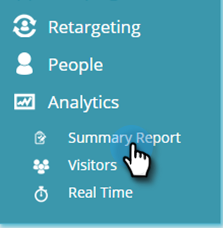
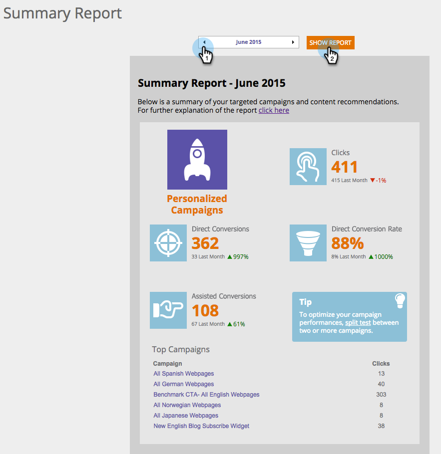

# Explicación del informe de resumen {#understanding-the-summary-report}

El informe Resumen es una vista mensual de todas las campañas y del rendimiento del contenido recomendado. Se basa en el número de clics y de posibles clientes (directos o asistidos) que interactuaron con la campaña personalizada o el contenido recomendado y luego se convirtieron en un posible cliente conocido. El informe compara los resultados con el mes anterior.

>[!NOTE]
>
>**Definición**
>
>Conversión directa: Un visitante web que hace clic en una campaña personalizada o en un recurso de contenido recomendado y, en la misma sesión de visita, rellena cualquier formulario del sitio web con su dirección de correo electrónico.
>
>Conversión asistida: Un visitante web que rellena cualquier formulario en el sitio web y abandona su dirección de correo electrónico, que en una visita anterior (en los últimos 6 meses) hizo clic en una campaña personalizada o en un recurso de contenido recomendado.

En Personalización web, vaya a **Analytics** y **Informe de resumen**.

Seleccione **Mes** y haga clic en **Mostrar informe**.

La primera parte del informe se relaciona con las campañas de Personalización web personalizada y muestra:

* **Clics** : todos los clics en campañas de personalización web
* **Conversiones**  directas: todos los visitantes que hicieron clic en una campaña de personalización web durante la visita y rellenaron un formulario
* **Tasa de conversión**  directa: el porcentaje de visitantes que se convirtieron en un posible cliente directo después de hacer clic en una campaña de Personalización web. Directos directos divididos por clics
* **Conversiones**  asistidas: todos los visitantes que rellenaron un formulario y hicieron clic en una campaña de Personalización web en una visita anterior (en los últimos 6 meses)
* **Sugerencias** : sugerencias para optimizar el rendimiento de la campaña de la personalización web
* **Campañas**  principales: las campañas de mayor rendimiento durante el período de tiempo seleccionado, ordenadas por número de clics

La segunda parte del informe se relaciona con Contenido recomendado del motor de recomendación de contenido de Personalización web. Muestra:

* **Clics** : todos los clics en el contenido recomendado para la Personalización web
* **Conversiones**  directas: todos los visitantes que hicieron clic en el contenido recomendado durante la visita y rellenaron un formulario
* **Tasa de conversión**  directa: el porcentaje de visitantes que se convirtieron en un posible cliente directo después de hacer clic en el contenido recomendado. Directos directos divididos por clics
* **Conversiones**  asistidas: todos los visitantes que rellenaron un formulario y hicieron clic en el contenido recomendado en una visita anterior (en los últimos 6 meses)
* **Sugerencias** : sugerencias para optimizar el uso del motor de recomendación de contenido
* **Recommendations**  principal: el contenido recomendado de mayor rendimiento durante el período de tiempo seleccionado, ordenado por número de clics

>[!NOTE]
>
>Personalización web de marketing captura la dirección de correo electrónico del visitante web para cualquier formulario completado en el sitio web. Esto se ve en la página Posibles clientes de Personalización Web y es el lead que se utiliza en el informe Resumen.
