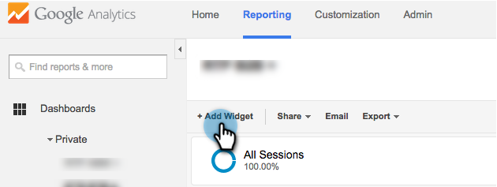
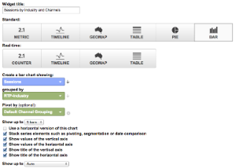

# Tableros RTP personalizados en Google Universal Analytics {#custom-rtp-dashboards-in-google-universal-analytics}

>[!PREREQUISITES]
>
>[Integración de RTP con Google Universal Analytics](/help/marketo/product-docs/web-personalization/reporting-for-web-personalization/web-analytics-integrations/integrate-rtp-with-google-universal-analytics.md)

En esta publicación se explica cómo configurar los paneles RTP en Google Universal Analytics (GUA). Los datos enviados desde RTP a GUA se pueden configurar como dos paneles personalizados independientes llamados:

* RTP B2B
* Participación de RTP

## Configuración de un tablero personalizado {#setting-up-a-custom-dashboard}

1. Inicie sesión en los Google Analytics. Haga clic en **Informes** en el menú superior. Haga clic en **Tableros** y **+Nuevo tablero personalizado**.

   

1. Select **Lienzo en blanco**, agregue un **Nombre del panel** y haga clic en **Crear tablero**.

1. Haga clic en **Agregar utilidad** para crear un nuevo widget.

   

## Tablero RTP B2B {#rtp-b-b-dashboard}

Este tablero permite a los usuarios analizar el rendimiento de su sitio web desde una perspectiva B2B.

Proporciona información como fuente de visitas y comportamiento en el sitio por sector, ingresos, tamaño, listas basadas en cuentas y segmentos de objetivo.

El tablero consta de 3 columnas

* Fuente de tráfico
* Segmentos
* Exploración en profundidad de firma

1. Cree un nuevo tablero llamado **Tablero RTP B2B** y defina las siguientes utilidades:

<table> 
 <thead> 
  <tr> 
   <th> 
    

      Columna 1 - Fuentes de tráfico
    
</th> 
   <th> 
    
 <strong>Columna 2: Segmentación</strong> 
    
</th> 
   <th> 
    
 <strong>Columna 3 - Desglose Firmográfico</strong> 
    
</th> 
  </tr> 
 </thead> 
 <tbody> 
  <tr> 
   <td> 
    <ul> 
     <li>Nombre: Sesiones por segmentos y canales</li> 
     <li>Tipo de utilidad: Barra </li> 
     <li>Cree un gráfico de barras que muestre: Sesión</li> 
     <li>Agrupado por: Etiqueta de evento</li> 
     <li>Dinámica por: Agrupación de canales predeterminada</li> 
     <li>Filtro:  Mostrar sólo | Categoría de evento (que contiene) RTP-Segments</li> 
    </ul>

</td> 
   <td> 
    <ul> 
     <li>Nombre: N.º de usuarios segmentados de RTP</li> 
     <li>Tipo: Métrica 2.1</li> 
     <li>Mostrar la siguiente métrica: Usuarios </li> 
     <li>Filtro:  Mostrar sólo | Categoría de evento (que contiene) RTP-Segments</li> 
    </ul>

</td> 
   <td> 
    <ul> 
     <li>Nombre: Sesiones por sector</li> 
     <li>Tipo: Circular </li> 
     <li>Cree un gráfico circular que muestre: Sesiones</li> 
     <li>Agrupado por: RTP-Industry</li> 
    </ul>

</td> 
  </tr> 
  <tr> 
   <th> 
    <ul> 
     <li><strong>Nombre: Sesiones por sector y canales</strong></li> 
     <li><strong>Tipo de utilidad: Barra</strong></li> 
     <li><strong>Cree un gráfico de barras que muestre: Sesión</strong></li> 
     <li><strong>Agrupado por: RTP-Industry</strong></li> 
     <li><strong>Dinámica por: Agrupación de canales predeterminada</strong> </li> 
    </ul></th> 
   <th> 
    <ul> 
     <li><strong>Nombre: Sesiones segmentadas por país</strong></li> 
     <li><strong>Tipo: Geomap</strong></li> 
     <li><strong>Diagrama de métrica seleccionada: País | Sesiones</strong></li> 
     <li><strong>Seleccione una región: El mundo</strong></li> 
     <li><strong>Filtro: Mostrar sólo | Categoría de evento (que contiene) RTP-Segments</strong></li> 
    </ul>

</th> 
   <th> 
    <ul> 
     <li><strong>Nombre: Sesiones por categoría RTP</strong></li> 
     <li><strong>Tipo: Circular</strong></li> 
     <li><strong>Cree un gráfico circular que muestre: Sesiones</strong></li> 
     <li><strong>Agrupado por: RTP-Category</strong></li> 
    </ul>

</th> 
  </tr> 
  <tr> 
   <th> </th> 
   <th> 
    <ul> 
     <li>Nombre: Segmentos de objetivo principales</li> 
     <li>Tipo: Barra</li> 
     <li>Cree un gráfico de barras que muestre: Usuarios</li> 
     <li>Agrupado por: Acción de evento</li> 
     <li>Filtro: Mostrar sólo | Categoría de evento (que contiene) RTP-Segments</li> 
    </ul>

</th> 
   <th> 
    <ul> 
     <li>Nombre: Sesiones por grupos RTP</li> 
     <li>Tipo: Barra </li> 
     <li>Cree un gráfico de barras que muestre: Sesiones</li> 
     <li>Agrupado por: Grupo RTP</li> 
    </ul>
<strong></strong>
</th> 
  </tr> 
  <tr> 
   <th> </th> 
   <th> 
    <ul> 
     <li>Nombre: Sesiones y objetivos por segmentos principales</li> 
     <li>Tipo: Tabla </li> 
     <li>Muestre las columnas siguientes:  Etiqueta de evento | Sesiones | Tasa de conversión de objetivos</li> 
     <li>Filtro:  Mostrar sólo | Categoría de evento (que contiene) RTP-Segments</li> 
    </ul>
<strong></strong>
</th> 
   <th> </th> 
  </tr> 
 </tbody> 
</table>

## Panel de participación de RTP {#rtp-engagement-dashboard}

Este tablero permite a los usuarios analizar el rendimiento de sus campañas RTP y las participaciones de los motores de recomendación. Proporciona comparación de avg. duración de la sesión y páginas por sesión entre:

* Sin participación
* Participación (impresiones y clics en una campaña personalizada)
* Clics en el motor de recomendación y contenido recomendado

Cree un nuevo tablero llamado **Panel de participación de RTP** y defina las siguientes utilidades:

<table> 
 <thead> 
  <tr> 
   <th> 
    
 <strong>Columna 1 Exposición de campañas</strong> 
    
</th> 
   <th> 
    
 <strong>Columna 2 Pulsaciones en campañas</strong> 
    
</th> 
   <th> 
    
 <strong>Motor de recomendación de la columna 3</strong> 
    
</th> 
  </tr> 
 </thead> 
 <tbody> 
  <tr> 
   <td> 
    <ul> 
     <li>Nombre: <strong>Total de llamada a acción (participación)</strong></li> 
     <li>Tipo: <strong>Métrica 2.1 </strong></li> 
     <li>Mostrar la siguiente métrica: <strong>Eventos totales</strong></li> 
     <li>Filtros: <strong>[mostrar solamente] Categoría del evento (contiene): RTP-Campaigns</strong> <strong>[mostrar solamente] Acción de evento (que coincida exactamente): Impresión</strong><strong>[no mostrar] Etiqueta de evento (que contiene): #</strong></li> 
    </ul>
<strong></strong>
</td> 
   <td> 
    <ul> 
     <li>Nombre: <strong>Total de llamada a acción (pulsación)</strong></li> 
     <li>Tipo: <strong>Métrica 2.1 </strong></li> 
     <li>Mostrar la siguiente métrica: <strong>Eventos totales</strong></li> 
     <li>Filtros: <strong>[mostrar solamente] Categoría del evento (contiene): RTP-Campaigns</strong> <strong>[mostrar solamente] Acción de evento (que coincida exactamente): Clics</strong><strong>[no mostrar] Etiqueta de evento (que contiene): #</strong></li> 
    </ul>
<strong></strong>
</td> 
   <td> 
    <ul> 
     <li>Nombre: <strong>CRE: Total de clics</strong></li> 
     <li>Tipo: <strong>Métrica 2.1</strong> </li> 
     <li>Mostrar la siguiente métrica: <strong>Vistas de página</strong></li> 
     <li>Filtro: <strong>[mostrar solamente] Página (que contiene): rcmd</strong></li> 
    </ul>

</td> 
  </tr> 
  <tr> 
   <td colspan="1"> 
    <ul> 
     <li>Nombre: <strong>Promedio de Duración de la sesión (participación)</strong></li> 
     <li>Tipo: <strong>Métrica 2.1 </strong></li> 
     <li>Mostrar la siguiente métrica: <strong>Promedio de Duración de la sesión</strong></li> 
     <li>Filtros: <strong>[mostrar solamente] Categoría del evento (que coincida exactamente): RTP-Campaigns</strong> <strong>[mostrar solamente] Acción de evento (que coincida exactamente): impresión</strong><strong>[no mostrar] Etiqueta de evento (que contiene): #</strong></li> 
    </ul>
<strong></strong>
</td> 
   <td colspan="1"> 
    <ul> 
     <li>Nombre: <strong>Promedio de Duración de la sesión (pulsación)</strong></li> 
     <li>Tipo: <strong>Métrica 2.1 </strong></li> 
     <li>Mostrar la siguiente métrica: <strong>Promedio de Duración de la sesión</strong></li> 
     <li>Filtros: <strong>[mostrar solamente] Categoría del evento (que coincida exactamente): RTP-Campaigns</strong> <strong>[mostrar solamente] Acción de evento (que coincida exactamente): clicks</strong><strong>[no mostrar] Etiqueta de evento (que contiene): #</strong></li> 
    </ul>
<strong></strong>
</td> 
   <td colspan="1"> 
    <ul> 
     <li>Nombre: <strong>CRE: contenido recomendado principal</strong></li> 
     <li>Tipo: <strong>Tabla</strong> </li> 
     <li>Muestre las columnas siguientes:  <strong>Título de página | Vistas de página</strong> </li> 
     <li>Filtros: Filtro: <strong>[mostrar solamente] Página (que contiene): rcmd</strong></li> 
    </ul>

</td> 
  </tr> 
  <tr> 
   <td> 
    <ul> 
     <li>Nombre: <strong>Páginas / Sesión (Participación)</strong></li> 
     <li>Tipo: <strong>Métrica 2.1 </strong></li> 
     <li>Mostrar la siguiente métrica: <strong>Páginas / Sesión</strong></li> 
     <li>Filtros: <strong>[mostrar solamente] Categoría del evento (que coincida exactamente): RTP-Campaigns</strong></li> 
     <li><strong>[mostrar solamente] Acción de evento (que coincida exactamente): impresión</strong></li> 
     <li><strong>[no mostrar] Etiqueta de evento (que contiene): #</strong></li> 
    </ul>

</td> 
   <td> 
    <ul> 
     <li>Nombre: <strong>Páginas / Sesión (pulsación)</strong></li> 
     <li>Tipo: <strong>Métrica 2.1 </strong></li> 
     <li>Mostrar la siguiente métrica: <strong>Páginas / Sesión</strong></li> 
     <li>Filtros: <strong>[mostrar solamente] Categoría del evento (que coincida exactamente): RTP-Campaigns</strong></li> 
     <li><strong>[mostrar solamente] Acción de evento (que coincida exactamente): clicks</strong></li> 
     <li><strong>[no mostrar] Etiqueta de evento (que contiene): #</strong></li> 
    </ul>
<strong></strong>
</td> 
   <td> </td> 
  </tr> 
  <tr> 
   <td> 
    <ul> 
     <li>Nombre: <strong>Impresiones por CTA</strong></li> 
     <li>Tipo: <strong>Tabla</strong></li> 
     <li>Muestre las columnas siguientes: <strong>Etiqueta de evento | Eventos totales | Usuarios</strong></li> 
     <li>Filtros: <strong>[mostrar solamente] Categoría del evento (que coincida exactamente): RTP-Campaigns</strong> <strong>[mostrar solamente] Acción de evento (que coincida exactamente): impresión</strong><strong>[no mostrar] Etiqueta de evento (que contiene): #</strong></li> 
    </ul>

</td> 
   <td> 
    <ul> 
     <li>Nombre: <strong>Pulsación mediante llamada a acción</strong></li> 
     <li>Tipo: <strong>Tabla</strong></li> 
     <li>Muestre las columnas siguientes: <strong>Etiqueta de evento | Eventos totales | Usuarios</strong></li> 
     <li>Filtros: <strong>[mostrar solamente] Categoría del evento (que coincida exactamente): RTP-Campaigns</strong> <strong>[mostrar solamente] Acción de evento (que coincida exactamente): clicks</strong></li> 
    </ul>

</td> 
   <td> </td> 
  </tr> 
 </tbody> 
</table>

>[!MORELIKETHIS]
>
>[Integración de RTP con Google Universal Analytics](/help/marketo/product-docs/web-personalization/reporting-for-web-personalization/web-analytics-integrations/custom-rtp-reports-in-google-universal-analytics.md)
>
>[Informes RTP personalizados en Google Universal Analytics](/help/marketo/product-docs/web-personalization/reporting-for-web-personalization/web-analytics-integrations/custom-rtp-reports-in-google-universal-analytics.md)
