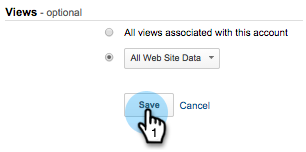

# Informes RTP personalizados en Google Universal Analytics {#custom-rtp-reports-in-google-universal-analytics}

>[!PREREQUISITES]
>
>[Integrar RTP con Google Universal Analytics](/help/marketo/product-docs/web-personalization/reporting-for-web-personalization/web-analytics-integrations/integrate-rtp-with-google-universal-analytics.md)

En este artículo se explica cómo configurar informes personalizados RTP para Google Universal Analytics (GUA).  Los datos enviados desde RTP a GUA pueden configurarse como dos informes personalizados independientes llamados:

* RTP B2B
* Participación de RTP

## Configuración de un informe personalizado {#setting-up-a-custom-report}

1. Inicie sesión en Google Analytics.

1. Haga clic en **Personalización** en el menú superior.

1. Haga clic en **+Nuevo informe personalizado**.

## Informe RTP B2B {#rtp-b-b-report}

1. Asigne un nombre al informe **Informe RTP B2B**.

1. Asigne un nombre a la primera ficha **Industria**.

>[!NOTE]
>
>Va a **Duplicado esta ficha** y creará otras similares - paso 5)

1. Seleccione el tipo de informe **Explorador**.

   

1. En la sección **Grupos de métricas**, seleccione las métricas que son relevantes para su negocio.

   a. Recomendamos lo siguiente:

   

1. Duplicado esta ficha 4 veces y asígneles un nombre:

   1. **Industria**
   1. **Grupo**
   1. **Categoría**
   1. **ABM**
   1. **Organizaciones**

   

1. En la sección **Desgloses de Dimension** establezca las dimensiones relevantes para cada ficha como se muestra a continuación.

<table> 
 <thead> 
  <tr> 
   <th> 
    

      Nombre de ficha 
    
</th> 
   <th> 
    

      Desgloses de Dimension
    
</th> 
  </tr> 
 </thead> 
 <tbody> 
  <tr> 
   <td>Industria</td> 
   <td></td> 
  </tr> 
  <tr> 
   <td>Grupo</td> 
   <td></td> 
  </tr> 
  <tr> 
   <td>Categoría</td> 
   <td></td> 
  </tr> 
  <tr> 
   <td>ABM</td> 
   <td></td> 
  </tr> 
  <tr> 
   <td>Organizaciones</td> 
   <td></td> 
  </tr> 
 </tbody> 
</table>

1. No configure ningún filtros y establezca este informe para que esté disponible para **Todos los datos del sitio web** (o cambie si es relevante para una cuenta específica de Analytics).

1. Haga clic en **Guardar**.

   

## Informe de participación de RTP {#rtp-engagement-report}

1. Asigne un nombre al informe **Informe de participación de RTP**.

1. Establezca el nombre de la primera ficha en **Todos los compromisos**.

>[!NOTE]
>
>Esta ficha se Duplicado y se crean otras similares - paso 5)

1. Seleccione el tipo de informe **Explorador**.

   

1. En la sección Grupos de métricas, seleccione las métricas que son relevantes para su negocio. Esta es una recomendación:

   

1. Duplicado esta ficha 4 veces y asígneles un nombre:

   1. **Todos los compromisos**
   1. **Participación por sector**
   1. **Participación por grupo**
   1. **Participación por Categoría**
   1. **Participación de ABM**

   

1. En la sección **Desgloses de Dimension** establezca las dimensiones relevantes para cada ficha como se muestra a continuación:

<table> 
 <thead> 
  <tr> 
   <th> 
    

      Nombre de ficha 
    
</th> 
   <th> 
    

      Desgloses de Dimension 
    
</th> 
  </tr> 
 </thead> 
 <tbody> 
  <tr> 
   <td>Todos los compromisos</td> 
   <td></td> 
  </tr> 
  <tr> 
   <td>Participación de ABM</td> 
   <td></td> 
  </tr> 
  <tr> 
   <td>Participación por Categoría</td> 
   <td></td> 
  </tr> 
  <tr> 
   <td>Participación por grupo</td> 
   <td></td> 
  </tr> 
  <tr> 
   <td>Participación por sector</td> 
   <td></td> 
  </tr> 
 </tbody> 
</table>

1. Establezca los siguientes filtros:

<table> 
 <thead> 
  <tr> 
   <th> 
    

      Inc/Exc 
    
</th> 
   <th> 
    

      Campo 
    
</th> 
   <th> 
    

      Tipo de coincidencia 
    
</th> 
   <th> 
    

      Valores 
    
</th> 
   <th colspan="1"> 
    

      Comentarios 
    
</th> 
  </tr> 
 </thead> 
 <tbody> 
  <tr> 
   <td>
Incluir
</td> 
   <td>
Categoría evento
</td> 
   <td>Regex</td> 
   <td>Campañas RTP|RTP-Recommendations|RTP-Segments</td> 
   <td colspan="1">Filtrará todos los demás eventos personalizados que no estén relacionados con RTP</td> 
  </tr> 
  <tr> 
   <td>Excluir</td> 
   <td>Etiqueta evento</td> 
   <td>Regex</td> 
   <td>#</td> 
   <td colspan="1">Permite filtrar desde la campaña de informes utilizando # en el nombre de la campaña</td> 
  </tr> 
 </tbody> 
</table>

1. Configure este informe para que esté disponible para **Todos los datos del sitio Web** (o cambie si es necesario).

   

1. Haga clic en **Guardar**.

>[!MORELIKETHIS]
>
>[Integrar RTP con Google Universal Analytics](/help/marketo/product-docs/web-personalization/reporting-for-web-personalization/web-analytics-integrations/integrate-rtp-with-google-universal-analytics.md)
>
>[Paneles RTP personalizados en Google Universal Analytics](/help/marketo/product-docs/web-personalization/reporting-for-web-personalization/web-analytics-integrations/custom-rtp-dashboards-in-google-universal-analytics.md)
