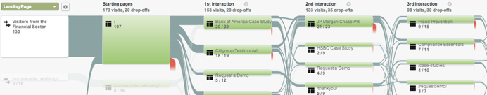

# Integración de RTP con Google Analytics {#integrate-rtp-with-google-analytics}

>[!NOTE]
>
>Universal Analytics es ahora el estándar operativo y todas las propiedades de Google se han actualizado a Universal Analytics.
>
>Este artículo muestra cómo utilizar el antiguo Google Standard Analytics, pero le recomendamos que cambie a Universal Analytics.
>
>Si aún no estás usando el [código de seguimiento de analytics.js](https://developers.google.com/analytics/devguides/collection/analyticsjs/), Google recomienda que vuelvas a etiquetar tu sitio para utilizarlo. Google está desaprobando lo siguiente:
>
>* ga.js
>* urchin.js
>* Fragmentos de datos WAP/del lado del servidor
>* YT/MO
>* Variables personalizadas
>* Variables definidas por el usuario
>
>Ver cómo integrar [Web Personalization con Universal Analytics](/help/marketo/product-docs/web-personalization/reporting-for-web-personalization/web-analytics-integrations/integrate-rtp-with-google-universal-analytics.md)

## Introducción {#introduction}

Analice el análisis web desde un nuevo ángulo con el flujo de datos directo de Marketo Real-Time Personalization (RTP) a su cuenta de Google Analytics (GA). Mida sus visitas web en GA según organizaciones, industrias y campañas de RTP. Vea métricas como los tipos de industrias o segmentos de RTP en GA y cómo funcionan y generan posibles clientes según diferentes fuentes de tráfico (social, de pago, orgánico), analizando las tasas de clics en las campañas y midiendo el impacto que las campañas de personalización tienen en su sitio web. Aproveche esta capacidad para obtener el máximo beneficio de su cuenta de RTP

**RTP Audience Analytics**

Con la integración, tiene una nueva dimensión en su cuenta de GA. RTP mejora automáticamente sus paneles con:

1. Organizaciones e industrias
1. Segmentos personalizados en RTP
1. Listas de Account-Based Marketing

Céntrese en sus clientes potenciales clave B2B. Analice canales por sectores y segmentos segmentados.

## Informe de canal {#channel-report}

El panel RTP B2B le ayuda a comprender el desglose de los visitantes según los segmentos verticales y la segmentación RTP. Puede ver el rendimiento de sus visitantes según el sector financiero y las diferentes campañas de marketing (de pago, orgánicas y sociales). El tablero también proporciona información general de alto nivel sobre el rendimiento de los segmentos de RTP y profundiza para mostrar las organizaciones principales que visitan el sitio.

## Flujo de comportamiento {#behavioral-flow}

El informe Flujo de comportamiento (consulte la imagen) visualiza la ruta que siguen los visitantes de una página o evento a la siguiente. El ejemplo de imagen muestra la ruta de todos los visitantes del sector financiero. Este informe puede ayudarle a descubrir qué contenido mantiene a los visitantes comprometidos con el sitio.

## Rendimiento de RTP {#rtp-performance}

Mida sus campañas RTP y correlácelas con el promedio general del sitio. Descubra cómo estas campañas afectan a las métricas de su sitio web y utilice estos datos para enfocar sus esfuerzos de personalización en los objetivos adecuados. Genere informes personalizados para comprender mejor el rendimiento de sus campañas de personalización.

## Configuración de RTP con Google Analytics {#setting-up-rtp-with-google-analytics}

1. Agregue el correo electrónico <rtp.ga2@gmail.com> como usuario de lectura y análisis a su cuenta de GA. Para obtener más información, vea [aquí](https://support.google.com/analytics/answer/2884495?hl=en).

1. En su cuenta de RTP. Vaya a **[!UICONTROL Configuración de la cuenta]**.

   

1. En **[!UICONTROL Configuración de la cuenta]**, **[!UICONTROL Dominio]** y **[!UICONTROL Analytics]**.

1. Haz clic en **Google Analytics**.

1. Active las **Variables personalizadas** y **Eventos** relevantes para anexar estos datos de RTP a Google Analytics.

1. Escriba el número **Slot** para enviar datos de variables personalizadas (el valor predeterminado es 1,2).

1. Haga clic en **[!UICONTROL Guardar]**.

>[!NOTE]
>
>Para enviar datos de segmentos a GA, en la página [[!UICONTROL Editar segmento]](/help/marketo/product-docs/web-personalization/using-web-segments/create-a-basic-web-segment.md) de la plataforma RTP, seleccione la casilla de verificación **[!UICONTROL Enviar evento a Google Analytics al coincidir el segmento]**.

## Configuración de informes de Google Analytics con datos RTP {#setting-up-google-analytics-reports-with-rtp-data}

En Google Analytics puede utilizar paneles, segmentación de GA e informes para ver los datos de RTP:

* [Paneles](https://support.google.com/analytics/answer/1068216?hl=en) proporcionan información general sobre el rendimiento del sitio web.
* Un segmento de GA está diseñado para filtrar visitantes en la interfaz de GA y ver el tráfico por segmento. Consulte cómo generar un segmento [aquí](https://support.google.com/analytics/answer/3124493?hl=en).
* Creando [informes personalizados](https://support.google.com/analytics/answer/1033013?hl=en) para ver o configurar correos electrónicos programados. Ver en **[!UICONTROL Personalización]** > **[!UICONTROL Nuevo informe personalizado]**.
