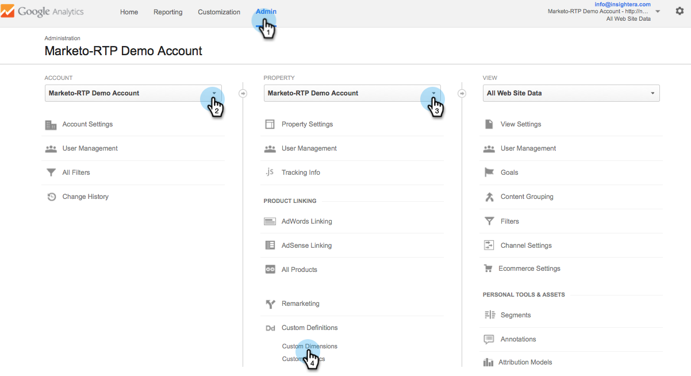
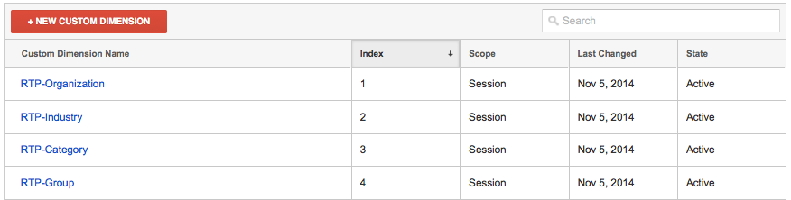

# Integrar RTP con Google Universal Analytics {#integrate-rtp-with-google-universal-analytics}

## Intro {#intro}

Aproveche Google Universal Analytics (GUA) con datos de personalización y firmografía de la Personalización en tiempo real (RTP) de Marketo para medir y analizar mejor sus esfuerzos de mercadotecnia en línea.

En este artículo se explica cómo configurar e integrar la plataforma de personalización en tiempo real (RTP) de Marketo con las cuentas de Google Universal Analytics (GUA). Los datos de RTP se pueden anexar a su cuenta de GUA permitiéndole realizar vistas y ver el rendimiento de organizaciones, industrias, firmografías y segmentos de RTP visitando su sitio web.

**Google Universal Analytics**

Google Universal Analytics con los datos de RTP le ofrece una mejor comprensión de cómo los usuarios de B2B interactúan con su contenido en línea y ayuda a medir y obtener mejores resultados con sus campañas de personalización. [Obtenga más información sobre Google Universal Analytics](https://support.google.com/analytics/answer/2790010/?hl=en&amp;authuser=1).

>[!NOTE]
>
>**Solo para usuarios de Administrador de etiquetas de Google**
>
>No es necesario codificar ni realizar ninguna configuración especial. Asegúrese de completar la siguiente lista de comprobación:
>
>* Las dimensiones RTP se crean en Google Universal Analytics
>* [La etiqueta RTP está instalada correctamente en el Administrador de etiquetas de Google](https://docs.marketo.com/display/public/DOCS/Implementing+RTP+using+Google+Tag+Manager)
>* La integración de Google Universal Analytics está habilitada en la configuración de cuenta de RTP
>* [La etiqueta Google Universal Analytics está configurada correctamente en el Administrador de etiquetas de Google](https://support.google.com/tagmanager/answer/6107124?hl=en)
>* [La etiqueta del Administrador de etiquetas de Google se ha instalado correctamente en el sitio web](https://developers.google.com/tag-manager/quickstart)

## Configurar Dimension personalizados en GUA {#set-up-custom-dimensions-in-gua}

1. En Google Analytics,

   1. Vaya a **Administración**
   1. Seleccione la **cuenta.**
   1. Seleccione la **propiedad.**
   1. Seleccione **Definiciones personalizadas** y **Dimension personalizados**.
      

1. Añada una nueva dimensión personalizada. Haga clic en **+Nuevo Dimension personalizado**

   

1. Añada los siguientes **Dimension personalizados:**

<table> 
 <tbody> 
  <tr> 
   <td>
<strong>Nombre del Dimension personalizado</strong>
</td> 
   <td>
<strong>Ámbito</strong>
</td> 
   <td>
<strong>Activo</strong>
</td> 
  </tr> 
  <tr> 
   <td>
<strong>RTP-Organization</strong>
</td> 
   <td>
Sesión
</td> 
   <td>
xib
</td> 
  </tr> 
  <tr> 
   <td>
<strong>RTP-Industry</strong>
</td> 
   <td>
Sesión
</td> 
   <td>
xib
</td> 
  </tr> 
  <tr> 
   <td>
<strong>Categoría RTP</strong>
</td> 
   <td>
Sesión
</td> 
   <td>
xib
</td> 
  </tr> 
  <tr> 
   <td>
<strong>RTP-Group</strong>
</td> 
   <td>
Sesión
</td> 
   <td>
xib
</td> 
  </tr> 
 </tbody> 
</table>

>[!NOTE]
>
>**Los** nombres de Dimension personalizados deben ser exactamente los definidos en la tabla anterior (de lo contrario, los informes y paneles RTP personalizados en GUA no se mostrarán correctamente)

1. Añada el **Nombre**. Seleccione el ámbito como **Sesión**. Haga clic en **Crear**.

   

La lista del Dimension personalizado debería tener este aspecto.

Una vez activados los Dimension personalizados en GUA, vaya a la plataforma RTP para habilitar estas dimensiones dentro de RTP.

## Active la integración de GUA en su cuenta RTP {#activate-the-gua-integration-in-your-rtp-account}

1. En la plataforma RTP, vaya a **Configuración de la cuenta.**

   

1. En **Configuración de cuenta**, haga clic en **Dominio**.
1. En **Analytics**, haga clic en **Google Universal Analytics**.
1. Active **Los Dimension y Eventos personalizados relevantes para anexar estos datos de RTP a Google Universal Analytics.**
1. Introduzca el **número de índice** de la dimensión alineada con el número de índice en GUA.
1. Haga clic en **Guardar**.

>[!NOTE]
>
>El número de índice del Dimension personalizado se encuentra en GUA, en Dimension personalizados.
>
>Ejemplo: El número de índice RTP-Industry es igual a 1, el número de índice de la organización RTP es igual a 2.

## Eliminar Paneles antiguos en Google Analytics {#remove-old-dashboards-in-google-analytics}

1. En Google Analytics. Vaya a **Sistema de informes.**
1. Haga clic en **Paneles.**
1. Seleccione un **Panel** (rendimiento RTP B2B o RTP)
1. Haga clic en **Eliminar Panel**.

