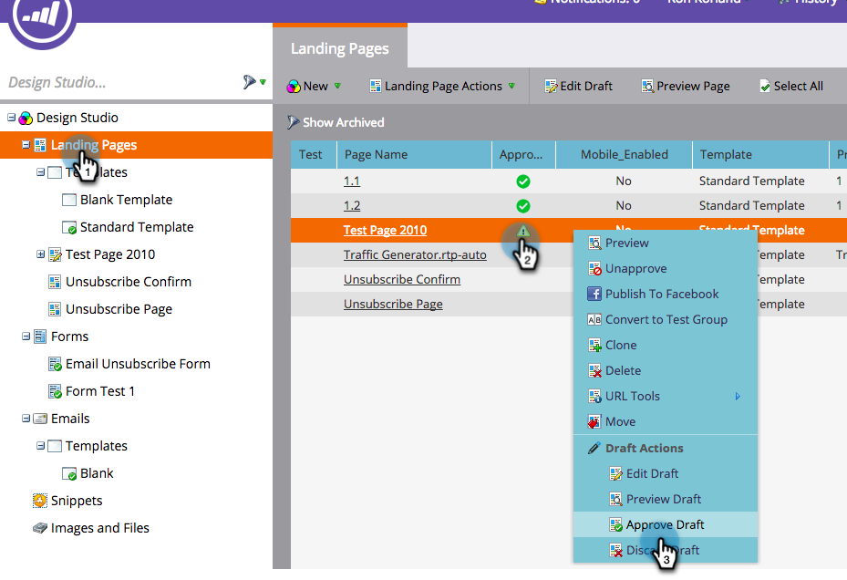

# Implementación de RTP en páginas de aterrizaje de Marketo {#implementing-rtp-on-marketo-landing-pages}

Para implementar su etiqueta RTP, siga las instrucciones de instalación a continuación:

1. Vaya a la **Design Studio.** Abra el elemento que desee editar. Select **Acciones de plantilla**, seleccione **Editar borrador**.

   

1. Realice los cambios de plantilla en la variable **Fuente de HTML** pestaña .

   

1. En su cuenta RTP, vaya a **Configuración de la cuenta**.

   a. Si ya ha recibido la etiqueta JavaScript de Asistencia : siga con el paso 5.

   

1. En Dominio, busque el dominio correspondiente y haga clic en **Generar etiqueta**.

   

   

1. Copie la etiqueta RTP JavaScript y péguela en todas las plantillas de página de aterrizaje entre las **`<head> </head>`** etiquetas.

1. Haga clic en **Guardar** y **Cerrar** la ventana .

1. Atrás en el **Design Studio**, apruebe la página de aterrizaje desde **Acciones de plantilla**, haga clic en **Aprobar**.

   

1. Por último, tendrá que **volver a aprobar** cualquier página de aterrizaje que use esa plantilla para la plantilla cambiará para que surta efecto. Puede volver a aprobarlos todos a la vez desde la sección principal de Páginas de aterrizaje.

   

1. Compruebe que aparece en todas las páginas, incluidas las páginas de aterrizaje y los subdominios.

   Para ello, haga clic con el botón derecho en la página de su sitio web. Vaya a **Ver origen de página.** Buscar **RTP** para localizar la etiqueta .
