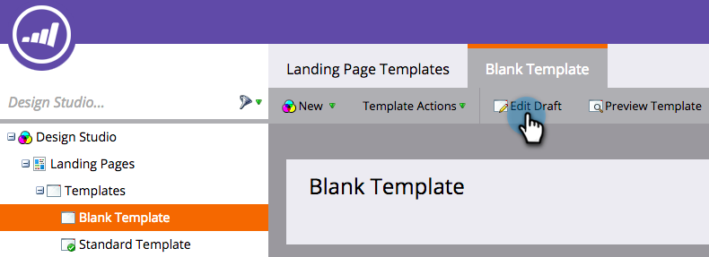

# Implementación de RTP en páginas de destino de Marketo {#implementing-rtp-on-marketo-landing-pages}

Para implementar su etiqueta RTP, siga las instrucciones de instalación a continuación:

1. Vaya a la **Estudio de diseño.** Abra el elemento que desee editar. Seleccionar **Acciones de plantilla**, seleccione **Editar borrador**.

   

1. Realice los cambios de la plantilla en **Origen del HTML** pestaña.

   

1. En su cuenta de RTP, vaya a **Configuración de cuenta**.

   a. Si ya ha recibido la etiqueta JavaScript del equipo de asistencia, siga con el paso 5.

   

1. En Dominio, busque el dominio correspondiente y haga clic en **Generar etiqueta**.

   

   

1. Copie la etiqueta JavaScript de RTP y péguela en todas las plantillas de página de aterrizaje entre las etiquetas **`<head> </head>`** etiquetas.

1. Clic **Guardar** y **Cerrar** la ventana.

1. De nuevo en **Design Studio**, apruebe la página de aterrizaje desde **Acciones de plantilla**, haga clic en **Aprobar**.

   

1. Por último, debe hacer lo siguiente **volver a aprobar** cualquier página de aterrizaje que utilice esa plantilla para que los cambios en la plantilla surtan efecto. Puede volver a aprobarlos todos a la vez desde la sección principal de Páginas de aterrizaje.

   

1. Compruebe que aparece en todas las páginas, incluidas las páginas de aterrizaje y los subdominios.

   Para ello, haga clic con el botón derecho en la página del sitio web. Ir a **Ver origen de página.** Buscar por **RTP** para localizar la etiqueta.
