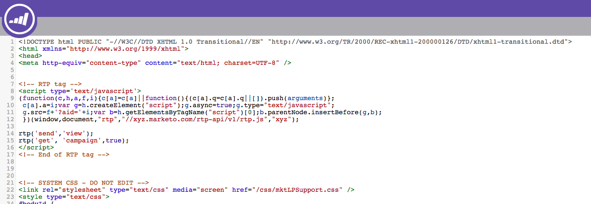

# Implementación de RTP en páginas de destino de Marketo {#implementing-rtp-on-marketo-landing-pages}

Para implementar su [!UICONTROL etiqueta RTP], siga las instrucciones de instalación a continuación:

1. Vaya a **[!UICONTROL Design Studio].** Abra el elemento que desee editar. Seleccione **[!UICONTROL Acciones de plantilla]**, seleccione **[!UICONTROL Editar borrador]**.

   

1. Realice los cambios de plantilla en la ficha **HTML Source**.

   

1. En su cuenta RTP, vaya a **[!UICONTROL Configuración de la cuenta]**.

   a. Si ya ha recibido la etiqueta JavaScript del equipo de asistencia, siga con el paso 5.

   

1. En [!UICONTROL Dominio], busque el dominio correspondiente y haga clic en **[!UICONTROL Generar etiqueta]**.

   

   

1. Copie la etiqueta RTP JavaScript y péguela en todas las plantillas de página de aterrizaje entre las etiquetas **`<head> </head>`**.

1. Haz clic en **[!UICONTROL Guardar]** y **[!UICONTROL Cerrar]** la ventana.

1. De nuevo en **[!UICONTROL Design Studio]**, apruebe la página de aterrizaje de **[!UICONTROL Acciones de plantilla]**, haga clic en **[!UICONTROL Aprobar]**.

   

1. Por último, tendrá que **volver a aprobar** cualquier página de aterrizaje que use esa plantilla para que los cambios en la plantilla surtan efecto. Puede volver a aprobarlas todas a la vez desde la sección principal [!UICONTROL Páginas de aterrizaje].

   

1. Compruebe que aparece en todas las páginas, incluidas las páginas de aterrizaje y los subdominios.

   Para ello, haga clic con el botón derecho en la página del sitio web. Vaya a **[!UICONTROL Ver página Source].** busque **[!UICONTROL RTP]** para encontrar la etiqueta.
