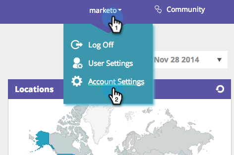

# Implementación de RTP en Wordpress {#implementing-rtp-on-wordpress}

Para implementar su etiqueta RTP, siga las instrucciones de instalación a continuación:

1. Abra el **header.php** del **Tema de WordPress**.

   Puede utilizar un cliente FTP para acceder al servidor o editar los archivos de temas directamente desde el panel de WordPress. El editor de archivos se encuentra en la sección **Aspecto** en el menú de la barra lateral.

   

1. En la lista de archivos de plantilla a la derecha del editor de texto, busque **header.php** y ábrala.

1. Vaya a **Configuración de la cuenta**.

   a. Si ya ha recibido la etiqueta JavaScript de Asistencia : siga con el paso 5.

   

1. En Dominio, busque el dominio correspondiente y haga clic en **Generar etiqueta**.

   

1. Copie la etiqueta RTP JavaScript y péguela en las plantillas de su sitio web.

   a. Asegúrese de que es la primera secuencia de comandos en el encabezado de la página, entre las **`<head> </head>`** etiquetas.

   

1. Haga clic en **Actualizar archivo** para el archivo header.php .

1. Compruebe que aparece en todas las páginas, incluidas las páginas de aterrizaje y los subdominios.

   a. Para ello, haga clic con el botón derecho en la página de su sitio web. Vaya a **Ver origen de página.** Buscar **RTP** para localizar la etiqueta .
