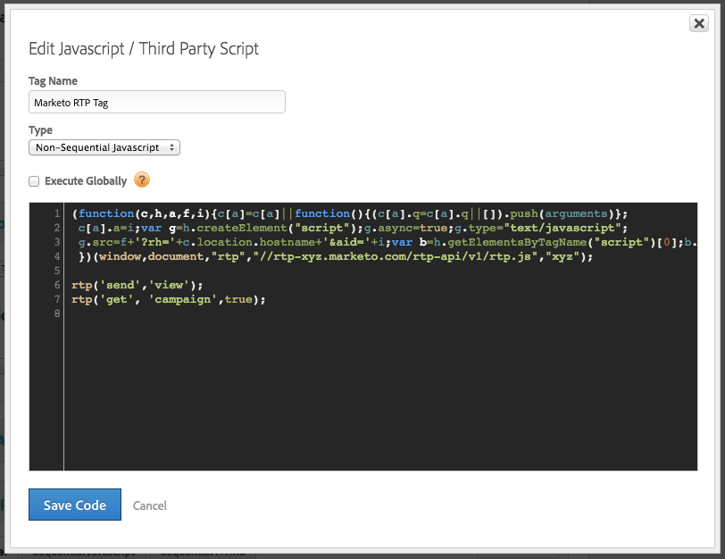

# Implementación de RTP mediante Adobe Tag Manager {#implementing-rtp-using-adobe-tag-manager}

Para implementar la etiqueta RTP, siga las instrucciones de instalación a continuación:

1. Inicie sesión en su cuenta RTP.

1. Vaya a **Configuración de la cuenta**.

   a. Si ya ha recibido la etiqueta JavaScript de la asistencia técnica, continúe con el paso 4.

   

1. En Dominio, localice el dominio relevante y haga clic en **Generar etiqueta**.

   

1. Inicie sesión en su cuenta del Administrador dinámico de etiquetas ([https://dtm.adobe.com/sign_in](https://dtm.adobe.com/sign_in)).

1. Vaya a **Panel.** Haga clic en la propiedad web correspondiente.

   

1. Vaya a **Reglas**, haga clic en **Crear nueva regla**.

1. Complete lo siguiente

   1. Nombre: **RTP de marketing**
   1. Condiciones (contraer): Regla de déclencheur en - **Principio de la página**
   1. Javascript (contraer): haga clic en **Añadir nueva secuencia de comandos**

   

1. Llame a la nueva etiqueta: **Etiqueta RTP de marketing**

1. Elimine el siguiente código de la etiqueta RTP

   * ``

1. Pegue la etiqueta RTP JavaScript.

   

   >[!CAUTION]
   >
   >Asegúrese de eliminar todas las etiquetas y dejar solo la propia secuencia de comandos (no `` )

1. Haga clic en **Guardar código** en el editor de secuencias de comandos y **Guardar regla** en el editor de reglas.

1. En el panel Reglas, ubique la regla de carga de página RTP de marketing y, en la lista desplegable **Acciones**, seleccione **Activar reglas**.

   

1. **** Compruebe que aparece en todas las páginas, incluidas las páginas de aterrizaje y los subdominios.

   Puede hacerlo haciendo clic con el botón derecho en las páginas del sitio web. Vaya a **Elemento de Inspect**, haga clic en **Red**, Buscar: **RTP**.
