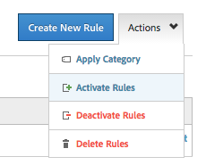

# Implementación de RTP con Adobe Tag Manager {#implementing-rtp-using-adobe-tag-manager}

Para implementar su etiqueta RTP, siga las instrucciones de instalación a continuación:

1. Inicie sesión en su cuenta de RTP.

1. Vaya a **[!UICONTROL Configuración de la cuenta]**.

   a. Si ya ha recibido la etiqueta JavaScript del equipo de asistencia, siga con el paso 4.

   

1. En [!UICONTROL Dominio], busque el dominio correspondiente y haga clic en **[!UICONTROL Generar etiqueta]**.

   

1. Inicie sesión en su cuenta de [!DNL Dynamic Tag Manager] ([https://dtm.adobe.com/sign_in](https://dtm.adobe.com/sign_in)).

1. Ir a **[!UICONTROL Tablero].** Haga clic en la propiedad web correspondiente.

   

1. Vaya a **[!UICONTROL Reglas]** y haga clic en **[!UICONTROL Crear nueva regla]**.

1. Complete lo siguiente

   1. [!UICONTROL Nombre]: **Marketo RTP**
   1. [!UICONTROL Condiciones] (contraer) : regla de Déclencheur en - **[!UICONTROL Parte superior de la página]**
   1. [!UICONTROL Javascript] (contraer): haga clic en **[!UICONTROL Agregar nuevo script]**

   

1. Llame a la nueva etiqueta: **Marketo RTP Tag**

1. Quite el siguiente código de la [!UICONTROL etiqueta RTP]

   * ``

1. Pegue la etiqueta RTP JavaScript.

   

   >[!CAUTION]
   >
   >Asegúrese de quitar todas las etiquetas y dejar solamente el script en sí (no `` )

1. Haga clic en **[!UICONTROL Guardar código]** en el editor de scripts y en **[!UICONTROL Guardar regla]** en el editor de reglas.

1. En el panel Reglas, busque la regla de carga de página Marketo RTP y, en el menú desplegable **[!UICONTROL Acciones]**, seleccione **[!UICONTROL Activar reglas]**.

   

1. **[!UICONTROL Compruebe]** que aparece en todas las páginas, incluidas las páginas de aterrizaje y los subdominios.

   Puede hacerlo haciendo clic con el botón derecho en las páginas del sitio web. Vaya a **[!UICONTROL Inspeccionar elemento]**, haga clic en **[!UICONTROL Red]**, Buscar: **RTP**.
