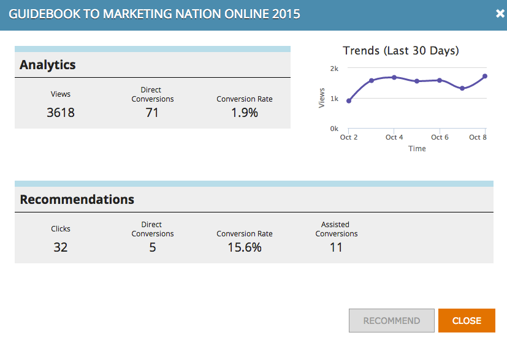

# Análisis de contenido {#understanding-content-analytics}

La página Análisis de contenido muestra el contenido existente descubierto (casos prácticos, anuncios de blog, vídeos, comunicados de prensa, etc.) del sitio web. También muestra el rendimiento del contenido y las personas que se generan cuando los visitantes interactúan con ellos.

## Análisis de contenido de vista {#view-content-analytics}

Vaya a **Análisis de contenido**.

En la página Análisis de contenido, puede:

* Filtrar por ámbito de tiempo (día, semana y mes)
* Búsqueda por título de contenido y dirección URL de contenido
* Ordene en orden descendente o ascendente haciendo clic en el título de la columna de Vistas, Conversiones directas y Tasa de conversión.

También puede exportar un archivo en formato CSV haciendo clic en el icono.

La tabla Análisis proporciona los siguientes detalles:

<table> 
 <thead> 
  <tr> 
   <th colspan="1" rowspan="1">Nombre</th> 
   <th colspan="1" rowspan="1">Descripción</th> 
  </tr> 
 </thead> 
 <tbody> 
  <tr> 
   <td colspan="1" rowspan="1"><strong>Título</strong></td> 
   <td colspan="1" rowspan="1">Nombre del recurso de contenido digital. Haga clic en <strong>Título</strong> para abrir la URL de contenido en una nueva ficha.</td> 
  </tr> 
  <tr> 
   <td colspan="1">
<strong>Icono  </strong><strong>de recomendación</strong>

<strong></strong>
</td> 
   <td colspan="1">Indica si la parte de contenido se ha agregado para <a href="#">Recommendations de contenido</a>.</td> 
  </tr> 
  <tr> 
   <td colspan="1" rowspan="1">
<strong>Vistas</strong>
</td> 
   <td colspan="1" rowspan="1">
Número de vistas de visitantes web en el recurso de contenido. Cantidad de veces que se ha visualizado, abierto, visto o descargado. Haga clic en el número de en la columna vistas para explorar en profundidad y ver quién ha visto el contenido
</td> 
  </tr> 
  <tr> 
   <td colspan="1" rowspan="1"><strong>Conversiones directas</strong></td> 
   <td colspan="1" rowspan="1">Visitantes Web que vieron el contenido y rellenaron un formulario en la misma visita</td> 
  </tr> 
  <tr> 
   <td colspan="1">
<strong>Icono de Analytics</strong>

<strong></strong>
</td> 
   <td colspan="1">Vea más análisis sobre el contenido</td> 
  </tr> 
  <tr> 
   <td colspan="1">
<strong>Eliminar icono</strong>

</td> 
   <td colspan="1">Elimina el contenido de Content Analytics</td> 
  </tr> 
 </tbody> 
</table>

## Análisis de contenido adicional de vista {#view-additional-content-analytics}

Haga clic en el icono de Analytics de un fragmento de contenido.

Se abre un cuadro de diálogo con Análisis de contenido adicional para esa parte de contenido específica.

Los análisis de contenido adicionales incluyen:

**Analytics**

* **Vistas**: Vistas de esa parte de contenido para el ámbito de tiempo seleccionado
* **Conversiones** directas: Visitantes Web que vieron el contenido y rellenaron un formulario en la misma visita.
* **tasa de conversión****:** Una tasa de conversión porcentual calculada por conversiones directas divididas por clics

**Tendencias**

* Un gráfico **Tendencias** que muestra los últimos 30 días de vistas del fragmento de contenido específico. Pase el ratón sobre el gráfico de líneas para ver el número de vistas de contenido de un día específico

## Eliminar contenido {#delete-content}

En la página Análisis de contenido, haga clic en el icono Eliminar del contenido que desee eliminar. Aparece un mensaje para confirmar que desea eliminar el contenido.

>[!MORELIKETHIS]
>
>* [Habilitar la barra de recomendaciones de contenido](/help/marketo/product-docs/predictive-content/enabling-predictive-content/enable-the-content-recommendation-bar.md)
>* [Habilitar contenido predictivo para medios enriquecidos por Web](/help/marketo/product-docs/predictive-content/enabling-predictive-content/enable-predictive-content-for-web-rich-media.md)

