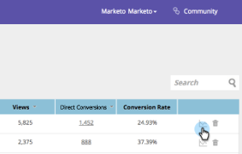

# Explicación de análisis de contenido {#understanding-content-analytics}

La página Análisis de contenido muestra el contenido existente descubierto (estudios de casos, publicaciones de blog, vídeos, comunicados de prensa, etc.) del sitio web. También muestra el rendimiento del contenido y de las personas que se generan cuando los visitantes interactúan con él.

## Ver análisis de contenido {#view-content-analytics}

Vaya a **Análisis de contenido**.

En la página Análisis de contenido, puede:

* Filtrar por ámbito de tiempo (día, semana y mes)
* Buscar por título de contenido y URL de contenido
* Ordene en orden descendente o ascendente haciendo clic en el título de la columna para Vistas, Conversiones directas y Tasa de conversión.

También puede exportar un archivo en formato CSV haciendo clic en el icono.

La tabla de Analytics proporciona los siguientes detalles:

<table> 
 <thead> 
  <tr> 
   <th colspan="1" rowspan="1">Nombre</th> 
   <th colspan="1" rowspan="1">Descripción</th> 
  </tr> 
 </thead> 
 <tbody> 
  <tr> 
   <td colspan="1" rowspan="1"><strong>Título</strong></td> 
   <td colspan="1" rowspan="1">Nombre del recurso de contenido digital. Haga clic en <strong>Título</strong> para abrir la dirección URL de contenido en una ficha nueva.</td> 
  </tr> 
  <tr> 
   <td colspan="1">
<strong>Icono </strong><strong>de recomendación</strong>

<strong></strong>
</td> 
   <td colspan="1">Indica si el fragmento de contenido se ha agregado para <a href="#">Recommendations de contenido</a>.</td> 
  </tr> 
  <tr> 
   <td colspan="1" rowspan="1">
<strong>Vistas</strong>
</td> 
   <td colspan="1" rowspan="1">
Número de vistas de visitantes web sobre el recurso de contenido. Cantidad de veces que se vio, abrió, vio o descargó. Haga clic en el número de páginas de la columna de vistas para explorar en profundidad y ver quién vio el contenido
</td> 
  </tr> 
  <tr> 
   <td colspan="1" rowspan="1"><strong>Conversiones directas</strong></td> 
   <td colspan="1" rowspan="1">Visitantes web que vieron el contenido y rellenaron un formulario en la misma visita</td> 
  </tr> 
  <tr> 
   <td colspan="1">
<strong>Icono de Analytics</strong>

<strong></strong>
</td> 
   <td colspan="1">Ver más análisis en el artículo de contenido</td> 
  </tr> 
  <tr> 
   <td colspan="1">
<strong>Icono Eliminar</strong>

</td> 
   <td colspan="1">Elimina el contenido de Análisis de contenido</td> 
  </tr> 
 </tbody> 
</table>

## Ver análisis de contenido adicional {#view-additional-content-analytics}

Haga clic en el icono de Analytics de un fragmento de contenido.

Se abre un cuadro de diálogo con análisis de contenido adicional para ese fragmento de contenido específico.

Los análisis de contenido adicionales incluyen:

**Analytics**

* **Vistas**: vistas de ese fragmento de contenido para el intervalo de tiempo seleccionado
* **Conversiones directas**: visitantes web que vieron el contenido y rellenaron un formulario en la misma visita.
* **Tasa de conversión****:** Una tasa de conversión porcentual calculada por conversiones directas divididas por clics

**Tendencias**

* Un gráfico de **tendencias** que muestra los últimos 30 días de vistas de la parte de contenido específica. Pase el ratón sobre el gráfico de líneas para ver la cantidad de vistas de contenido de un día específico

## Eliminar contenido {#delete-content}

En la página Análisis de contenido, haga clic en el icono Eliminar del contenido que desea eliminar. Aparecerá un mensaje para confirmar que desea eliminar el contenido.

>[!MORELIKETHIS]
>
>* [Habilitar la barra de recomendaciones de contenido](/help/marketo/product-docs/predictive-content/enabling-predictive-content/enable-the-content-recommendation-bar.md)
>* [Habilitar contenido predictivo para medios enriquecidos en web](/help/marketo/product-docs/predictive-content/enabling-predictive-content/enable-predictive-content-for-web-rich-media.md)
