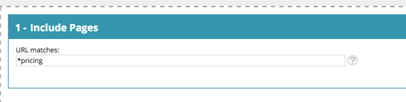

# Glosario de [!DNL Web Personalization] {#web-personalization-glossary}

Información sobre el mundo y el idioma de [!DNL Marketo Web Personalization].

| Término | Definición |
|---|---|
| **Visitante anónimo** | Un visitante web que nunca rellenó un formulario ni dejó sus detalles en el sitio web. |
| **Campaña web** | Una reacción personalizada asociada a un segmento específico. Con Web Personalization, las campañas web incluyen cuadros de diálogo, zonas de entrada y widgets. |
| **Flujo de navegación** | La actividad del visitante y la ruta URL en el sitio, así como la duración de la visita en cada página |
| **ISP** | Proveedor de servicio de Internet |
| **Visitante conocido** | Visitante web que ha completado un formulario y ha dejado sus detalles (dirección de correo electrónico) en su sitio web o ha hecho clic en un vínculo de un correo electrónico de Marketo. |
| **Lista de cuentas** | Una lista de nombres clave de cuenta u organización. También conocida como lista de Account-Based Marketing (ABM). |
| **Segmentos** | Colección de visitantes que cumplen los criterios especificados definidos en la página [ &quot;Establecer un segmento&quot;](/help/marketo/product-docs/web-personalization/using-web-segments/web-segments.md). |
| **Prueba dividida** | Experimento de prueba con dos o más variantes para medir la diferencia en los resultados. El objetivo es identificar los cambios en las páginas web que aumentan o maximizan un resultado de interés. |
| **Comodín** | Se usa un carácter comodín (&#42;) antes o después de una cadena para sustituir cualquier otro carácter o caracteres de una cadena. Consulte los ejemplos siguientes. |

## Ejemplos de comodines {#wildcard-examples}

Estas son tres formas de usar un comodín en [!DNL Web Personalization].

Igualar todos los visitantes en las direcciones URL de la página que terminen con los precios (por ejemplo, `www.marketo.com/pricing`

Igualar todos los visitantes en las direcciones URL de la página que empiecen por https:// (por ejemplo, `https://www.marketo.com`

Hacer coincidir todos los visitantes en las direcciones URL de la página que incluyan la palabra copia de seguridad (por ejemplo, `https://www.marketo.com/backup/pricing.html`

