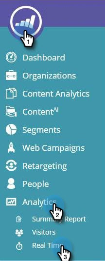

# Información general sobre la personalización de Web {#web-personalization-overview}

## Introducción {#introduction}

Para los nuevos clientes de Marketing to, la personalización en tiempo real se divide en cuatro aplicaciones, a las que se accede mediante estos dos mosaicos: Personalización web y ContentAI.

 

>[!NOTE]
>
>Personalización web y ContentAI están disponibles en todos los idiomas admitidos por el mercado (inglés, francés, alemán, japonés, portugués, español).

Los clientes existentes siguen accediendo a las aplicaciones a través del mosaico de Personalización en tiempo real hasta la renovación, momento en el que utilizarán el inicio de sesión anterior.

Al hacer clic en el mosaico Personalización web, aparece la página de Panel. Haga clic en el mosaico ContentAI y vaya directamente a la página de Recommendations de contenido.

Las cuatro aplicaciones son:

* Personalización web
* Mercadotecnia Web basada en cuentas
* Resegmentación de sitios web
* ContentAI

El mosaico **Personalización web** es el punto de acceso para crear campañas web personalizadas. Marketing web basado en cuentas y redireccionamiento web. Puede agregar contenido en la página Análisis de contenido.

**La** mercadotecnia web basada en cuentas funciona con la personalización web y las funciones de cuentas con nombre. La página Cuentas con Nombre proporciona información gráfica sobre los clientes existentes, las participaciones totales y las tendencias organizativas, así como una lista de las cuentas. También puede crear nuevas cuentas con nombre allí.

**La** resegmentación de sitios web le da el poder de remercadotecnia a audiencias segmentadas. Puede definir segmentos, pero no puede utilizar Cuentas con nombre en el filtro.

**** ContentAIes el lugar donde se ofrecen recomendaciones de contenido. Puede añadir contenido fácilmente a la página de Recommendations de contenido.

>[!NOTE]
>
>Para acceder al marketing web basado en cuentas o al redireccionamiento de sitios web, debe hacer clic en el mosaico Personalización web, aunque no tenga la aplicación de personalización web.

## Organizaciones {#organizations}

La ficha Organizaciones muestra todos los detalles (nombre, ubicación, actividad y marca de hora) de las organizaciones que visitaron el sitio web durante un período determinado. La tabla se puede ordenar y organizar por tiempo, ubicación, dominio y mediante una búsqueda de texto libre.

>[!TIP]
>
>‘Más activo’ vs. ‘Última’ - La tabla está organizada por organizaciones identificadas y luego Proveedores de servicio de Internet (denotada por un icono de ISP). Puede ordenarse según:
>
>* Más activo: las organizaciones más activas de la tabla, según el número de vistas de página
>* Última: las organizaciones más recientes de la tabla (predeterminado)
>* Para obtener perspectivas valiosas, filtre según los elementos más activos

**Organizaciones: panel derecho**

El panel derecho de la página Organizaciones oferta las siguientes funciones y perspectivas:

<table> 
 <tbody> 
  <tr> 
   <td>
<strong>Icono</strong> de hoja de cálculo: Situado en la parte superior derecha del panel, el icono descarga la tabla Organizaciones en formato CSV para uso sin conexión

<strong>Establecer alerta</strong> de correo electrónico: Envía al usuario que ha iniciado sesión un correo electrónico cada vez que la organización seleccionada visita el sitio Web

<strong>Posibles clientes</strong>: Abre la tabla de leads de la organización seleccionada

<strong>Compartir</strong>: Abre una ventana emergente para enviar por correo electrónico y compartir los detalles de la organización que visitó la página web

<strong>Icono</strong> de ubicación: Muestra el país y la ciudad de la organización seleccionada

<strong>Vínculos</strong>: Jigsaw, Whois, Linkedin, Google, Twitter abre una nueva ventana con información adicional de la página web respectiva que ofrece una perspectiva adicional sobre la organización seleccionada

<strong>Buscar</strong>: Muestra la palabra clave utilizada si el visitante llegó a través de un motor de búsqueda

<strong>Remitentes del reenvío</strong>: Muestra el vínculo de la dirección URL de la página que dirigió el tráfico a su sitio

<strong>Visitantes</strong>: Muestra el número de visitas, el número de páginas vistas por la organización seleccionada y su dirección de correo electrónico (si completó un formulario de envío), así como la hora y la fecha de la última visita

<strong>Clickstream</strong>: Muestra una tabla de la actividad del usuario y la ruta de URL en el sitio y el tiempo que han visitado cada página
</td> 
   <td></td> 
  </tr> 
 </tbody> 
</table>

**Compartir organizaciones**

¿Desea compartir la información del visitante de su sitio web con un colega? Haga clic en una organización y, a continuación, haga clic en el vínculo Compartir en el panel de la derecha.

Esto activa la superposición Compartir esta organización, donde puede enviar un correo electrónico compartiendo el nombre y los detalles de la organización que visitó el sitio web.

## Visitantes {#visitors}

La página Visitantes muestra todos los detalles y el comportamiento en línea de cada visitante que llegó al sitio dentro de un período de tiempo determinado. La página oferta una perspectiva profunda de las actividades y el comportamiento en línea de cada visitante individual. Los datos de visitante de la tabla se actualizan entre 24 y 48 horas.

El panel derecho de la página Visitantes proporciona las siguientes perspectivas:

<table> 
 <thead> 
  <tr> 
   <th colspan="1" rowspan="1">Nombre</th> 
   <th colspan="1" rowspan="1">Descripción</th> 
  </tr> 
 </thead> 
 <tbody> 
  <tr> 
   <td colspan="1" rowspan="1"><strong>Icono de hoja de cálculo</strong></td> 
   <td colspan="1" rowspan="1">Situado en la parte superior derecha del panel, el icono descarga la tabla de Visitantes en formato CSV para su uso sin conexión</td> 
  </tr> 
  <tr> 
   <td colspan="1" rowspan="1">
<strong>Nombre de la organización</strong>
</td> 
   <td colspan="1" rowspan="1"> </td> 
  </tr> 
  <tr> 
   <td colspan="1" rowspan="1"><strong>Definir Campaña</strong></td> 
   <td colspan="1" rowspan="1">Permite configurar una llamada a acción de Campaña asociada al visitante seleccionado</td> 
  </tr> 
  <tr> 
   <td colspan="1"><strong>Ubicación</strong></td> 
   <td colspan="1">Muestra el país, el estado y la ciudad del visitante</td> 
  </tr> 
  <tr> 
   <td colspan="1" rowspan="1"><strong>Clickstream</strong></td> 
   <td colspan="1" rowspan="1">Muestra una tabla de la actividad del visitante y la ruta de URL en el sitio y el tiempo que han visitado cada página</td> 
  </tr> 
 </tbody> 
</table>

## Tiempo real {#real-time}

La página Tiempo real muestra los visitantes en el sitio web en tiempo real, midiendo la actividad a medida que se produce.

La página en tiempo real se divide en 6 tablas informativas de detalles de visitantes en el sitio:

<table> 
 <thead> 
  <tr> 
   <th colspan="1" rowspan="1">Nombre</th> 
   <th colspan="1" rowspan="1">Descripción</th> 
  </tr> 
 </thead> 
 <tbody> 
  <tr> 
   <td colspan="1" rowspan="1"><strong>Visitantes</strong></td> 
   <td colspan="1" rowspan="1"> Representa el número de visitantes que hay actualmente en el sitio web</td> 
  </tr> 
  <tr> 
   <td colspan="1" rowspan="1">
<strong>Clics por minuto</strong>
</td> 
   <td colspan="1" rowspan="1"> Gráfico de líneas activas que muestra la cantidad de clics en el sitio por minuto</td> 
  </tr> 
  <tr> 
   <td colspan="1" rowspan="1"><strong>Organizaciones principales</strong></td> 
   <td colspan="1" rowspan="1">Una versión corta de la tabla Organizaciones</td> 
  </tr> 
  <tr> 
   <td colspan="1"><strong>Segmento en tiempo real</strong></td> 
   <td colspan="1">El número de visitantes que actualmente están en el sitio y que coinciden con los segmentos designados</td> 
  </tr> 
  <tr> 
   <td colspan="1"><strong>Exploración en curso</strong></td> 
   <td colspan="1">La dirección URL de las páginas que los visitantes en el sitio están viendo en ese momento</td> 
  </tr> 
  <tr> 
   <td colspan="1" rowspan="1"><strong>Referencias principales</strong></td> 
   <td colspan="1" rowspan="1">La dirección URL de referencia que llevó el visitante a su sitio</td> 
  </tr> 
 </tbody> 
</table>
