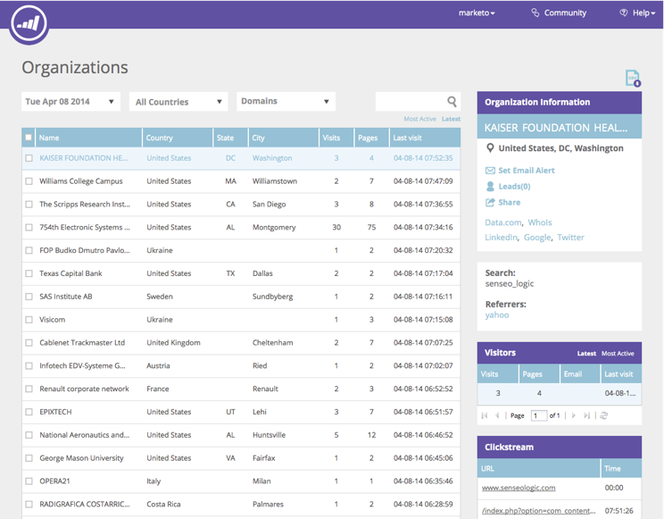

# Información general sobre la personalización web {#web-personalization-overview}

## Introducción {#introduction}

Para los nuevos clientes de Marketo, la personalización en tiempo real se divide en cuatro aplicaciones, a las que se accede mediante estos dos mosaicos: Personalización web y ContentAI.

 

>[!NOTE]
>
>La personalización web y ContentAI están disponibles en todos los idiomas compatibles con Marketo (inglés, francés, alemán, japonés, portugués y español).

Los clientes existentes siguen accediendo a las aplicaciones a través del mosaico de personalización en tiempo real hasta la renovación, momento en el que utilizarán el inicio de sesión anterior.

Al hacer clic en el mosaico Personalización web, aparece la página Tablero . Haga clic en el mosaico ContentAI y vaya directamente a la página Content Recommendations .

Las cuatro aplicaciones son:

* Personalización web
* Marketing web basado en cuentas
* Redireccionamiento de sitios web
* ContentAI

La variable **Personalización web** tile es el punto de acceso para crear campañas web personalizadas. Marketing web basado en cuentas y redireccionamiento web. Puede añadir contenido en la página Análisis de contenido .

**Marketing web basado en cuentas** funciona con la personalización web y con las funciones de cuentas con nombre. La página Cuentas con nombre proporciona información gráfica sobre los clientes existentes, las participaciones totales y las tendencias organizativas, así como una lista de las cuentas. También puede crear nuevas cuentas con nombre.

**Redireccionamiento de sitios web** le permite volver a enviar marketing a audiencias segmentadas. Puede establecer segmentos, pero no puede utilizar Cuentas con nombre en el filtro.

**ContentAI** es el lugar donde dar recomendaciones de contenido. Puede añadir contenido fácilmente a la página de Recommendations de contenido .

>[!NOTE]
>
>Para acceder al Marketing web basado en cuentas o al retargeting de sitios web, debe hacer clic en el mosaico Personalización web , aunque no tenga la aplicación de personalización web.

## Organizaciones {#organizations}

La ficha Organizaciones muestra todos los detalles (nombre, ubicación, actividad y marca de hora) de las organizaciones que visitaron el sitio web durante un período determinado. La tabla se puede ordenar y organizar por tiempo, ubicación, dominio y mediante una búsqueda de texto libre.

>[!TIP]
>
>‘Más activo’ vs. ‘Última’ - La tabla está organizada por organizaciones identificadas y luego proveedores de servicios de Internet (indicada por un icono ISP). Se puede ordenar según:
>
>* Más activo: las organizaciones más activas de la tabla, según el número de vistas de página
>* Última: las organizaciones más recientes de la tabla (predeterminado)
>* Para obtener información valiosa, filtre según los elementos más activos

**Organizaciones: panel derecho**

El panel derecho de la página Organizaciones ofrece las siguientes funciones y perspectivas:

<table> 
 <tbody> 
  <tr> 
   <td>
<strong>Icono de hoja de cálculo</strong>: Situado en la parte superior derecha del panel, el icono descarga la tabla Organizaciones en formato CSV para su uso sin conexión

<strong>Establecer alerta de correo electrónico</strong>: Envía al usuario que ha iniciado sesión un correo electrónico cada vez que la organización seleccionada visita el sitio web

<strong>Posibles clientes</strong>: Abre la tabla de posibles clientes para la organización seleccionada

<strong>Compartir</strong>: Abre una ventana emergente para enviar un correo electrónico y compartir los detalles de la organización que visitó la página web.

<strong>Icono de ubicación</strong>: Muestra el país y la ciudad de la organización seleccionada

<strong>Vínculos</strong>: Jigseen, Whois, Linkedin, Google, Twitter abre una nueva ventana con información adicional de la página web correspondiente, lo que ofrece información adicional sobre la organización seleccionada

<strong>Buscar</strong>: Muestra la palabra clave utilizada si el visitante llegó a través de un motor de búsqueda

<strong>Referentes</strong>: Muestra el vínculo URL de la página que dirigió el tráfico al sitio

<strong>Visitantes</strong>: Muestra el número de visitas, el número de páginas vistas por la organización seleccionada y su dirección de correo electrónico (si completó un formulario de envío), así como la hora y la fecha de la última visita

<strong>Flujo de navegación</strong>: Muestra una tabla de la actividad del usuario y la ruta URL del sitio, así como el tiempo que visitaron cada página
</td> 
   <td></td> 
  </tr> 
 </tbody> 
</table>

**Compartir organizaciones**

¿Quiere compartir la información del visitante de su sitio web con un colega? Haga clic en una organización y, a continuación, haga clic en el vínculo Compartir del panel de la derecha.

Esto activa la superposición Compartir esta organización , donde puede enviar un correo electrónico que comparta el nombre y los detalles de la organización que visitó el sitio web.

## Visitantes {#visitors}

La página Visitantes muestra todos los detalles y el comportamiento en línea de cada visitante que llegó al sitio dentro de un período de tiempo determinado. La página ofrece una perspectiva profunda de las actividades y el comportamiento en línea de cada visitante individual. Los datos de visitantes de la tabla se actualizan en un plazo de 24 a 48 horas.

El panel derecho de la página Visitantes proporciona las siguientes perspectivas:

<table> 
 <thead> 
  <tr> 
   <th colspan="1" rowspan="1">Nombre</th> 
   <th colspan="1" rowspan="1">Descripción</th> 
  </tr> 
 </thead> 
 <tbody> 
  <tr> 
   <td colspan="1" rowspan="1"><strong>Icono de hoja de cálculo</strong></td> 
   <td colspan="1" rowspan="1">Situado en la parte superior derecha del panel, el icono descarga la tabla Visitantes en formato CSV para uso sin conexión</td> 
  </tr> 
  <tr> 
   <td colspan="1" rowspan="1">
<strong>Nombre de la organización</strong>
</td> 
   <td colspan="1" rowspan="1"> </td> 
  </tr> 
  <tr> 
   <td colspan="1" rowspan="1"><strong>Establecer campaña</strong></td> 
   <td colspan="1" rowspan="1">Permite configurar un CTA de campaña asociado con el visitante seleccionado</td> 
  </tr> 
  <tr> 
   <td colspan="1"><strong>Ubicación</strong></td> 
   <td colspan="1">Muestra el país, el estado y la ciudad del visitante</td> 
  </tr> 
  <tr> 
   <td colspan="1" rowspan="1"><strong>Flujo de navegación</strong></td> 
   <td colspan="1" rowspan="1">Muestra una tabla de la actividad del visitante y la ruta URL en el sitio, así como el tiempo que ha visitado cada página</td> 
  </tr> 
 </tbody> 
</table>

## Tiempo real {#real-time}

La página Tiempo real muestra los visitantes del sitio web en tiempo real y mide la actividad a medida que pasa.

La página en tiempo real se divide en 6 tablas informativas de detalles del visitante en el sitio:

<table> 
 <thead> 
  <tr> 
   <th colspan="1" rowspan="1">Nombre</th> 
   <th colspan="1" rowspan="1">Descripción</th> 
  </tr> 
 </thead> 
 <tbody> 
  <tr> 
   <td colspan="1" rowspan="1"><strong>Visitantes</strong></td> 
   <td colspan="1" rowspan="1"> Representa el número de visitantes que hay actualmente en el sitio web</td> 
  </tr> 
  <tr> 
   <td colspan="1" rowspan="1">
<strong>Clics por minuto</strong>
</td> 
   <td colspan="1" rowspan="1"> Gráfico de líneas activas que muestra el número de clics en el sitio por minuto</td> 
  </tr> 
  <tr> 
   <td colspan="1" rowspan="1"><strong>Organizaciones principales</strong></td> 
   <td colspan="1" rowspan="1">Una versión breve de la tabla Organizaciones</td> 
  </tr> 
  <tr> 
   <td colspan="1"><strong>Segmento en tiempo real</strong></td> 
   <td colspan="1">El número de visitantes que están en el sitio y que coinciden con los segmentos designados</td> 
  </tr> 
  <tr> 
   <td colspan="1"><strong>Explorando actualmente</strong></td> 
   <td colspan="1">La dirección URL de las páginas que están viendo los visitantes en el sitio</td> 
  </tr> 
  <tr> 
   <td colspan="1" rowspan="1"><strong>Principales referencias</strong></td> 
   <td colspan="1" rowspan="1">La dirección URL de referencia que llevó al visitante a su sitio</td> 
  </tr> 
 </tbody> 
</table>
