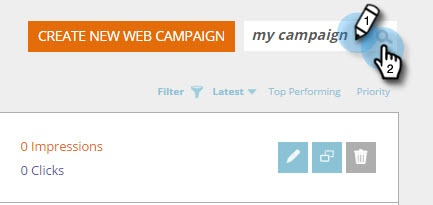

# Guardar la campaña como una plantilla {#save-your-campaign-as-a-template}

¿Alguna vez ha dedicado tiempo a crear la campaña web perfecta? Ahora puede guardarlo como plantilla para facilitar su reutilización en el futuro.

1. Vaya a **[!UICONTROL Campañas web]**.

   

1. Busque la campaña que desee guardar como plantilla.

   

1. Haga clic en el icono Edit.

   

1. Marque **[!UICONTROL Usar como plantilla]** y haga clic en **[!UICONTROL Guardar]**.

      

1. La próxima vez que cree una campaña y seleccione una plantilla, marque [!UICONTROL Mis plantillas] en la página Definir campañas para ver las plantillas que guardó.

   
