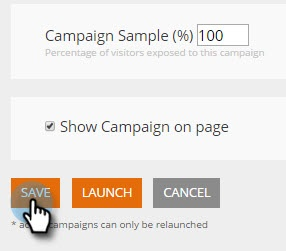

# Uso de plantillas para crear campañas web {#using-templates-to-create-web-campaigns}

Acelere y simplifique su proceso de creación de campañas web usando nuestras plantillas integradas o [guardando las suyas](save-your-campaign-as-a-template.md).

>[!NOTE]
>
>Las plantillas están optimizadas para todos los dispositivos y experiencias de navegación, tanto para escritorio como para móviles.

1. Vaya a **Campañas web**.

   

1. Haga clic en **Crear nueva campaña web**.

   

1. Asigne un nombre a la campaña.

   

1. Seleccione un Segmento de destino.

   

1. Haga clic en **Plantillas**.

   

1. Seleccione el área adecuada para que su campaña vea y seleccione una plantilla que le funcione.

   >[!NOTE]
   >
   >Hay algunas plantillas interesantes para elegir, y añadiremos más en el futuro.

   

   >[!TIP]
   >
   >Para campañas móviles, seleccione una plantilla de la sección **mobile**.

1. Personalice la plantilla.

   

1. Haga clic en **Guardar**.

   

¡Bien hecho! ¿Ha visto cuánto tiempo ha ahorrado utilizando una plantilla?

>[!MORELIKETHIS]
>
>[Guardar una campaña como plantilla](/help/marketo/product-docs/web-personalization/using-templates/save-your-campaign-as-a-template.md)
