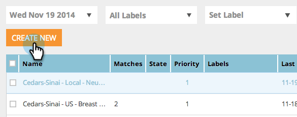
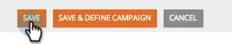

# Crear un segmento Web básico {#create-a-basic-web-segment}

Vamos a crear un segmento básico dirigido a todos los visitantes web de EE.UU. y del sector de los servicios financieros.

1. Vaya a **Segmentos**.

   

1. Haga clic en **Crear nuevo**.

   

1. Introduzca el nombre del segmento.

   

1. Arrastre **Ubicación** desde el menú de la derecha y colóquelo en el editor de segmentos.

   

1. Seleccione un país para agregar en la lista desplegable. Seleccione **Estados Unidos**.

   

   >[!NOTE]
   >
   >El número de ciudades está limitado a 300 por segmento.

1. Arrastre **Industrias** desde el menú de la derecha y colóquelo en el editor de segmentos.

   

1. Seleccione Industrias para agregar en la lista desplegable. Seleccione el **Sector de servicios financieros**.

   

   Ahora ha configurado un segmento básico para todos los clientes potenciales que visitan su sitio web desde los Estados Unidos y el sector financiero.

1. Haga clic en **Guardar** para guardar el segmento o **Guardar y definir Campaña** para ir a la página Campañas.

   

Ahora ha segmentado sus visitantes de los Estados Unidos, siga adelante y agregue el sector de los servicios financieros.

>[!MORELIKETHIS]
>
>[Segmentos Web](/help/marketo/product-docs/web-personalization/using-web-segments/web-segments.md)
