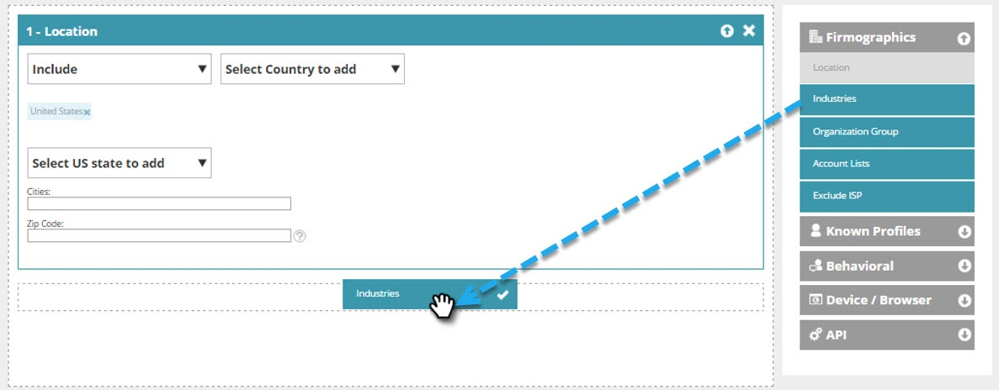

# Creación de un segmento web básico {#create-a-basic-web-segment}

Vamos a crear un segmento básico dirigido a todos los visitantes web de EE. UU. y del sector de los servicios financieros.

1. Vaya a **[!UICONTROL Segmentos]**.

   

1. Haga clic en **[!UICONTROL Crear nuevo]**.

   

1. Introduzca el nombre del segmento.

   

1. Arrastre **[!UICONTROL Location]** desde el menú de la derecha y suéltelo en el editor de segmentos.

   

1. Seleccione un país para añadir en la lista desplegable. Seleccione **Estados Unidos**.

   

   >[!NOTE]
   >
   >El número de ciudades está limitado a 300 por segmento.

1. Arrastre **[!UICONTROL Industrias]** desde el menú de la derecha y suéltelo en el editor de segmentos.

   

1. Seleccione [!UICONTROL Industrias] que agregar en la lista desplegable. Seleccione el sector **[!UICONTROL Servicios financieros]**.

   

   Ahora ha configurado un segmento básico para todos los clientes potenciales que visitan su sitio web desde EE. UU. y el sector financiero.

1. Haga clic en **[!UICONTROL Guardar]** para guardar el segmento o en **[!UICONTROL Guardar y definir la campaña]** para ir a la página Campañas.

   

Ahora que ha segmentado a sus visitantes de Estados Unidos, continúe y añada la industria de servicios financieros.

>[!MORELIKETHIS]
>
>[Segmentos web](/help/marketo/product-docs/web-personalization/using-web-segments/web-segments.md)
