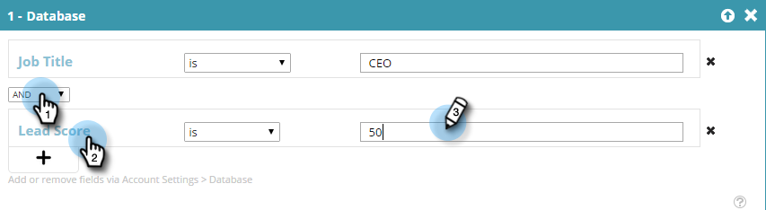

# Creación de segmentos con datos de personas conocidas {#create-a-segment-using-known-person-data}

A continuación, se muestra cómo crear un segmento utilizando valores de datos de persona conocida.

>[!PREREQUISITES]
>
>[Administrar datos de persona](/help/marketo/product-docs/web-personalization/using-web-segments/manage-person-data.md)

1. Ir a **Segmentos**.

   

1. Clic **Crear nuevo**.

   

1. Introduzca un Nombre del segmento.

   

1. En Segmentación de perfiles, arrastre **Base de datos** al lienzo.

   

1. Seleccione un campo de datos de persona de la lista desplegable.

   

1. Introduzca un valor para los datos de persona.

   

   Solo puede haber un valor para cada campo. Por ejemplo, si desea agregar varios valores para el campo de cargo, debe crear una nueva línea con el mismo nombre de campo para cada valor. Asegúrese de utilizar el valor OR para asegurarse de que cualquier valor capture una coincidencia.

   

## Selección de varios campos de datos de persona {#selecting-multiple-person-data-fields}

1. Clic **+** para agregar otro campo de datos de persona.

   

1. Seleccione el operador AND/OR. Seleccione el campo que desea añadir. Seleccione un campo de datos de persona. Introduzca El Valor De Datos De Persona.

   

1. Clic **Guardar** para guardar el segmento o **Guardar y definir la campaña** para guardar y vaya a la página de Campañas.

   

   Ahora ha configurado un segmento dirigido a los datos de persona conocida.
