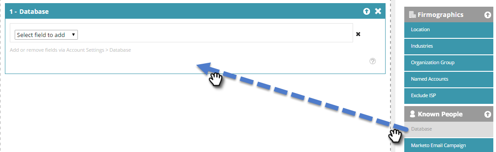
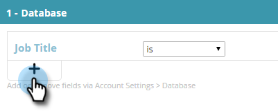
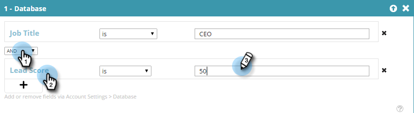

# Creación de un segmento mediante datos de personas conocidas {#create-a-segment-using-known-person-data}

A continuación, se muestra cómo crear un segmento utilizando valores de datos de persona conocida.

>[!PREREQUISITES]
>
>[Administrar datos de persona](/help/marketo/product-docs/web-personalization/using-web-segments/manage-person-data.md)

1. Vaya a **[!UICONTROL Segmentos]**.

   

1. Haga clic en **[!UICONTROL Crear nuevo]**.

   

1. Introduzca un Nombre del segmento.

   

1. En Segmentación de perfiles, arrastre **[!UICONTROL Base de datos]** al lienzo.

   

1. Seleccione un campo de datos de persona de la lista desplegable.

   

1. Introduzca un valor para los datos de persona.

   

   Solo puede haber un valor para cada campo. Por ejemplo, si desea agregar varios valores para el campo de cargo, debe crear una nueva línea con el mismo nombre de campo para cada valor. Asegúrese de utilizar el valor OR para asegurarse de que cualquier valor capture una coincidencia.

   

## Selección de varios campos de datos de persona {#selecting-multiple-person-data-fields}

1. Haga clic en **+** para agregar el campo de datos de otra persona.

   

1. Seleccione el operador [!UICONTROL AND]/[!UICONTROL OR]. Seleccione el campo que desea añadir. Seleccione un campo de datos de persona. Introduzca El Valor De Datos De Persona.

   

1. Haga clic en **[!UICONTROL Guardar]** para guardar el segmento o en **[!UICONTROL Guardar y definir la campaña]** para guardar e ir a la página [!UICONTROL Campañas].

   

   Ahora ha configurado un segmento dirigido a los datos de persona conocida.
