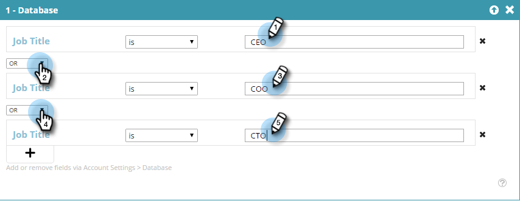

# Crear un segmento utilizando datos de personas conocidas {#create-a-segment-using-known-person-data}

A continuación, se explica cómo crear un segmento utilizando valores de datos de personas conocidas.

>[!PREREQUISITES]
>
>[Administrar datos de personas](/help/marketo/product-docs/web-personalization/using-web-segments/manage-person-data.md)

1. Vaya a **Segmentos**.

   

1. Haga clic en **Crear nuevo**.

   

1. Introduzca un nombre de segmento.

   

1. En Segmentación de perfiles, arrastre **Base de datos** pase al lienzo.

   

1. Seleccione un campo de datos de persona en la lista desplegable.

   

1. Introduzca un valor de Datos de persona.

   

   Solo puede haber un valor para cada campo. Por ejemplo, si desea agregar varios valores para el campo de título del trabajo, debe crear una línea nueva con el mismo nombre de campo para cada valor. Asegúrese de utilizar el valor O para asegurarse de que cualquier valor captura una coincidencia.

   

## Selección de campos de datos de varias personas {#selecting-multiple-person-data-fields}

1. Haga clic en **+** para agregar otro campo de datos de persona.

   

1. Seleccione el operador AND/OR . Seleccione el campo que desea añadir. Seleccione un campo de datos de persona. Introduzca el valor de los datos de la persona.

   

1. Haga clic en **Guardar** para guardar el segmento o **Guardar y definir campaña** para guardar y ir a la página Campañas .

   

   Ahora ha configurado un segmento dirigido a datos de persona conocida.
