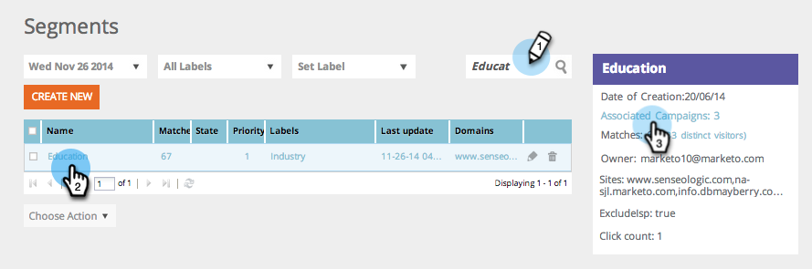

# Buscar Campañas Web que utilizan un segmento específico {#find-web-campaigns-that-are-using-a-specific-segment}

¿Busca campañas web que utilicen un segmento específico?

1. Vaya a **Segmentos**.

   

1. Busque un **segmento**. Seleccione el **Nombre del segmento**. En el panel derecho, haga clic en **Campañas asociadas** para vista de las campañas asociadas a este segmento específico.

   

1. Vista las **Campañas** asociadas con el segmento seleccionado.

   

>[!MORELIKETHIS]
>
>Obtenga más información sobre [segmentos](/help/marketo/product-docs/web-personalization/using-web-segments/web-segments.md) y cómo [crear un segmento básico](/help/marketo/product-docs/web-personalization/using-web-segments/create-a-basic-web-segment.md).
