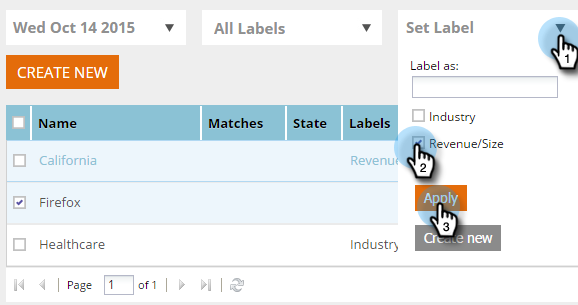

# Etiquetar El Segmento {#label-your-segment}

¿Tiene tantos segmentos que el desplazamiento se está volviendo engorroso? Utilice etiquetas para etiquetar los segmentos de modo que pueda encontrarlos rápidamente.

## Etiquetado de segmentos {#tag-a-segment}

1. Inicie sesión en Web Personalization y vaya a **Segmentos**.

   

1. Seleccione los segmentos que desea etiquetar con una etiqueta.

   

1. Para usar una etiqueta existente, haz clic en **Establecer etiqueta**, marca una casilla y haz clic en **Aplicar**.

   

1. O bien, para crear una etiqueta nueva, haga clic en **Establecer etiqueta**, escriba el nombre de la etiqueta nueva y haga clic en **Crear nueva**.

   

   >[!NOTE]
   >
   >El botón Crear nueva muestra el nombre de la etiqueta nueva. Si la etiqueta es demasiado larga, es posible que &quot;Crear nuevo&quot; no aparezca allí.

¡Genial! Ahora sabe cómo asignar y crear etiquetas para segmentos.
