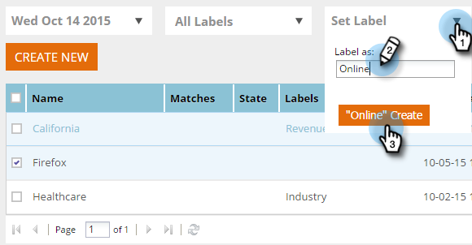

# Etiquetar el segmento {#label-your-segment}

¿Tiene tantos segmentos que el desplazamiento se está volviendo complicado? Utilice etiquetas para etiquetar los segmentos de modo que pueda encontrarlos rápidamente.

## Etiquetar un segmento {#tag-a-segment}

1. Inicie sesión en Personalización Web y vaya a **Segmentos**.

   

1. Seleccione los segmentos que desee etiquetar con una etiqueta.

   

1. Para utilizar una etiqueta existente, haga clic en **Establecer etiqueta**, marque una casilla y haga clic en **Aplicar**.

   

1. O bien, para crear una nueva etiqueta, haga clic en **Establecer etiqueta**, escriba el nuevo nombre de la etiqueta y haga clic en **Crear nueva**.

   

   >[!NOTE]
   >
   >El botón Crear nuevo muestra el nombre de la nueva etiqueta. Si la etiqueta es demasiado larga, puede que &quot;Crear nuevo&quot; no aparezca allí.

¡Genial! Ahora sabe cómo asignar y crear etiquetas para segmentos.
