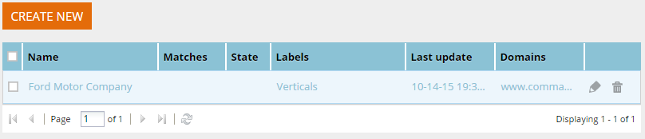

# Ver segmentos desde una etiqueta específica {#view-segments-from-a-specific-label}

¿Quiere ver y filtrar sus segmentos según una etiqueta específica?

## Filtrar por etiquetas existentes {#filter-by-existing-labels}

En la lista desplegable de etiquetas, seleccione la etiqueta que desee.

Genial, ¿se ha dado cuenta de que ahora solo le mostramos los segmentos asociados a la etiqueta seleccionada?

