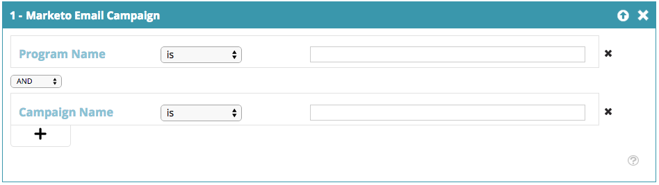

# Segmentos Web {#web-segments}

## Segmento de vista {#view-segment}

La ficha Segmentos muestra todos los segmentos definidos personalizados que configuró en función de varios atributos.  **Un segmento es una colección de visitantes que cumplen los criterios especificados definidos en la página ‘Definir un segmento’.**  Un segmento puede ser visitantes de una industria, ubicación o según la actividad en el sitio del visitante.

En Personalización web, un visitante puede coincidir con más de un segmento. Por ejemplo, si hay un segmento para visitantes estadounidenses y otro para compañías financieras, un visitante web de Bank of America coincidiría con **tanto** el segmento para visitantes estadounidenses como el segmento para compañías financieras.

**GRÁFICO:**  La página Segmentos muestra un gráfico de barras de los segmentos seleccionados según el número de visitantes del segmento (eje y) y el nombre del segmento (eje x).

<table> 
 <thead> 
  <tr> 
   <th colspan="1" rowspan="1">Nombre</th> 
   <th colspan="1" rowspan="1">Descripción</th> 
  </tr> 
 </thead> 
 <tbody> 
  <tr> 
   <td colspan="1" rowspan="1"><strong>Nombre</strong></td> 
   <td colspan="1" rowspan="1">Título del segmento</td> 
  </tr> 
  <tr> 
   <td colspan="1" rowspan="1">
<strong>Coincidencias</strong>
</td> 
   <td colspan="1" rowspan="1">El número de visitantes que cumplen los criterios personalizados y definidos del segmento</td> 
  </tr> 
  <tr> 
   <td colspan="1" rowspan="1"><strong>Definir Campaña</strong></td> 
   <td colspan="1" rowspan="1">Permite configurar una llamada a acción de Campaña asociada con el término de búsqueda seleccionado</td> 
  </tr> 
  <tr> 
   <td colspan="1"><strong>Visitantes</strong></td> 
   <td colspan="1">Una previsualización de la tabla de visitantes asociada con el término de búsqueda seleccionado</td> 
  </tr> 
  <tr> 
   <td colspan="1" rowspan="1"><strong>Clickstream</strong></td> 
   <td colspan="1" rowspan="1">Muestra una tabla de la actividad del visitante y la ruta de URL en el sitio y el tiempo que han visitado cada página </td> 
  </tr> 
 </tbody> 
</table>

Consulte [cómo crear y vista de etiquetas de segmentos](label-your-segment.md)

**Segmentos: panel derecho**

Al seleccionar un segmento en la tabla, se muestran detalles adicionales sobre el segmento en el panel derecho.

Estos detalles incluyen:

* Nombre del segmento
* Fecha de creación del segmento
* Las campañas asociadas que muestran las campañas que funcionan con el segmento. Al hacer clic en el número de reacciones, se abre la página campañas que muestra la llamada a acción de Campaña para el segmento
* El número de coincidencias (cantidad de visitantes que cumplen los criterios del segmento) para el segmento y el número de visitantes distintos (únicos) que coincidieron con el segmento. Al hacer clic en el vínculo de visitante único se accede a la página del visitante que muestra los resultados del segmento
* Creador propietario/usuario del segmento
* Los sitios de dominio asociados con el segmento
* Breve resumen de los criterios seleccionados del segmento

## Habilitar o deshabilitar un segmento {#enable-or-disable-a-segment}

Para habilitar o deshabilitar un segmento, seleccione la casilla de verificación de ese segmento en la tabla y, en la casilla desplegable &quot;Elegir acción&quot; en la parte inferior de la tabla, seleccione la acción &quot;Habilitar&quot; o &quot;Deshabilitar&quot;. Cuando se deshabilita un segmento, la palabra &quot;deshabilitar&quot; aparece en la columna Estado.

## Crear segmentos {#create-segments}

El segmento que cree cumple los criterios específicos que defina en la página **Definir segmento**. También puede personalizar los segmentos en función de una combinación de criterios, dirigiéndose a una audiencia específica de la campaña.

Para crear un nuevo segmento

En la página **Segmentos**, haga clic en **Crear nuevo** debajo del gráfico. Aparece la siguiente pantalla.

Defina los parámetros generales del segmento:

* **Nombre:**  asigne un nombre al segmento.
* **Descripción:**  proporcione una explicación más detallada de los criterios del segmento.
* **Dominios:**  seleccione los dominios que desee incluir en el segmento.
* **Lógica de regla de segmento:**  seleccione una lógica Y / O para generar cada atributo de segmentación
* **Temporización:** defina el nivel de compromiso de visitante que desee en la campaña

   * **Entrada**: La participación del visitante llega al sitio web
   * **Después del primer - noveno clic**: Participación del visitante después de una cantidad específica de clics en el sitio web

>[!TIP]
>
>**Lógica de regla de segmento**
>
>Existen tres opciones de filtro:
>
>1. Usar todos los Filtros (1 y 2 y 3...)
>1. Usar cualquier Filtros (1, 2 o 3...)
>1. Filtros avanzados (uso y/o expresiones)

   >
   >    
   Los filtros avanzados le permiten controlar la condición del segmento. Introduzca los números de filtro separados por &quot;y&quot; y &quot;o&quot;.
   >
   >    
   * 1 y 2 y 3
   >    * 1 o 2 o 3

   >
   La combinación de &quot;y&quot; y &quot;o&quot; requiere paréntesis para aclarar la intención lógica. p. ej. &quot;1 ó 2 y 3&quot; deberá escribirse como uno de los siguientes:

   * 1 y (2 o 3)
   * (1 y 2) o 3

   Se aceptan paréntesis anidados para una lógica más complicada, por ejemplo:

   * (1 y 2) o (3 y 4)
   * 1 y (2 o (3 y 4)

   Compruebe la lógica después de insertar, eliminar o reordenar.

Arrastre y suelte los atributos del segmento desde la columna del lado derecho en el editor de segmentos del lado izquierdo:

### Firmographics {#firmographics}

**Ubicación**

Arrastre y suelte **Ubicación** en el editor de segmentos.

* Seleccione uno de los parámetros siguientes:

   * **Incluir** : seleccione si desea que la campaña incluya o excluya una ubicación.
   * **Seleccione el país que desee agregar** : en el cuadro desplegable, seleccione el país que desee incluir en el segmento. El nombre del país aparece a la derecha. Puede elegir varios países.

Una vez agregado el país, también puede especificar el estado, la ciudad y el código postal del segmento.

* **Seleccione Estado o provincia para agregar** : en el cuadro desplegable, seleccione el estado de EE.UU. o la provincia canadiense que desee incluir. Puede realizar varias selecciones.
* **Código**  postal: introduzca el código postal que desea incluir en el segmento.
* **Ciudades** - Introduzca la ciudad o ciudades que desee incluir. Utilice un punto y coma entre las ciudades.

>[!TIP]
>
>**¿Qué condiciones de segmento elijo? ¿‘AND’ o ‘OR’?** O funciona como una opción adicional dentro de cada campo. Los clientes potenciales solo necesitan cumplir un criterio de los múltiples criterios seleccionados dentro de cada campo para poder calificar para el segmento. (Por ejemplo, los clientes potenciales pueden ser de EE.UU. *o* de la industria de defensa). Y funciona como un parámetro obligatorio adicional que debe cumplirse para este segmento. (Por ejemplo, los clientes potenciales deben ser tanto de EE.UU. como de la industria de defensa). Dentro de cada perfil de segmentación, cada campo por separado puede funcionar como ambos, ya sea &quot;Y&quot; o &quot;O&quot;, dependiendo de la condición de segmento seleccionada.

**** IndustriasEn la sección  **Perfil** Segmentación, marque la casilla junto a  **Industria**.

* Seleccione uno de los parámetros siguientes:

   * **Incluye** : seleccione si desea que el segmento incluya o excluya un sector.
   * **Seleccionar industrias para agregar** : seleccione la industria que desee incluir en el segmento. El sector aparece debajo del cuadro desplegable. Puede elegir varias industrias.

**Grupo de organización**

En la sección **Segmentación de Perfil**, marque la casilla junto a **Grupo de organización.**

* En el cuadro desplegable, seleccione una de las siguientes opciones:

   * Fortune 500: incluye solo compañías de Fortune 500 en este segmento
   * Fortune 1000: incluye solo compañías de Fortune 1000 en este segmento
   * Global 2000 - Incluye las compañías de Global 2000 en este segmento
   * Empresa: incluye organizaciones con más de 1.000 empleados e ingresos buenos por más de 250 millones de dólares
   * SMB: solo incluye pequeñas y medianas empresas en este segmento

**Cuentas con nombre**

**Organizaciones**

* **Es de estas compañías (nombres específicos)**

   * Seleccione compañía a destinatario en la lista desplegable &#39;Seleccionar compañía para agregar&#39;.
   * Puede escribir el nombre exacto de la organización que desee destinatario. *Siempre *se recomienda utilizar Listas de cuenta con nombre en lugar de escribir los nombres manualmente para obtener mejores coincidencias (ver más abajo).*

**Lista de cuenta con nombre**

Seleccione una [Lista de cuenta con nombre](../../../product-docs/web-personalization/account-based-web-marketing/create-a-new-account-list.md) para segmentar las cuentas con objetivo clave

>[!NOTE]
>
>El número entre corchetes junto al nombre de la Lista de cuenta con nombre se utiliza como referencia de índice para la lista de la API de lectura [de personalización de Web](https://developers.marketo.com/documentation/websites/rtp-js-api/).

**Excluir ISP**

Excluye a los Proveedores de servicio de Internet (ISP) del segmento.

### Personas conocidas {#known-people}

**Base de datos**

La personalización de Web se integra con la base de datos de Marketing, lo que le permite segmentar y personalizar campañas según los datos y atributos de las personas conocidas.

Seleccione Base de datos y seleccione un campo de datos de persona en la lista desplegable. Seleccione el   **+** para agregar campos desde la lista desplegable.

Puede agregar o quitar campos de datos de personas de Configuración de cuenta > Base de datos

>[!TIP]
>
>Cree los criterios del segmento según todos los campos de datos de persona desde Personas con marketing como, por ejemplo, Cargo de trabajo; Puntuación; Función; etc...
>
>Por ejemplo: &quot;Puesto de trabajo es igual a CMO&quot; y &quot;Puntuación es menor o igual a 50&quot;

**Campaña de marketing por correo electrónico** Segmentar y personalizar campañas mediante referencia por correo electrónico desde un visitante que hace clic en un correo electrónico de marketing y llega al sitio. Segmento por nombre de Programa de marketing o nombre de Campaña y continúe la conversación de correo electrónico a Web. Seleccione + para agregar campos en la lista desplegable.

**Estado**

Defina el segmento según el estado del cliente potencial: conocido o anónimo.

* Conocido: seleccione esta opción en el cuadro desplegable para visitantes conocidos. Se conoce un visitante cuando envía un formulario a su sitio web y aparece en la página Personas con Personalización web.
* Anónimo: seleccione esta opción en el cuadro desplegable para visitantes anónimos.

### Comportamiento {#behavioral}

**Visitas:** defina el segmento según el comportamiento del visitante o la identificación.

* Número de visitas: seleccione esta opción en el cuadro desplegable para especificar el número de visitas para clientes potenciales en el sitio web.

   * Seleccione Igual a, Igual a o Bueno que, o Igual a o Menor que en el cuadro desplegable.

* Visitas específicas: seleccione esta opción en el cuadro desplegable para especificar un visitante específico.

   * En el cuadro de texto de la derecha, escriba el número de visitante que desee rastrear. El número de identificación exclusivo del visitante de personalización web se puede encontrar al hacer clic en un visitante (en la página visitantes) y en la Campaña de conjunto en el panel derecho. El ID de Visitante se encuentra en la sección Configuración avanzada. El ID de visitante también se encuentra en la URL (por ejemplo: VISITANTE=JZZJIFJNUI60PZ8Y97BHTY9BL8PKWS).

**Términos**  de búsqueda: defina un segmento según los términos de búsqueda de un cliente potencial.

* El visitante buscado: en la lista desplegable, seleccione los términos que desee rastrear en la búsqueda de visitantes o agregue sus propios términos de búsqueda. (No es necesario el comodín * en los términos de búsqueda, ya que se configura como predeterminado para incluir frases que contengan el término de búsqueda).

**Referencias** : Añada las direcciones URL por las que se hizo referencia al visitante.

* Seleccionar referencias para agregar: en la lista desplegable, seleccione los sitios de referencia que desee rastrear o agregue su propia referencia. Una vez seleccionados, los referentes aparecerán en el cuadro de abajo. (Se permite el uso de * como comodín)

**Incluir páginas** : realice un seguimiento de los clientes potenciales de páginas específicas visitados en el sitio web.

* Coincidencias de URL: Añada la dirección URL de las páginas web específicas que desee rastrear. Puede agregar varias direcciones URL separándolas con un punto y coma. (Se permite el uso de * como comodín).

**Excluir páginas** : excluya las páginas específicas que no desee que coincidan en el segmento. (Se permite el uso de * como comodín).

* La dirección URL no coincide: Añada la dirección URL de páginas web específicas que desee excluir del seguimiento. Puede agregar varias direcciones URL separándolas con un punto y coma

### Dispositivo/Explorador {#device-browser}

**Sistema operativo móvil**

Arrastre y suelte Mobile OS en el editor de segmentos

* **Tipo de visitante**

   **Sistema operativo**  móvil: en el cuadro desplegable, seleccione uno o varios sistemas operativos móviles. El sistema operativo móvil seleccionado aparece a continuación.

   * El visitante utiliza cualquier dispositivo móvil
   * El visitante utiliza este dispositivo o sistema operativo específico
   * El visitante no utiliza ningún dispositivo móvil

* **Dispositivo**  : en la lista desplegable, seleccione uno o varios dispositivos (Apple, Samsung, LG, HTC, Nexus, Blackberry, etc.). Los dispositivos seleccionados aparecen a continuación.

**Explorador**

Visitante de destinatario que utiliza tipos y/o versiones de explorador específicos.

* Tipo de explorador: en el cuadro desplegable, seleccione uno o varios exploradores de Internet. Los exploradores seleccionados aparecen a continuación.
* Versión del explorador: introduzca la versión del explorador que desea agregar al segmento. Puede seleccionar varias versiones separándolas con una coma. (Se permite el uso de * como comodín).

### API {#api}

**Eventos**  de datos: visitantes de segmentos que déclencheur Eventos de datos personalizados específicos

Añada el valor de Evento que desee destinatario. Por ejemplo, de fuentes de datos de terceros.

**API de contexto de usuario**

Llamada de API de personalización web [lea más aquí.](https://developers.marketo.com/documentation/websites/rtp-user-context-api/)

>[!TIP]
>
>**Uso de comodines:** cuando desee incluir cualquier término de búsqueda o dirección URL que contenga algo dentro de él, por ejemplo: &quot;[google.com](https://google.com)&quot; o &quot;search term product&quot;, llamamos a esto comodín y debería introducirse con un asterisco - este pequeño tipo* - en cada extremo. Así que todo lo que venga de [google.com](https://google.com) debe introducirse como * [google.com](https://google.com)*

## Editar segmentos {#edit-segments}

Puede editar un segmento que se haya creado.

1. Para editar un segmento, vaya a **Segmentos**.

   

1. En la tabla **Segmentos**, haga clic en el icono de edición ( ) del segmento que desee editar. Se abre la página **Definir segmento** con el segmento seleccionado.
1. Aplique las modificaciones o cambios que desee realizar en el segmento.
1. Haga clic en **Guardar**.

## Eliminar segmentos {#delete-segments}

Puede eliminar segmentos que haya creado.

1. En la página **Segmentos** anterior, seleccione un segmento.
1. Haga clic en el icono Eliminar (  ) del segmento que desee eliminar.
1. Aparece un mensaje de confirmación que confirma que está a punto de eliminar el **segmento**.

>[!NOTE]
No se puede eliminar un segmento asociado a una campaña. Primero debe eliminar la campaña y luego el segmento.

¡bueno! Ahora que comprende la sección Segmentos, vamos a conocer las campañas.

>[!MORELIKETHIS]
* [Crear un segmento Web básico](create-a-basic-web-segment.md)
* [Crear una nueva Campaña web de cuadro de diálogo](../../../product-docs/web-personalization/working-with-web-campaigns/create-a-new-dialog-web-campaign.md)
* [Crear una nueva Campaña web en la zona](../../../product-docs/web-personalization/working-with-web-campaigns/create-a-new-in-zone-web-campaign.md)
* [Crear una nueva Campaña Web de utilidades](../../../product-docs/web-personalization/working-with-web-campaigns/create-a-new-widget-web-campaign.md)

