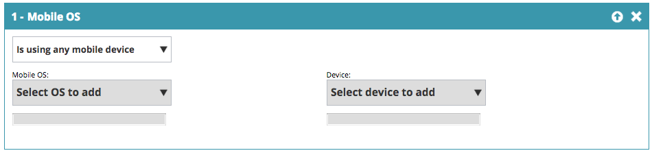

# Segmentos web {#web-segments}

## Ver segmento {#view-segment}

La pestaña Segmentos muestra todos los segmentos definidos personalizados que ha configurado en función de varios atributos.  **Un segmento es un conjunto de visitantes que cumplen los criterios especificados definidos en la página &#39;Establecer un segmento&#39;.** Un segmento puede ser de visitantes de una industria, ubicación o en función de la actividad en el sitio del visitante.

En [!DNL Web Personalizatio] , un visitante puede coincidir con más de un segmento. Por ejemplo, si hay un segmento para visitantes de EE. UU. y otro para empresas financieras, un visitante web de Bank of America coincidiría con **tanto** el segmento para visitantes de EE. UU. como el segmento para empresas financieras.

**GRÁFICO:** La página Segmentos muestra un gráfico de barras de los segmentos seleccionados de acuerdo con el número de visitantes del segmento (eje y) y el nombre del segmento (eje x).

<table>
 <thead>
  <tr>
   <th colspan="1" rowspan="1">Nombre</th>
   <th colspan="1" rowspan="1">Descripción</th>
  </tr>
 </thead>
 <tbody>
  <tr>
   <td colspan="1" rowspan="1"><strong>Nombre</strong></td>
   <td colspan="1" rowspan="1">El título del segmento</td>
  </tr>
  <tr>
   <td colspan="1" rowspan="1">
<strong>Coincidencias</strong>
</td>
   <td colspan="1" rowspan="1">El número de visitantes que cumplen los criterios personalizados y definidos del segmento</td>
  </tr>
  <tr>
   <td colspan="1" rowspan="1"><strong>Definir campaña</strong></td>
   <td colspan="1" rowspan="1">Permite configurar una CTA de campaña asociada al término de búsqueda seleccionado</td>
  </tr>
  <tr>
   <td colspan="1"><strong>Visitantes</strong></td>
   <td colspan="1">Vista previa de la tabla de visitantes asociada al término de búsqueda seleccionado</td>
  </tr>
  <tr>
   <td colspan="1" rowspan="1"><strong>Flujo de navegación</strong></td>
   <td colspan="1" rowspan="1">Muestra una tabla de la actividad y la ruta URL del visitante en el sitio, así como la duración de su visita a cada página </td>
  </tr>
 </tbody>
</table>

Ver [cómo crear y ver etiquetas de segmentos](/help/marketo/product-docs/web-personalization/using-web-segments/label-your-segment.md)

**Segmentos - Panel derecho**

Al seleccionar un segmento en la tabla, se muestran detalles adicionales sobre el segmento en el panel derecho.

Estos detalles incluyen:

* Nombre del segmento
* Fecha de creación del segmento
* Las campañas asociadas que muestran las campañas que operan con el segmento. Al hacer clic en el número de reacciones, accederá a la página de campañas que muestra Campaign CTA (Call to action) para el segmento
* El número de coincidencias (cantidad de visitantes que cumplieron los criterios del segmento) para el segmento y el número de visitantes distintos (únicos) que coincidieron con el segmento. Al hacer clic en el vínculo de visitante único, accederá a la página del visitante donde se muestran los resultados del segmento
* El propietario/creador de usuario del segmento
* Los sitios de dominio asociados con el segmento
* Un breve resumen de los criterios seleccionados del segmento

## Habilitar o deshabilitar un segmento {#enable-or-disable-a-segment}

Para habilitar o deshabilitar un segmento, seleccione la casilla de verificación de ese segmento en la tabla y en el cuadro desplegable &quot;[!UICONTROL Elegir acción]&quot; en la parte inferior de la tabla, seleccione la acción &quot;[!UICONTROL Habilitar]&quot; o &quot;[!UICONTROL Deshabilitar]&quot;. Cuando un segmento está deshabilitado, se muestra la palabra &quot;deshabilitar&quot; en la columna [!UICONTROL Estado].

## Crear segmentos {#create-segments}

El segmento que cree cumple con los criterios específicos que defina en la página **[!UICONTROL Establecer segmento]**. También puede personalizar los segmentos en función de una combinación de criterios y segmentar una audiencia específica en la campaña.

Para crear un nuevo segmento

En la página **[!UICONTROL Segmentos]**, haga clic en **[!UICONTROL Crear nuevo]** debajo del gráfico. Aparece la siguiente pantalla.

Defina parámetros generales para el segmento:

* **Nombre:** Asigne un nombre al segmento.
* **Descripción:** Proporcione una explicación más detallada de los criterios del segmento.
* **Dominios:** Seleccione los dominios que desea incluir en el segmento.
* **Lógica de regla de segmento:** Seleccione una lógica AND/OR para generar cada atributo de segmentación
* **Horario:** Defina el nivel de participación del visitante que desea en su campaña

   * **En la entrada**: el compromiso del visitante llega al sitio web
   * **Después del primer a noveno clic**: Capte al visitante después de una cantidad específica de clics en el sitio web

>[!TIP]
>
>**Lógica de regla de segmento**
>
>Hay tres opciones de filtro:
>
>1. Usar todos los filtros (1 y 2 y 3...)
>1. Utilice cualquier filtro (1, 2 o 3...)
>1. Filtros avanzados (con expresiones y/o )
>
>    Los filtros avanzados permiten controlar la condición del segmento. Introduzca los números de filtro separados por &quot;and&quot; y &quot;or&quot;.
>
>    * 1 y 2 y 3
>    * 1, 2 o 3
>
>    La combinación de &quot;y&quot; y &quot;o&quot; requiere paréntesis para aclarar la intención lógica. Por ejemplo, &quot;1 o 2 y 3&quot; debe escribirse de una de las siguientes maneras:
>
>    * 1 y (2 o 3)
>    * (1 y 2) o 3
>
>    Los paréntesis anidados se aceptan para lógicas más complicadas.
>
>    * (1 y 2) o (3 y 4)
>    * 1 y (2 o (3 y 4))
>
>    Compruebe la lógica después de insertar, eliminar o reordenar.

Arrastre y suelte los atributos de segmento de la columna derecha en el editor de segmentos de la izquierda:

### Firmografía {#firmographics}

**Ubicación**

Arrastre y suelte **[!UICONTROL Location]** en el editor de segmentos.

* Seleccione entre los siguientes parámetros:

   * **[!UICONTROL Incluir]** - Seleccione si desea que la campaña incluya o excluya una ubicación.
   * **[!UICONTROL Seleccione el país que desea agregar]**: en el cuadro desplegable, seleccione el país que desea incluir en el segmento. El nombre del país aparece a la derecha. Puede elegir varios países.

Una vez agregado el país, también puede especificar el estado, la ciudad y el código postal del segmento.

* **[!UICONTROL Seleccione el estado o la provincia que desea agregar]**: en el cuadro desplegable, seleccione el estado de EE. UU. o la provincia de Canadá que desee incluir. Puede realizar varias selecciones.
* **[!UICONTROL Código postal]**: escriba el código postal que desee incluir en el segmento.
* **[!UICONTROL Ciudades]** - Escriba la ciudad o ciudades que desee incluir. Utilice un punto y coma entre ciudades.

>[!TIP]
>
>**¿Qué condiciones de segmento elijo? ¿&#39;Y&#39; u &#39;O&#39;?** OR funciona como una opción adicional dentro de cada campo. Los clientes potenciales solo tienen que cumplir uno de los criterios seleccionados en cada campo para poder acceder al segmento. (Por ejemplo, los clientes potenciales pueden ser de EE. UU. *o* de la industria de defensa). Y funciona como un parámetro obligatorio adicional que debe cumplirse para este segmento. (Por ejemplo, las perspectivas deben ser tanto de Estados Unidos como de la industria de Defensa). Dentro de cada perfil de segmentación, cada campo independiente puede funcionar como ambos, ya sea como &quot;Y&quot; u &quot;O&quot; según la Condición del segmento seleccionada.

**Industrias** En la sección **[!UICONTROL Segmentación de perfiles]**, marque la casilla junto a **[!UICONTROL Industria]**.

* Seleccione entre los siguientes parámetros:

   * **[!UICONTROL Incluye]**: seleccione si desea que el segmento incluya o excluya un sector.
   * **[!UICONTROL Seleccionar sectores que agregar]** - Seleccione el sector que desee incluir en el segmento. El sector aparece debajo del cuadro desplegable. Puede elegir varias industrias.

**Grupo de organización**

En la sección **[!UICONTROL Segmentación de perfiles]**, marque la casilla junto a **[!UICONTROL Grupo de organización].**

* En el cuadro desplegable, seleccione una de las siguientes opciones:

   * Fortune 500: incluye solo las compañías de Fortune 500 en este segmento
   * Fortune 1000: incluye solo las compañías de Fortune 1000 en este segmento
   * Global 2000: incluye las empresas de Global 2000 en este segmento
   * Empresa: incluye organizaciones con más de 1000 empleados e ingresos superiores a 250 millones de dólares
   * SMB: sólo incluye pequeñas y medianas empresas en este segmento

Cuentas con nombre de **-**

**Organizaciones**

* **Es de estas empresas (nombres específicos)**

   * Seleccione la empresa de destino en la lista desplegable &quot;Seleccionar empresa para agregar&quot;.
   * Puede escribir el nombre exacto de la organización a la que desea dirigirse. *Se recomienda *siempre* usar Listas de cuentas con nombre en lugar de escribir los nombres manualmente para obtener mejores coincidencias (ver a continuación).

**Lista de cuentas con nombre**

Seleccione de una [lista de cuentas con nombre](/help/marketo/product-docs/web-personalization/account-based-web-marketing/create-a-new-account-list.md) para segmentar cuentas de destino clave.

>[!NOTE]
>
>El número entre corchetes junto al nombre de la lista de cuentas con nombre se usa como referencia de índice para la lista de Web Personalization [Read API](https://experienceleague.adobe.com/es/docs/marketo-developer/marketo/javascriptapi/web-personalization).

**Excluir ISP**

Excluye a los proveedores de servicios de Internet (ISP) del segmento.

### Personas conocidas {#known-people}

**[!UICONTROL Base de datos]**

[!DNL Web Personalization] se integra con su base de datos de Marketo, lo que le permite segmentar y personalizar campañas por atributos y datos de personas conocidas.

Seleccione Base de datos y seleccione un campo de datos de persona de la lista desplegable. Seleccione **+** para agregar campos de la lista desplegable.

Puede agregar o quitar campos de datos de personas desde Configuración de cuenta > Base de datos

>[!TIP]
>
>Cree sus criterios de segmento según todos los campos de datos de personas de Marketo, como puesto de trabajo, puntuación, función, etc.
>
>P. ej. &quot;Puesto igual a CMO&quot; y &quot;Puntuación menor o igual a 50&quot;

**[!UICONTROL Campaña de correo electrónico de Marketo]** Segmente y personalice campañas por referencia de correo electrónico de un visitante que hace clic en un correo electrónico de Marketo y llega al sitio. Segmente por nombre de programa de Marketo o de campaña y continúe la conversación desde el correo electrónico a la web. Seleccione el signo + para añadir campos de la lista desplegable.

**[!UICONTROL Estado]**

Defina su segmento según el estado de un cliente potencial: conocido o anónimo.

* Conocido: seleccione esta opción en el cuadro desplegable para visitantes conocidos. Un visitante es conocido cuando envía un formulario en su sitio web y aparece en la página [!DNL Web Personalization] [!UICONTROL Personas].
* Anónimo: seleccione esta opción en el cuadro desplegable para visitantes anónimos.

### De comportamiento {#behavioral}

**[!UICONTROL Visitas] -** Defina su segmento de acuerdo con el comportamiento o la identificación del visitante.

* Número de visitas: seleccione esta opción en el cuadro desplegable para especificar el número de visitas de los posibles clientes en el sitio web.

   * Seleccione Igual, Igual o Mayor que, o Igual o Menor que en el cuadro desplegable.

* Visitas específicas: seleccione esta opción en el cuadro desplegable para especificar un visitante específico.

   * En el cuadro de texto de la derecha, introduzca el número de visitante que desea rastrear. Se puede encontrar el número de identificación único de visitante [!DNL Web Personalization] al hacer clic en un visitante (en la página de visitantes) y en Establecer campaña en el panel lateral derecho. El ID de visitante se encuentra en la sección Configuración avanzada. El ID de visitante también se puede encontrar en la dirección URL (por ejemplo, VISITOR=JZZJIFJNUI60PZ8Y97BHTY9BL8PKWS).

**Términos de búsqueda**: defina un segmento de acuerdo con los términos de búsqueda de un cliente potencial.

* El visitante buscó: en la lista desplegable, seleccione los términos que desee rastrear en la búsqueda de visitantes o agregue sus propios términos de búsqueda. (No es necesario el comodín &#42; en los términos de búsqueda, ya que está establecido como predeterminado para incluir frases que contienen el término de búsqueda).

**[!UICONTROL Referencias]** - Agregar direcciones URL a las que se refirió el visitante.

* Seleccionar referencias que agregar: en la lista desplegable, seleccione los sitios de referencia que desee rastrear o agregue su propia referencia. Una vez seleccionadas, las referencias aparecerán en el cuadro siguiente. (Se permite usar &#42; como comodín)

**[!UICONTROL Incluir páginas]**: realiza un seguimiento de las páginas específicas que han visitado los posibles clientes en tu sitio web.

* Coincidencias de URL: añada la URL de las páginas web específicas que desea rastrear. Puede agregar varias direcciones URL separándolas con un punto y coma. (Se permite usar &#42; como comodín).

**[!UICONTROL Excluir páginas]**: excluye páginas específicas que no quieras que coincidan en el segmento. (Se permite usar &#42; como comodín).

* La URL no coincide: añada la URL de las páginas web específicas que desee excluir del seguimiento. Puede agregar varias direcciones URL separándolas con un punto y coma

### Dispositivo/Explorador {#device-browser}

**[!UICONTROL SO móvil]**

Arrastre y suelte el [!UICONTROL sistema operativo móvil] en el editor de segmentos

* **Tipo de visitante** 
  **[!UICONTROL Sistema operativo móvil]**: en el cuadro desplegable, seleccione uno o varios de los sistemas operativos móviles de la lista. El sistema operativo móvil seleccionado aparece a continuación.

   * El visitante utiliza cualquier dispositivo móvil
   * El visitante utiliza este dispositivo/SO específico
   * El visitante no utiliza ningún dispositivo móvil

* **[!UICONTROL Dispositivo]**: en la lista desplegable, seleccione uno o más dispositivos (Apple, Samsung, LG, HTC, Nexus, Blackberry, etc.). Los dispositivos seleccionados aparecen a continuación.

**Explorador**

Visitante de Target que utiliza tipos de explorador o versiones específicos.

* Tipo de explorador: en el cuadro desplegable, seleccione uno o varios exploradores de Internet Los exploradores seleccionados aparecen a continuación.
* Versión del explorador: introduzca la versión del explorador que desea añadir al segmento. Puede seleccionar varias versiones separándolas con una coma. (Se permite usar &#42; como comodín).

### API {#api}

**Eventos de datos** - Visitantes de segmentos que almacenan en déclencheur eventos de datos personalizados específicos

Añada el valor de Event que desee segmentar. Por ejemplo, de fuentes de datos de terceros.

**API de contexto de usuario**

Llamada de la API de Web Personalization [más información al respecto aquí.](https://experienceleague.adobe.com/es/docs/marketo-developer/marketo/javascriptapi/web-personalization)

>[!TIP]
>
>**Uso de caracteres comodín -** Cuando quiera incluir cualquier término de búsqueda o URL que contenga algo dentro de él, por ejemplo &quot;[google.com](https://google.com)&quot; o &quot;producto de término de búsqueda&quot;, llamamos a esto un comodín y se debe introducir con un asterisco (este pequeñín&#42;) en cada extremo. Así que cualquier cosa que provenga de [google.com](https://google.com) debe introducirse como &#42; [google.com](https://google.com)&#42;

## Editar [!UICONTROL segmentos] {#edit-segments}

Puede editar un segmento que se haya creado.

1. Para editar un segmento, vaya a **[!UICONTROL Segmentos]**.

   

1. En la tabla **[!UICONTROL Segmentos]**, haga clic en el icono de edición () del segmento que desea editar. La página **[!UICONTROL Establecer segmento]** se abre con el segmento seleccionado.
1. Aplique las ediciones o cambios que desee realizar en el segmento.
1. Haga clic en **[!UICONTROL Guardar]**.

## Eliminar segmentos {#delete-segments}

Puede eliminar los segmentos que ha creado.

1. En la página de arriba **[!UICONTROL Segmentos]**, seleccione un segmento.
1. Haga clic en el icono de eliminación (  ) del segmento que desea eliminar.
1. Aparece un mensaje de confirmación que confirma que está a punto de eliminar el **segmento**.

>[!NOTE]
>
>No puede eliminar un segmento asociado a una campaña. Primero debe eliminar la campaña y luego el segmento.

¡Excelente! Ahora que comprende la sección Segmentos, vamos a obtener más información sobre las campañas.

>[!MORELIKETHIS]
>
>* [Crear un segmento web básico](/help/marketo/product-docs/web-personalization/using-web-segments/create-a-basic-web-segment.md)
>* [Crear una nueva campaña web de diálogo](/help/marketo/product-docs/web-personalization/working-with-web-campaigns/create-a-new-dialog-web-campaign.md)
>* [Crear una nueva campaña web en la zona](/help/marketo/product-docs/web-personalization/working-with-web-campaigns/create-a-new-in-zone-web-campaign.md)
>* [Crear una nueva campaña web de widget](/help/marketo/product-docs/web-personalization/working-with-web-campaigns/create-a-new-widget-web-campaign.md)
