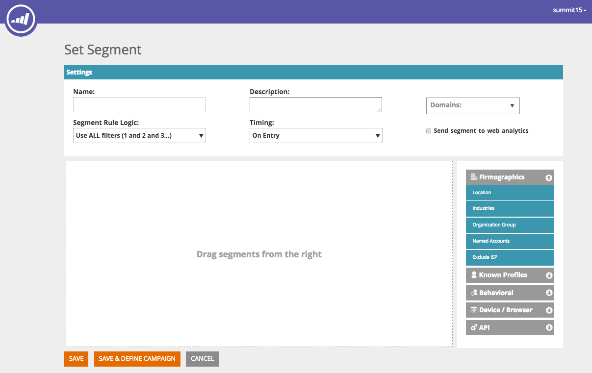

# Segmentos web {#web-segments}

## Ver segmento {#view-segment}

La ficha Segmentos muestra todos los segmentos definidos personalizados que ha configurado en función de distintos atributos.  **Un segmento es una colección de visitantes que cumplen los criterios especificados definidos en la página &quot;Establecer un segmento&quot;.**  Un segmento puede ser visitantes de una industria, ubicación o en función de la actividad en el sitio del visitante.

En la personalización web, un visitante puede coincidir con más de un segmento. Por ejemplo, si hay un segmento para visitantes de EE. UU. y un segmento para empresas financieras, un visitante web de Bank of America coincidiría **both** el segmento para visitantes de EE. UU. y el segmento para empresas financieras.

**GRÁFICO:**  La página Segmentos muestra un gráfico de barras de los segmentos seleccionados en función del número de visitantes del segmento (eje Y) y el nombre del segmento (eje x).

<table> 
 <thead> 
  <tr> 
   <th colspan="1" rowspan="1">Nombre</th> 
   <th colspan="1" rowspan="1">Descripción</th> 
  </tr> 
 </thead> 
 <tbody> 
  <tr> 
   <td colspan="1" rowspan="1"><strong>Nombre</strong></td> 
   <td colspan="1" rowspan="1">Título del segmento</td> 
  </tr> 
  <tr> 
   <td colspan="1" rowspan="1">
<strong>Coincide</strong>
</td> 
   <td colspan="1" rowspan="1">El número de visitantes que cumplen los criterios personalizados y definidos del segmento</td> 
  </tr> 
  <tr> 
   <td colspan="1" rowspan="1"><strong>Establecer campaña</strong></td> 
   <td colspan="1" rowspan="1">Permite configurar una llamada a acción de campaña asociada al término de búsqueda seleccionado</td> 
  </tr> 
  <tr> 
   <td colspan="1"><strong>Visitantes</strong></td> 
   <td colspan="1">Vista previa de la tabla de visitantes asociada al término de búsqueda seleccionado</td> 
  </tr> 
  <tr> 
   <td colspan="1" rowspan="1"><strong>Flujo de navegación</strong></td> 
   <td colspan="1" rowspan="1">Muestra una tabla de la actividad del visitante y la ruta URL en el sitio, así como el tiempo que ha visitado cada página </td> 
  </tr> 
 </tbody> 
</table>

Consulte [cómo crear y ver etiquetas de segmentos](/help/marketo/product-docs/web-personalization/using-web-segments/label-your-segment.md)

**Segmentos: panel derecho**

Al seleccionar un segmento en la tabla, se muestran detalles adicionales sobre el segmento en el panel derecho.

Estos detalles incluyen:

* Nombre del segmento
* Fecha de creación del segmento
* Campañas asociadas que muestran las campañas que operan con el segmento. Al hacer clic en el número de reacciones, accederá a la página de campañas que muestra el CTA de campaña (Llamada a acción) para el segmento
* El número de coincidencias (cantidad de visitantes que cumplieron los criterios del segmento) para el segmento y el número de visitantes diferentes (únicos) que coincidieron con el segmento. Al hacer clic en el vínculo de visitante único, accederá a la página del visitante que muestra los resultados del segmento
* El creador propietario/usuario del segmento
* Los sitios de dominio asociados al segmento
* Breve resumen de los criterios seleccionados del segmento

## Habilitar o deshabilitar un segmento {#enable-or-disable-a-segment}

Para habilitar o deshabilitar un segmento, seleccione la casilla de ese segmento en la tabla y, en el cuadro desplegable &quot;Elegir acción&quot; de la parte inferior de la tabla, seleccione la acción &quot;Habilitar&quot; o &quot;Deshabilitar&quot;. Cuando se deshabilita un segmento, la palabra &quot;deshabilitar&quot; aparece en la columna Estado .

## Crear segmentos {#create-segments}

El segmento que cree cumple los criterios específicos definidos en la variable **Definir segmento** página. También puede personalizar los segmentos en función de una combinación de criterios, dirigiéndose a una audiencia específica de la campaña.

Para crear un segmento nuevo

En el **Segmentos** página, haga clic en **Crear nuevo** en el gráfico. Aparece la siguiente pantalla.

Defina parámetros generales para su segmento:

* **Nombre:**  Asigne un nombre al segmento.
* **Descripción:**  Proporcione una explicación más detallada de los criterios del segmento.
* **Dominios:**  Seleccione los dominios que desee incluir en el segmento.
* **Lógica de regla de segmento:**  Seleccione una lógica AND / OR para crear cada atributo de segmentación
* **Temporización:** Defina el nivel de compromiso del visitante que desee en la campaña

   * **En la entrada**: Participación del visitante llega al sitio web
   * **Después de 1º a 9º clic**: Participación del visitante después de una cantidad específica de clics en el sitio web

>[!TIP]
>
>**Lógica de regla de segmento**
>
>Hay tres opciones de filtro:
>
>1. Utilizar todos los filtros (1 y 2 y 3...)
>1. Utilizar cualquier filtro (1, 2 o 3...)
>1. Filtros avanzados (con y / o expresiones)

   >
   >    Los filtros avanzados le permiten controlar la condición del segmento. Introduzca los números de filtro separados por &quot;y&quot; y &quot;o&quot;.
   >
   >    * 1 y 2 y 3
   >    * 1 o 2 o 3

   >
   >    La combinación de &quot;y&quot; y &quot;o&quot; requiere paréntesis para aclarar la intención lógica. p. ej. &quot;1 o 2 y 3&quot; deberá escribirse como uno de los siguientes:
   >
   >    * 1 y (2 o 3)
   >    * (1 y 2) o 3

   >
   >    Los paréntesis anidados se aceptan para una lógica más complicada, por ejemplo
   >
   >    * (1 y 2) o (3 y 4)
   >    * 1 y (2 o (3 y 4)

   >
   >    Compruebe la lógica después de cualquier inserción, eliminación o reordenación.

Arrastre y suelte los atributos de segmento desde la columna derecha hasta el editor de segmentos en el lado izquierdo:

### Firmografía {#firmographics}

**Ubicación**

Arrastrar y soltar **Ubicación** en el editor de segmentos.

* Seleccione entre los siguientes parámetros:

   * **Incluir** - Seleccione si desea que la campaña incluya o excluya una ubicación.
   * **Seleccione el país que desea agregar** - En el cuadro desplegable, seleccione el país que desee incluir en el segmento. El nombre del país aparece a la derecha. Puede elegir varios países.

Una vez agregado el país, puede especificar el estado, la ciudad y el código postal del segmento.

* **Seleccione el estado o la provincia que desee añadir** - En el cuadro desplegable, seleccione el estado de EE. UU. o la provincia canadiense que desee incluir. Puede realizar varias selecciones.
* **Código postal** - Introduzca el código postal que desea incluir en el segmento.
* **Ciudades** - Entrar en la ciudad o ciudades que desee incluir. Utilice un punto y coma entre ciudades.

>[!TIP]
>
>**¿Qué condiciones de segmento elijo? ¿Y u O?** O funciona como una opción adicional dentro de cada campo. Las perspectivas solo deben cumplir uno de los criterios de los múltiples criterios seleccionados dentro de cada campo para poder pertenecer al segmento. (Por ejemplo, los posibles clientes pueden provenir de EE. UU. *o* de la industria de defensa). AND funciona como un parámetro obligatorio adicional que debe cumplirse para este segmento. (Por ejemplo, las perspectivas deben ser tanto de EE.UU. como de la industria de defensa). Dentro de cada perfil de segmentación, cada campo independiente puede funcionar como ambos, un &quot;AND&quot; o un &quot;OR&quot; según la condición de segmento seleccionada.

**Sectores** En el **Segmentación de perfiles** , marque la casilla situada junto a **Industria**.

* Seleccione entre los siguientes parámetros:

   * **Incluye** - Seleccione si desea que el segmento incluya o excluya un sector.
   * **Seleccionar industrias para agregar** : seleccione el sector que desea incluir en el segmento. El sector aparece debajo del cuadro desplegable. Puede elegir varias industrias.

**Grupo de organizaciones**

En el **Segmentación de perfiles** , marque la casilla situada junto a **Grupo de organización.**

* En el cuadro desplegable, seleccione entre las siguientes opciones:

   * Fortune 500: incluye solo empresas de Fortune 500 en este segmento
   * Fortune 1000: incluye solo empresas de Fortune 1000 en este segmento
   * Global 2000 - Incluye a las empresas globales de 2000 en este segmento
   * Empresa: incluye organizaciones con más de 1.000 empleados e ingresos buenos a más de 250 millones de dólares
   * SMB: solo incluye pequeñas y medianas empresas en este segmento

**-Cuentas con nombre-**

**Organizaciones**

* **Es de estas empresas (nombres específicos)**

   * Seleccione la empresa a la que desea dirigirse en la lista desplegable &quot;Seleccionar empresa para agregar&quot;.
   * Puede escribir el nombre de organización exacto que desee segmentar. *Es _always_ Se recomienda utilizar Listas de cuentas con nombre en lugar de escribir los nombres manualmente para que haya mejores coincidencias (consulte a continuación).

**Lista de cuentas con nombre**

Seleccione una [Lista de cuentas con nombre](/help/marketo/product-docs/web-personalization/account-based-web-marketing/create-a-new-account-list.md) para segmentar cuentas de destino clave.

>[!NOTE]
>
>El número entre corchetes situado al lado del nombre de la lista de cuentas con nombre se utiliza como referencia de índice para la lista de personalización web [Leer API](https://developers.marketo.com/documentation/websites/rtp-js-api/).

**Excluir ISP**

Excluye a los proveedores de servicios de Internet (ISP) del segmento.

### Personas conocidas {#known-people}

**Base de datos**

La personalización web se integra con la base de datos de Marketo, lo que le permite segmentar y personalizar campañas según los datos y atributos de las personas conocidas.

Seleccione Database y, a continuación, un campo de datos de persona en la lista desplegable. Seleccione el **+** para agregar campos desde la lista desplegable.

Puede agregar o quitar campos de datos de personas de Configuración de la cuenta > Base de datos

>[!TIP]
>
>Cree sus criterios de segmento según todos los campos de datos de personas de Marketo como, por ejemplo, Cargo de trabajo; Puntuación; Función; etc...
>
>Por ejemplo. &quot;Puesto de trabajo es igual a CMO&quot; y &quot;Puntuación menor o igual que 50&quot;

**Campaña de correo electrónico de Marketo** Segmente y personalice campañas por referencia de correo electrónico de un visitante que hace clic en un correo electrónico de Marketo y llega al sitio. Segmente por nombre de programa de Marketo o nombre de campaña y continúe la conversación de correo electrónico a web. Seleccione + para añadir campos en la lista desplegable.

**Estado**

Defina su segmento según el estado de un cliente potencial: conocido o anónimo.

* Conocido : seleccione esta opción en el cuadro desplegable de visitantes conocidos. Un visitante es conocido cuando envía un formulario a su sitio web y aparece en la página Personas de personalización web .
* Anónimo : seleccione esta opción en el cuadro desplegable para visitantes anónimos.

### De comportamiento {#behavioral}

**Visitas -** Defina su segmento según el comportamiento del visitante o la identificación.

* Número de visitas : seleccione esta opción en el cuadro desplegable para especificar el número de visitas para los posibles clientes en el sitio web.

   * Seleccione Igual, Igual o Bueno que, Igual o Menor que en el cuadro desplegable.

* Visitas específicas : seleccione esta opción en el cuadro desplegable para especificar un visitante específico.

   * En el cuadro de texto de la derecha, introduzca el número de visitante que desee rastrear. El número de identificación de visitantes de Personalización web único se puede encontrar al hacer clic en un visitante (en la página de visitantes) y en el panel de la derecha Definir campaña . El ID de visitante se encuentra en la sección Configuración avanzada . El ID de visitante también se encuentra en la dirección URL (por ejemplo, VISITOR=JZZJIFJNUI60PZ8Y97BHTY9BL8PKWS).

**Términos de búsqueda** : Defina un segmento según los términos de búsqueda de un cliente potencial.

* El visitante buscado: en la lista desplegable, seleccione los términos que desee rastrear en la búsqueda de visitantes o agregue sus propios términos de búsqueda. (No es necesario el &#42; comodín en los términos de búsqueda, ya que está configurado como predeterminado para incluir frases que contienen el término de búsqueda).

**Referencias** - Añada las direcciones URL por las que se hizo referencia al visitante.

* Seleccionar referencias para agregar : en la lista desplegable, seleccione los sitios de referencia que desee rastrear o agregue su propio referente. Una vez seleccionados, los referentes aparecerán en el cuadro siguiente. (Uso de &#42; como comodín permitido)

**Incluir páginas** : rastree las páginas específicas que visitan los posibles clientes en su sitio web.

* Coincidencias de URL : agregue la dirección URL de las páginas web específicas que desee rastrear. Puede añadir varias direcciones URL separándolas con un punto y coma. (Uso de &#42; como comodín está permitido).

**Excluir páginas** - Excluya las páginas específicas que no desee que coincidan en el segmento. (Uso de &#42; como comodín está permitido).

* La dirección URL no coincide : Agregue la dirección URL de páginas web específicas que desee excluir del seguimiento. Puede añadir varias direcciones URL separándolas con un punto y coma

### Dispositivo/navegador {#device-browser}

**Sistema operativo móvil**

Arrastre y suelte el sistema operativo móvil en el editor de segmentos

* **Tipo de visitante** 

   **Sistema operativo móvil** - En el cuadro desplegable, seleccione uno o varios sistemas operativos móviles de la lista. El sistema operativo móvil seleccionado aparece a continuación.

   * El visitante está usando cualquier dispositivo móvil
   * El visitante está usando este dispositivo o sistema operativo específico
   * El visitante no utiliza ningún dispositivo móvil

* **Dispositivo**  - En la lista desplegable, seleccione uno o varios dispositivos (Apple, Samsung, LG, HTC, Nexus, Blackberry, etc.). Los dispositivos seleccionados aparecen a continuación.

**Navegador**

Segmente a los visitantes que usen tipos de explorador y/o versiones específicos.

* Tipo de explorador : en el cuadro desplegable, seleccione uno o varios exploradores de Internet . Los navegadores seleccionados aparecen a continuación.
* Versión del explorador : introduzca la versión del explorador que desea agregar al segmento. Puede seleccionar varias versiones separándolas con una coma. (Uso de &#42; como comodín está permitido).

### API {#api}

**Eventos de datos** - Segmentar a los visitantes que generan déclencheur en eventos de datos personalizados específicos

Añada el valor Event que desee establecer como objetivo. Por ejemplo, desde fuentes de datos de terceros.

**API de contexto de usuario**

Llamada de API de personalización web  [leer más sobre esto aquí.](https://developers.marketo.com/documentation/websites/rtp-user-context-api/)

>[!TIP]
>
>**Uso de comodines -** Cuando desee incluir cualquier término de búsqueda o dirección URL que contenga algo dentro de él, por ejemplo: &quot;[google.com](https://google.com)&quot; o &quot;producto de término de búsqueda&quot;, lo llamamos comodín y debería introducirse con un asterisco - este tipo pequeño&#42; - en cada extremo. Así que cualquier cosa que venga de [google.com](https://google.com) debe introducirse como &#42; [google.com](https://google.com)&#42;

## Editar segmentos {#edit-segments}

Puede editar un segmento que se haya creado.

1. Para editar un segmento, vaya a **Segmentos**.

   

1. En el **Segmentos** , haga clic en el icono de edición ( ) del segmento que desea editar. La variable **Definir segmento** se abre con el segmento seleccionado.
1. Aplique cualquier edición o cambio que desee realizar en el segmento.
1. Haga clic en **Guardar**.

## Eliminar segmentos {#delete-segments}

Puede eliminar segmentos que haya creado.

1. En el **Segmentos** más arriba, seleccione un segmento.
1. Haga clic en el icono Eliminar (  ) del segmento que desea eliminar.
1. Aparece un mensaje de confirmación que confirma que está a punto de eliminar la variable **Segmento**.

>[!NOTE]
>
>No puede eliminar un segmento asociado a una campaña. Primero debe eliminar la campaña y luego el segmento.

¡Excelente! Ahora que comprende la sección Segmentos , vamos a obtener más información sobre las campañas.

>[!MORELIKETHIS]
>
>* [Crear un segmento web básico](/help/marketo/product-docs/web-personalization/using-web-segments/create-a-basic-web-segment.md)
>* [Crear una nueva campaña web de cuadro de diálogo](/help/marketo/product-docs/web-personalization/working-with-web-campaigns/create-a-new-dialog-web-campaign.md)
>* [Crear una campaña web nueva en Zone](/help/marketo/product-docs/web-personalization/working-with-web-campaigns/create-a-new-in-zone-web-campaign.md)
>* [Crear una nueva campaña web en utilidades](/help/marketo/product-docs/web-personalization/working-with-web-campaigns/create-a-new-widget-web-campaign.md)

