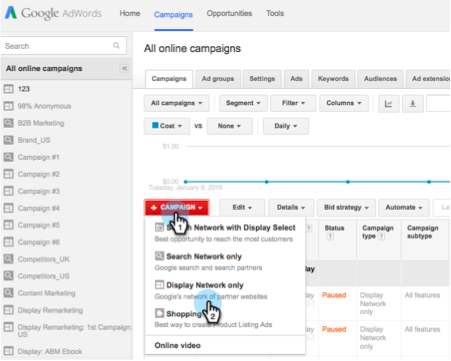

# Remercadotecnia personalizada en Google {#personalized-remarketing-in-google}

La remercadotecnia personalizada le permite volver a interactuar con los usuarios mediante los datos RTP y el poder de los Google Analytics con el alcance de la red de visualización de Google.

>[!PREREQUISITES]
>
>* Complete la configuración de [redireccionamiento con datos de personalización web](/help/marketo/product-docs/web-personalization/website-retargeting/retargeting-with-web-personalization-data.md)
>* Revise la [documentación de la ayuda](https://support.google.com/analytics/topic/2611283?hl=en&amp;ref_topic=3413645) de remercadotecnia con Google Analytics.

## Creación de una Audiencia de remercadotecnia en Google {#creating-a-remarketing-audience-in-google}

1. Inicie sesión en sus Google Analytics. Haga clic en **Administración**, **Cuenta**, **Propiedad**. Haga clic en **Definiciones de Audiencia** y **Audiencias**.

   

1. Haga clic en **+Nueva Audiencia**.

   

1. **Configuración** del vínculo: Vínculo a su cuenta de Google Adwords. **Definir Audiencia**: Haga clic en  **Crear nuevo**.

   

1. En el Generador de Audiencias, haga clic en **Secuencias** y **Buscar los datos de RTP** en Dimension personalizados, Variables personalizadas y Eventos.

>[!TIP]
>
>¿Cómo encontrar los datos RTP en Analytics para crear su audiencia?
>
>En Google Analytics:
>
>* Variables personalizadas: Organización, industria
>* Categoría de evento: Segmento, Insightera-CTA, Remercadotecnia RTP
>* Etiqueta de evento: Nombre del segmento, Nombre de la Campaña, Nombre de la Audiencia segmentada

>
>
En Google Universal Analytics:
>
>* Dimension personalizados: Organización, Industria, Categoría (Fortune 500.1000, Global 2000), Grupo (Enterprise, SMB), Lista ABM (Lista de cuentas con nombre)
>* Categoría de evento: RTP-Segmento, RTP-Campaña Remarketing
>* Etiqueta de evento: Nombre del segmento, Nombre de la Campaña, Nombre de la Audiencia segmentada

**Ejemplo de Audiencia de remercadotecnia a partir de datos de Audiencia segmentados de RTP**

1. Haga clic en **Secuencias.**
1. Seleccione **Etiqueta de Evento.**
1. Escriba **Nombre de la Audiencia segmentada** (tal como aparece en RTP).
1. Haga clic en **Aplicar**.

**Ejemplo de Audiencia de datos de la industria RTP**

1. Haga clic en **Secuencias**.
1. Seleccione **RTP-Industry**.
1. Escriba **Nombre de la industria** (p. ej. Servicios financieros, educación...).
1. Haga clic en **Aplicar**.
1. Escriba un **Nombre de Audiencia**. Haga clic en **Guardar**.

## Crear una Campaña de publicidad de remercadotecnia en Google Adwords {#create-a-remarketing-ad-campaign-in-google-adwords}

1. Inicie sesión en **Google Adwords**. Haga clic en **Campañas**, seleccione **Mostrar sólo red**.

   

1. Escriba **Nombre de Campaña**, seleccione **Remarketing de tipo.**

   

1. Escriba **Nombre del grupo de publicidad,** escriba **CPC mejorado**, seleccione **Lista de remercadotecnia**.

   

1. Haga clic en Guardar y continúe.
1. Añada la publicidad de imagen o texto y inicio la campaña de remarketing.

   

>[!MORELIKETHIS]
>
>* [Redireccionamiento con datos de personalización web](/help/marketo/product-docs/web-personalization/website-retargeting/retargeting-with-web-personalization-data.md)
>* [Remercadotecnia personalizada en Facebook](/help/marketo/product-docs/web-personalization/website-retargeting/personalized-remarketing-in-facebook.md)

