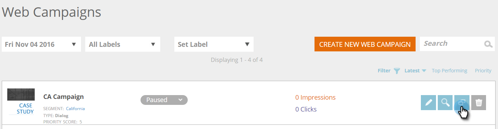

# Clonar una campaña web {#clone-a-web-campaign}

Utilice la función clonar de la página Campañas web para copiar la configuración de la campaña y cambiar el contenido para la optimización de pruebas divididas, o clona una campaña con el mismo contenido y asígnela a un segmento diferente. Cree campañas web en segundos.

## Creación de una campaña de clon {#create-a-clone-campaign}

1. Vaya a **Campañas web**.

   

   >[!NOTE]
   >
   >Para facilitar la búsqueda de la campaña web que desea, use la variable [función de filtro](/help/marketo/product-docs/web-personalization/working-with-web-campaigns/filter-web-campaigns.md).

1. Para la campaña web, haga clic en **Clonar**.

   

1. El proceso de clonación de campañas copia todo el contenido de la campaña web existente en la nueva campaña clonada. La nueva campaña web clonada se titula: &quot;[NOMBRE DE CAMPAÑA] Copiar&quot;.

   

   >[!TIP]
   >
   >Todo el contenido de la campaña web se copia en la campaña de clon excepto en la prueba dividida, por lo que no olvide agregar un grupo de prueba dividido a la campaña clonada si desea probarlo con otros.

>[!MORELIKETHIS]
>
>* [Creación de una campaña de diálogo](/help/marketo/product-docs/web-personalization/working-with-web-campaigns/create-a-new-dialog-web-campaign.md)
>* [Creación de una campaña RTP en zona](/help/marketo/product-docs/web-personalization/working-with-web-campaigns/create-a-new-in-zone-web-campaign.md)
>* [Creación de una campaña de utilidades RTP](/help/marketo/product-docs/web-personalization/working-with-web-campaigns/create-a-new-widget-web-campaign.md)

