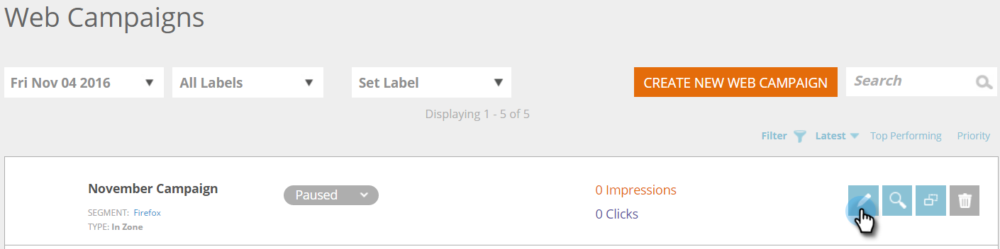

# Crear una campaña web nueva en Zone {#create-a-new-in-zone-web-campaign}

Una campaña web es una reacción personalizada asociada a un segmento específico y puede ser una [cuadro de diálogo](/help/marketo/product-docs/web-personalization/working-with-web-campaigns/create-a-new-dialog-web-campaign.md) en su sitio web, un reemplazo de zona in, un [función widget](/help/marketo/product-docs/web-personalization/working-with-web-campaigns/create-a-new-widget-web-campaign.md) o una alerta por correo electrónico. Una campaña web In Zone reemplaza un elemento del sitio web basado en el id de la zona por contenido o banners gráficos.

## Crear una campaña web en zona {#create-an-in-zone-web-campaign}

1. Vaya a **Campañas web**.

   

1. Select **Crear nueva campaña web.**

   

1. Seleccione el **En zona** tipo de campaña. Personalizar y agregar un **Id. de zona.** Configure la campaña como **Fijo** y añada el elemento creativo al editor. Añada la dirección URL de la página para obtener una vista previa y haga clic en **Vista previa** para ver cómo reaccionará la campaña en el sitio.

   

   >[!NOTE]
   >
   >**¿Qué es un ID de zona?**
   >
   >En un ID de zona es donde desea que la campaña web &quot;En zona&quot; se encuentre en el sitio. Para buscar un &quot;ID de zona&quot;, simplemente vaya a su sitio web seleccione el área que desea reemplazar por una campaña web y haga clic con el botón derecho del ratón. En Chrome, la opción es &quot;Elemento Inspect&quot;, pero en otros navegadores puede variar.
   >
   >A continuación, desea encontrar el &quot;id&quot; asociado con esta sección del sitio web, que se resalta porque está inspeccionando ese elemento. Por ejemplo, si una vez que hace clic con el botón derecho en Chrome, el texto resaltado indica `
` a continuación, el deslizador de funciones es lo que debe escribir en la sección &quot;id de zona&quot;. Normalmente se utiliza &quot;div id&quot;, pero también se puede utilizar cualquier ID, como h1 id, p id, etc.

<table> 
 <thead> 
  <tr> 
   <th colspan="1" rowspan="1">Nombre</th> 
   <th colspan="1" rowspan="1">Descripción</th> 
  </tr> 
 </thead> 
 <tbody> 
  <tr> 
   <td colspan="1" rowspan="1"><strong> Id. de zona </strong></td> 
   <td colspan="1" rowspan="1">
Introduzca el nombre del id que se encuentra en el código de HTML del elemento de sitio web que reemplaza la campaña.
</td> 
  </tr> 
  <tr> 
   <td colspan="1" rowspan="1">
<strong> Fijo </strong>
</td> 
   <td colspan="1" rowspan="1">La casilla Fijo está seleccionada de forma predeterminada para la campaña En zona y mantiene la campaña En zona en su posición Id. de zona durante toda la sesión del visitante en el sitio web. Se recomienda tener siempre una zona de entrada configurada como Fijo.</td> 
  </tr> 
  <tr> 
   <td colspan="1" rowspan="1">
<strong> Desvanecimiento</strong> 
</td> 
   <td colspan="1" rowspan="1">Al seleccionar la casilla de verificación Utilizar efecto y Desvanecer se proporciona un efecto de desvanecimiento en el área de identificación de zona del sitio web. Si la zona de entrada es un banner gráfico, la página primero se carga y luego la campaña se activa con un efecto de atenuación.</td> 
  </tr> 
  <tr> 
   <td colspan="1"><strong>Deslizamiento</strong></td> 
   <td colspan="1">Al seleccionar la casilla de verificación Utilizar efecto y la opción Deslizamiento , se proporciona un desplazamiento en el área de identificación de zona del sitio web. Si la zona de entrada es un banner gráfico, la página primero se carga y luego la campaña se activa con un efecto deslizante de izquierda a derecha.</td> 
  </tr> 
  <tr> 
   <td colspan="1"><strong> Editor de texto enriquecido  </strong></td> 
   <td colspan="1">El editor de texto enriquecido permite aplicar formato de texto, vincular e insertar imágenes. <a href="/help/marketo/product-docs/web-personalization/working-with-web-campaigns/using-the-web-personalization-rich-text-editor.md">Lea más aquí</a> .</td> 
  </tr> 
  <tr> 
   <td colspan="1"><strong> Vista previa en el sitio   </strong></td> 
   <td colspan="1">Previsualizar las campañas antes de iniciarlas.   
    <ul> 
     <li> URL : introduzca una URL de ejemplo en la que se ejecutaría la campaña para ver un ejemplo preliminar de cómo se vería la campaña en vivo.</li> 
     <li>Dispositivo: obtenga una vista previa de cómo aparecerá la campaña por dispositivo: Escritorio, Vertical Móvil, Horizontal Móvil, Vertical Tableta, Horizontal Vertical.</li> 
     <li> Vista previa - Haga clic <strong>Vista previa</strong> para abrir una nueva ventana de la URL de ejemplo para ver cómo reacciona la campaña.</li> 
     <li> Compartir: utilice el botón Compartir para enviar un correo electrónico a un colega con un vínculo para ver la campaña de proxy.</li> 
    </ul></td> 
  </tr> 
 </tbody> 
</table>

>[!TIP]
>
>Acelere y simplifique su proceso de creación de campañas utilizando nuestra [plantillas integradas](/help/marketo/product-docs/web-personalization/using-templates/using-templates-to-create-web-campaigns.md) o [guardar la campaña existente](/help/marketo/product-docs/web-personalization/using-templates/using-templates-to-create-web-campaigns.md) como plantilla para su reutilización.

>[!NOTE]
>
>**¿Quiere probar A/B sus campañas web?** Una o más campañas web pueden [Prueba A/B para obtener resultados óptimos](/help/marketo/product-docs/web-personalization/working-with-web-campaigns/ab-test-your-web-campaign.md). Con la función de ajuste automático, la plataforma reconoce automáticamente las campañas de mejor rendimiento, continúa con las campañas de conversión más altas y pone en pausa las demás.

## Editar una campaña web {#edit-a-web-campaign}

En el **Campañas web** página, haga clic en **Editar** en la campaña.

>[!NOTE]
>
>Para facilitar la búsqueda de la campaña que desea, use la variable [función de filtro](/help/marketo/product-docs/web-personalization/working-with-web-campaigns/filter-web-campaigns.md).

## Vista previa de una campaña web {#preview-a-web-campaign}

1. En la página Campañas web, haga clic en **Vista previa** en la campaña web que desee ver.

   

## Clonar una campaña web {#clone-a-web-campaign}

Consulte [Clonar una campaña web](/help/marketo/product-docs/web-personalization/working-with-web-campaigns/clone-a-web-campaign.md).

## Eliminar una campaña web {#delete-a-web-campaign}

1. En la página Campañas web, haga clic en **Eliminar** en la campaña que desee eliminar.

   

1. Aparece un mensaje de confirmación para confirmar si desea eliminar la campaña.

>[!MORELIKETHIS]
>
>* [Crear una nueva campaña web en utilidades](/help/marketo/product-docs/web-personalization/working-with-web-campaigns/create-a-new-widget-web-campaign.md)
>* [Crear una nueva campaña web de cuadro de diálogo](/help/marketo/product-docs/web-personalization/working-with-web-campaigns/create-a-new-dialog-web-campaign.md)

