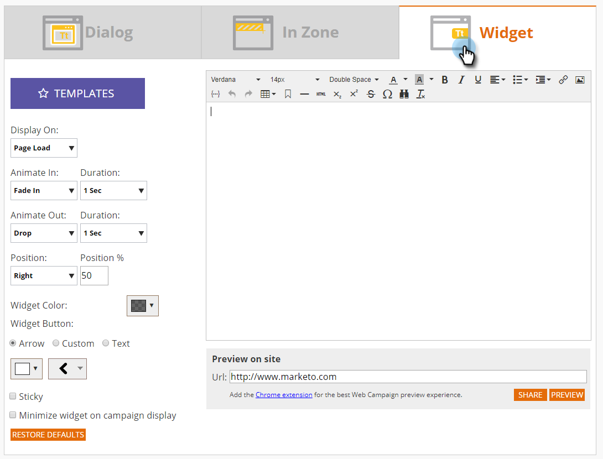

# Crear una nueva Campaña Web de utilidades {#create-a-new-widget-web-campaign}

Una campaña Web es una reacción personalizada asociada a un segmento específico y puede ser un [cuadro de diálogo](/help/marketo/product-docs/web-personalization/working-with-web-campaigns/create-a-new-dialog-web-campaign.md) en su sitio Web, un [reemplazo de zona](/help/marketo/product-docs/web-personalization/working-with-web-campaigns/create-a-new-in-zone-web-campaign.md), una función de utilidad o una alerta por correo electrónico. La campaña web Widget es un texto o una pancarta que aparece en la parte vertical de la página web con la capacidad de expandirse y contraerse, mientras se mantiene fija en la página web durante toda la visita.

## Crear una Campaña Web de utilidades {#create-a-widget-web-campaign}

1. Vaya a **Campañas Web**.

   

1. Seleccione **Crear nueva Campaña Web**.

   

1. Seleccione el tipo de campaña **Utilidad**.

   

1. Utilice las múltiples opciones para personalizar la utilidad.

   

1. Haga clic en **Previsualización** para ver cómo reaccionará la campaña Web en el sitio.

   

<table> 
 <thead> 
  <tr> 
   <th colspan="1" rowspan="1">Nombre</th> 
   <th colspan="1" rowspan="1">Descripción</th> 
  </tr> 
 </thead> 
 <tbody> 
  <tr> 
   <td colspan="1"><strong>Plantillas</strong></td> 
   <td colspan="1">Elija una de las varias plantillas prediseñadas.</td> 
  </tr> 
  <tr> 
   <td colspan="1"><strong>Mostrar en</strong></td> 
   <td colspan="1">Permite <a href="/help/marketo/product-docs/web-personalization/working-with-web-campaigns/set-how-your-web-campaign-displays.md" rel="nofollow">personalizar cuándo y cómo</a> se muestra la campaña Web.</td> 
  </tr> 
  <tr> 
   <td colspan="1"><strong>Animar entrada/salida</strong></td> 
   <td colspan="1">Se configura al entrar o salir del cuadro de diálogo. Seleccione el efecto (soltar, ciego, deslizar, fundir, sin efecto), la duración (en segundos) y la dirección (arriba, abajo, izquierda, derecha).</td> 
  </tr> 
  <tr> 
   <td colspan="1"><strong>Posición</strong></td> 
   <td colspan="1">Seleccione una de las cuatro opciones para la posición del widget en la página: Derecha, Izquierda, Arriba, Abajo. Posición % es el porcentaje de la posición en cuanto a dónde aparecerá la utilidad en la página del explorador (por ejemplo: "50 % inferior" hará que la utilidad aparezca a medio camino hacia abajo en la parte inferior de la página, "10 % izquierda" hará que la utilidad aparezca cerca de la parte superior izquierda de la página, etc.). </td> 
  </tr> 
  <tr> 
   <td colspan="1" rowspan="1"><strong>Color de utilidad</strong></td> 
   <td colspan="1" rowspan="1">
Seleccione el color del widget en un gráfico de colores o introdúzcalo como código de color RGB. También puede seleccionar el nivel de transparencia del fondo del widget moviendo la barra de la parte inferior en cualquier dirección.
</td> 
  </tr> 
  <tr> 
   <td colspan="1" rowspan="1">
<strong>Botón de utilidad</strong> 
</td> 
   <td colspan="1" rowspan="1">Personalice el propio botón de la utilidad. Flecha: Permite elegir entre varios iconos diferentes en el menú desplegable derecho. La lista desplegable izquierda determina su color. Personalizado: Inserte la dirección URL de cualquier imagen alojada. Tipos de archivo aceptados: .JPEG, .GIF (incluido animado), .PNG, .APNG, .SVG, .BMP. Texto: La utilidad puede ser texto: personalice su color, tamaño y fuente.</td> 
  </tr> 
  <tr> 
   <td colspan="1"><strong>Fijo</strong></td> 
   <td colspan="1">Si selecciona esta opción, la utilidad aparecerá en todas las páginas web durante la sesión del visitante.</td> 
  </tr> 
  <tr> 
   <td colspan="1"><strong>Minimizar utilidad al visualizar Campaña</strong></td> 
   <td colspan="1">Inserta una utilidad pero la mantiene minimizada, lo que requiere que el usuario haga clic en ella para maximizarla.</td> 
  </tr> 
  <tr> 
   <td colspan="1"><strong>Restaurar predeterminado </strong></td> 
   <td colspan="1">Restaura la configuración predeterminada original del widget, estableciendo el color del widget en la opción de gris transparente predeterminada.</td> 
  </tr> 
  <tr> 
   <td colspan="1"><strong>Previsualización en el sitio </strong></td> 
   <td colspan="1">Campañas de previsualización antes de que se inicien.  
    <ul> 
     <li>URL: introduzca una URL de ejemplo en la que se ejecutaría la campaña para ver un ejemplo de previsualización de cómo se vería la campaña en directo.</li> 
     <li>Previsualización: haga clic en <strong>Previsualización </strong>para abrir una nueva ventana de la URL de ejemplo para ver cómo reacciona la campaña (Añada la <a href="https://chrome.google.com/extensions/detail/ldiddonjplchallbngbccbfdfeldohkj?hl=en" rel="nofollow">extensión de Chrome</a> para obtener la mejor experiencia de previsualización de Campaña Web). </li> 
     <li>Compartir: utilice el botón Compartir para enviar un correo electrónico a un colega con un vínculo para ver la campaña proxy.</li> 
    </ul></td> 
  </tr> 
 </tbody> 
</table>

>[!NOTE]
>
>**¿Desea probar A/B sus campañas web?** Se puede probar una o varias campañas web  [A/B para obtener resultados](/help/marketo/product-docs/web-personalization/working-with-web-campaigns/ab-test-your-web-campaign.md) óptimos. Con la función de ajuste automático, la plataforma reconoce automáticamente las campañas de mejor rendimiento, continúa con las campañas de conversión más elevadas y pone en pausa las demás.

## Editar una Campaña Web {#edit-a-web-campaign}

En la página Campañas Web, haga clic en **Editar** en la Campaña.

>[!NOTE]
>
>Para facilitar la búsqueda de la campaña deseada, utilice la función [filter](/help/marketo/product-docs/web-personalization/working-with-web-campaigns/filter-web-campaigns.md).

## Clonar una Campaña Web {#clone-a-web-campaign}

Consulte [Clonar una Campaña Web](/help/marketo/product-docs/web-personalization/working-with-web-campaigns/clone-a-web-campaign.md).

## Previsualización de una Campaña Web {#preview-a-web-campaign}

En la página Campañas Web, haga clic en **Previsualización** en la campaña Web que desee previsualización

## Eliminar una Campaña Web {#delete-a-web-campaign}

1. En la página Campañas Web, haga clic en **Eliminar** en la campaña Web que desee eliminar.

   

1. Aparecerá un mensaje de confirmación para confirmar si desea eliminar la campaña web.

>[!MORELIKETHIS]
>
>* [Crear una nueva Campaña web en la zona](/help/marketo/product-docs/web-personalization/working-with-web-campaigns/create-a-new-in-zone-web-campaign.md)
>* [Crear una nueva Campaña web de cuadro de diálogo](/help/marketo/product-docs/web-personalization/working-with-web-campaigns/create-a-new-dialog-web-campaign.md)

