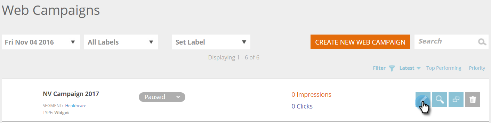

# Crear una nueva campaña web en utilidades {#create-a-new-widget-web-campaign}

Una campaña web es una reacción personalizada asociada a un segmento específico y puede ser una [cuadro de diálogo](/help/marketo/product-docs/web-personalization/working-with-web-campaigns/create-a-new-dialog-web-campaign.md) en su sitio web, una [en sustitución de zona](/help/marketo/product-docs/web-personalization/working-with-web-campaigns/create-a-new-in-zone-web-campaign.md), una función de utilidad o una alerta de correo electrónico. La campaña web en utilidades es un texto o un banner que aparece en el lado vertical de la página web con la capacidad de expandirse y contraerse, mientras que se mantiene fijo en la página del sitio web durante toda la visita.

## Creación de una campaña web en utilidades {#create-a-widget-web-campaign}

1. Vaya a **Campañas web**.

   

1. Select **Crear nueva campaña web**.

   

1. Seleccione el **Widget** tipo de campaña.

   

1. Utilice las distintas opciones para personalizar el widget.

   

1. Haga clic en **Vista previa** para ver cómo reaccionará la campaña web en el sitio.

   

<table> 
 <thead> 
  <tr> 
   <th colspan="1" rowspan="1">Nombre</th> 
   <th colspan="1" rowspan="1">Descripción</th> 
  </tr> 
 </thead> 
 <tbody> 
  <tr> 
   <td colspan="1"><strong>Plantillas</strong></td> 
   <td colspan="1">Elija una de las varias plantillas creadas previamente.</td> 
  </tr> 
  <tr> 
   <td colspan="1"><strong>Mostrar en</strong></td> 
   <td colspan="1">Permite <a href="/help/marketo/product-docs/web-personalization/working-with-web-campaigns/set-how-your-web-campaign-displays.md" rel="nofollow">personalizar cuándo y cómo</a> se muestra la campaña web.</td> 
  </tr> 
  <tr> 
   <td colspan="1"><strong>Animar entrada/salida</strong></td> 
   <td colspan="1">Se establece en la entrada o salida del cuadro de diálogo. Seleccione el efecto (soltar, ciego, deslizar, desvanecer, sin efecto), la duración (en segundos) y la dirección (arriba, abajo, izquierda, derecha).</td> 
  </tr> 
  <tr> 
   <td colspan="1"><strong>Posición</strong></td> 
   <td colspan="1">Seleccione una de las cuatro opciones para la posición del widget en la página: Derecha, Izquierda, Arriba, Abajo. Posición % es el porcentaje de la posición en la que aparecerá el widget en la página del explorador (por ejemplo, "50 % inferior" hará que el widget aparezca a mitad de la parte inferior de la página, "10 % a la izquierda" hará que el widget aparezca cerca de la parte superior izquierda de la página, etc.). </td> 
  </tr> 
  <tr> 
   <td colspan="1" rowspan="1"><strong>Color de la utilidad</strong></td> 
   <td colspan="1" rowspan="1">
Seleccione el color del widget en un gráfico de colores o indíquelo como un código de color RGB. También puede seleccionar el nivel de transparencia del fondo del widget moviendo la barra de la parte inferior en cualquier dirección.
</td> 
  </tr> 
  <tr> 
   <td colspan="1" rowspan="1">
<strong>Botón Widget</strong> 
</td> 
   <td colspan="1" rowspan="1">Personalice el propio botón del widget. Flecha: Permite elegir entre varios iconos diferentes en el menú desplegable derecho. La lista desplegable izquierda determina su color. Personalizado: Inserte la URL de cualquier imagen alojada. Tipos de archivo aceptados: .JPEG, .GIF (incluido el animado), .PNG, .APNG, .SVG, .BMP. Texto: El widget puede ser texto: personalice su color, tamaño y fuente.</td> 
  </tr> 
  <tr> 
   <td colspan="1"><strong>Fijo</strong></td> 
   <td colspan="1">Si selecciona esta opción, la utilidad aparecerá en todas las páginas web de la sesión del visitante.</td> 
  </tr> 
  <tr> 
   <td colspan="1"><strong>Minimizar la utilidad en la visualización de la campaña</strong></td> 
   <td colspan="1">Inserta un widget pero lo mantiene minimizado, lo que requiere que el usuario haga clic en él para maximizarlo.</td> 
  </tr> 
  <tr> 
   <td colspan="1"><strong>Restaurar predeterminado </strong></td> 
   <td colspan="1">Restaura la configuración predeterminada original del widget, configurando el color del widget en la opción de gris transparente predeterminada.</td> 
  </tr> 
  <tr> 
   <td colspan="1"><strong>Vista previa en el sitio </strong></td> 
   <td colspan="1">Previsualizar las campañas antes de iniciarlas.  
    <ul> 
     <li>URL : introduzca una URL de ejemplo en la que se ejecutaría la campaña para ver un ejemplo preliminar de cómo se vería la campaña en vivo.</li> 
     <li>Vista previa - Haga clic <strong>Vista previa </strong>para abrir una nueva ventana de la URL de ejemplo para ver cómo reacciona la campaña (añada la variable <a href="https://chrome.google.com/extensions/detail/ldiddonjplchallbngbccbfdfeldohkj?hl=en" rel="nofollow">Extensión de Chrome</a> para obtener la mejor experiencia de vista previa de Web Campaign). </li> 
     <li>Compartir: utilice el botón Compartir para enviar un correo electrónico a un colega con un vínculo para ver la campaña de proxy.</li> 
    </ul></td> 
  </tr> 
 </tbody> 
</table>

>[!NOTE]
>
>**¿Quiere probar A/B sus campañas web?** Una o más campañas web pueden [Prueba A/B para obtener resultados óptimos](/help/marketo/product-docs/web-personalization/working-with-web-campaigns/ab-test-your-web-campaign.md). Con la función de ajuste automático, la plataforma reconoce automáticamente las campañas de mejor rendimiento, continúa con las campañas de conversión más altas y pone en pausa las demás.

## Editar una campaña web {#edit-a-web-campaign}

En la página Campañas web, haga clic en **Editar** en la campaña.

>[!NOTE]
>
>Para facilitar la búsqueda de la campaña que desea, use la variable [función de filtro](/help/marketo/product-docs/web-personalization/working-with-web-campaigns/filter-web-campaigns.md).

## Clonar una campaña web {#clone-a-web-campaign}

Consulte [Clonar una campaña web](/help/marketo/product-docs/web-personalization/working-with-web-campaigns/clone-a-web-campaign.md).

## Vista previa de una campaña web {#preview-a-web-campaign}

En la página Campañas web, haga clic en **Vista previa** en la campaña web que desee previsualizar

## Eliminar una campaña web {#delete-a-web-campaign}

1. En la página Campañas web, haga clic en **Eliminar** en la campaña web que desee eliminar.

   

1. Aparece un mensaje de confirmación para confirmar si desea eliminar la campaña web.

>[!MORELIKETHIS]
>
>* [Crear una campaña web nueva en Zone](/help/marketo/product-docs/web-personalization/working-with-web-campaigns/create-a-new-in-zone-web-campaign.md)
>* [Crear una nueva campaña web de cuadro de diálogo](/help/marketo/product-docs/web-personalization/working-with-web-campaigns/create-a-new-dialog-web-campaign.md)

