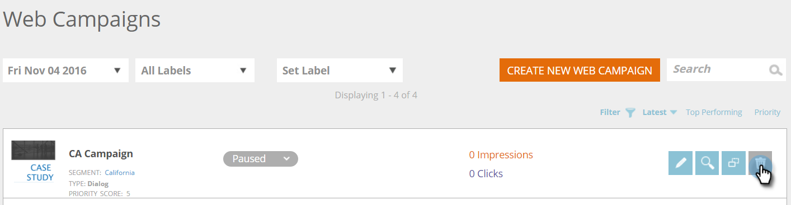

# Eliminación de una campaña web {#delete-a-web-campaign}

1. Vaya a **[!UICONTROL Campañas web]**.

   

   >[!NOTE]
   >
   >Para facilitar la búsqueda de la campaña web que deseas, usa la [característica de filtro](/help/marketo/product-docs/web-personalization/working-with-web-campaigns/filter-web-campaigns.md).

1. En la página [!UICONTROL Campañas web], haga clic en **[!UICONTROL Eliminar]** en la campaña que desee eliminar.

   

1. Aparece un mensaje de confirmación para confirmar si desea eliminar la campaña web.

>[!MORELIKETHIS]
>
>* [Editar una campaña web](/help/marketo/product-docs/web-personalization/working-with-web-campaigns/edit-an-existing-web-campaign.md)
>* [Iniciar/Pausar una campaña web](/help/marketo/product-docs/web-personalization/working-with-web-campaigns/launch-pause-a-web-campaign.md)
