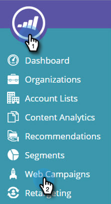
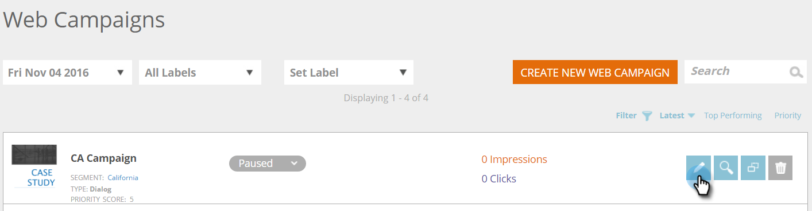

# Edición de una campaña web existente {#edit-an-existing-web-campaign}

1. Vaya a **[!UICONTROL Campañas web]**.

   

1. En la página **[!UICONTROL Campañas web]**, haga clic en **[!UICONTROL Editar]** en la campaña que desee editar.

   

   >[!NOTE]
   >
   >Para facilitar la búsqueda de la campaña web que deseas, usa la [característica de filtro](/help/marketo/product-docs/web-personalization/working-with-web-campaigns/filter-web-campaigns.md).

>[!MORELIKETHIS]
>
>* [Eliminar una campaña web](/help/marketo/product-docs/web-personalization/working-with-web-campaigns/delete-a-web-campaign.md)
>* [Iniciar/Pausar una campaña](/help/marketo/product-docs/web-personalization/working-with-web-campaigns/launch-pause-a-web-campaign.md).
