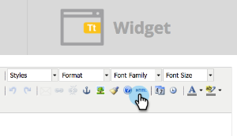

# Incrustar un formulario en una Campaña Web {#embed-a-form-into-a-web-campaign}

Vea cómo incrustar un formulario de marketing en una campaña web (cuadro de diálogo, en zona o utilidad).

1. Haga clic con el botón derecho en un formulario aprobado. Seleccione **Código incrustado**.

   ** 

   **

1. Copie el código.

   

1. En Personalización Web, vaya a **Campañas Web**.

   

1. Haga clic en **Crear nueva campaña**.

   ** 

   **

1. En el Editor de texto enriquecido, haga clic en el icono HTML.

   

1. Pegue el código incrustado del formulario en el Editor de código fuente HTML. Haga clic en **Actualizar**.

   

1. El formulario no se mostrará en la vista del editor, pero puede previsualización para ver cómo se representará en una campaña.
1. Haga clic en **Iniciar** para inicio de la campaña.

   >[!NOTE]
   >
   >Cualquier cambio en los campos del formulario debe realizarse dentro de las Actividades de marketing de Marketing Cloud en Editar borrador del formulario.

## Tres formas de Añadir una imagen de fondo en un formulario {#three-ways-to-add-a-background-image-to-a-form}

Para agregar una imagen de fondo al formulario, puede:

* Editar la CSS de un tema de formulario
* Cambiar los colores del cuadro de diálogo o del widget en Establecer Campaña
* Añadir código CSS a la secuencia de comandos

Para editar la CSS de un tema de formulario, consulte [este artículo](../../../product-docs/demand-generation/forms/form-design/edit-the-css-of-a-form-theme.md).

Para cambiar los colores del cuadro de diálogo o del widget en Establecer Campaña:

1. En el Editor de texto enriquecido, seleccione un tipo de campaña de cuadro de diálogo y un estilo de cuadro de diálogo, color de encabezado y color de fondo para personalizar los colores de fondo del formulario. Haga clic en **Guardar**.

   

1. A continuación se muestra un ejemplo de cómo se ve un estilo de cuadro de diálogo de recorte moderno con un encabezado púrpura claro y un color de fondo.

   

Para agregar código CSS a la secuencia de comandos:

1. En el Editor de texto enriquecido, haga clic en el icono HTML.

   

1. Pegue el código incrustado del formulario con el código de estilo de fondo en el Editor de código fuente HTML. Haga clic en **Actualizar**.

   

1. Haga clic en **Previsualización** para ver cómo se representará en una campaña (el formulario no se mostrará en la vista del editor). A continuación se muestra un ejemplo de cómo se procesa el código de formulario anterior en una campaña con una imagen de fondo.

   

>[!MORELIKETHIS]
>
>* [Editar la CSS de un tema de formulario](https://docs.marketo.com/display/public/DOCS/Edit+the+CSS+of+a+Form+Theme)
>* [Mostrar mensaje de agradecimiento sin una Página de aterrizaje de seguimiento](https://developers.marketo.com/blog/show-thank-you-message-without-a-follow-up-landing-page/)
>* [Forms 2.0](https://developers.marketo.com/documentation/websites/forms-2-0/)

>

