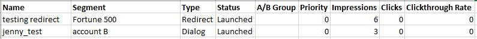

# Exportación de datos de campañas web {#export-web-campaign-data}

Siga estos sencillos pasos para exportar los datos de su campaña web.

1. Vaya a **[!UICONTROL Campañas web]**.

   

1. En la parte superior derecha de la página, haga clic en el icono Exportar CSV.

   

1. Abra o guarde el archivo.

   

1. Vea el archivo para ver estadísticas útiles.

   
