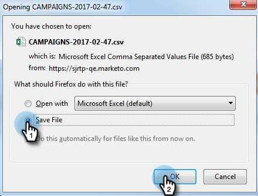

# Exportar datos de Campaña web {#export-web-campaign-data}

Siga estos sencillos pasos para exportar los datos de campaña web.

1. Vaya a Campañas **** Web.

   

1. En la parte superior derecha de la página, haga clic en el icono Exportar CSV.

   

1. Abra o guarde el archivo.

   

1. Vista el archivo para ver estadísticas útiles.

   

