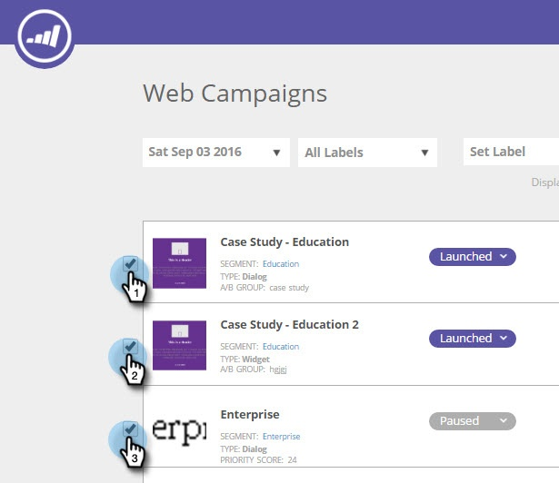

# Etiquetar las campañas web {#label-your-web-campaigns}

¿Tiene tantas campañas que el desplazamiento se está volviendo engorroso? Utilice etiquetas para etiquetar sus campañas, de modo que pueda ordenarlas y encontrarlas rápidamente.

## Añadir una etiqueta a una campaña web {#add-a-label-to-a-web-campaign}

1. Inicie sesión en [!DNL Web Personalization] y vaya al área de [!UICONTROL Campañas web].

   

   >[!NOTE]
   >
   >Para facilitar la búsqueda de la campaña que desea, use la [característica de filtro](/help/marketo/product-docs/web-personalization/working-with-web-campaigns/filter-web-campaigns.md).

1. Seleccione las campañas que desee etiquetar con una etiqueta.

   

1. Introduzca el nombre de etiqueta deseado y haga clic en Crear nuevo.

   >[!TIP]
   >
   >Si la etiqueta ya existe, selecciónela y no cree una nueva.

   

¡Genial! Ahora sabe cómo crear etiquetas y asignarlas a campañas.

## Filtrar por etiquetas existentes {#filter-by-existing-labels}

1. En la lista desplegable etiquetas, seleccione la etiqueta que desee utilizar como filtro.

   

1. Ahora solo se muestran las campañas asociadas a la etiqueta seleccionada.

   

>[!MORELIKETHIS]
>
>[Etiquetar un segmento](/help/marketo/product-docs/web-personalization/using-web-segments/label-your-segment.md)
