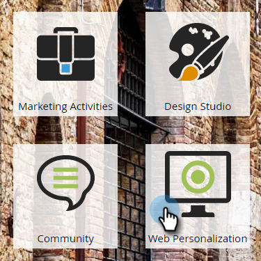

# Inicio/pausa de una campaña web {#launch-pause-a-web-campaign}

Una campaña web es una reacción personalizada asociada a un segmento específico y puede ser una [cuadro de diálogo](/help/marketo/product-docs/web-personalization/working-with-web-campaigns/create-a-new-dialog-web-campaign.md) en su sitio web, una [reemplazo de zona](/help/marketo/product-docs/web-personalization/working-with-web-campaigns/create-a-new-in-zone-web-campaign.md), una función de widget o una alerta por correo electrónico.

Puede iniciar o pausar una campaña web de dos formas desde la página Campañas web o la página Definir campañas web.

1. Clic **Personalización web**.

   

1. Ir a **Campañas web**.

   

1. Si se inicia la campaña, haga clic en **Iniciado** para cambiar el estado de la campaña a **Pausado**, para pausar la campaña.

   

1. Si la campaña está en pausa, haga clic en **Pausado** para cambiar el estado de la campaña a **Iniciado**. Esto activa e inicia la campaña.

   

   >[!NOTE]
   >
   >También puede cambiar el estado de la campaña en Establecer página de campaña.

1. En la campaña, haga clic en **Editar**.

   

1. Clic **Guardar** para guardar y pausar la campaña. Clic **Launch** para iniciar y activar la campaña.

   

>[!MORELIKETHIS]
>
>* [Creación de una campaña de diálogo](/help/marketo/product-docs/web-personalization/working-with-web-campaigns/create-a-new-dialog-web-campaign.md)
>* [Creación de una campaña de RTP en la zona](/help/marketo/product-docs/web-personalization/working-with-web-campaigns/create-a-new-in-zone-web-campaign.md)
>* [Creación de una campaña de widget RTP](/help/marketo/product-docs/web-personalization/working-with-web-campaigns/create-a-new-widget-web-campaign.md)
