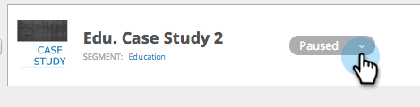

# Iniciar/poner en pausa una campaña web {#launch-pause-a-web-campaign}

Una campaña web es una reacción personalizada asociada a un segmento específico y puede ser un [cuadro de diálogo](/help/marketo/product-docs/web-personalization/working-with-web-campaigns/create-a-new-dialog-web-campaign.md) en tu sitio web, un [reemplazo de zona](/help/marketo/product-docs/web-personalization/working-with-web-campaigns/create-a-new-in-zone-web-campaign.md), una característica de widget o una alerta por correo electrónico.

Puede iniciar o pausar una campaña web de dos formas desde la página [!UICONTROL Campañas web] o la página [!UICONTROL Establecer campañas web].

1. Haga clic en **[!UICONTROL Web Personalization]**.

   

1. Vaya a **[!UICONTROL Campañas web]**.

   

1. Si se inicia la campaña, haga clic en **[!UICONTROL Iniciada]** para cambiar el estado de la campaña a **[!UICONTROL En pausa]**, para pausar la campaña.

   

1. Si la campaña está en pausa, haga clic en **[!UICONTROL En pausa]** para cambiar el estado de la campaña a **[!UICONTROL Iniciada]**. Esto activa e inicia la campaña.

   

   >[!NOTE]
   >
   >También puede cambiar el estado de la campaña en Establecer página de campaña.

1. En la campaña, haga clic en **[!UICONTROL Editar]**.

   

1. Haga clic en **[!UICONTROL Guardar]** para guardar y pausar la campaña. Haga clic en **[!UICONTROL Iniciar]** para iniciar y activar la campaña.

   

>[!MORELIKETHIS]
>
>* [Crear una campaña de diálogo](/help/marketo/product-docs/web-personalization/working-with-web-campaigns/create-a-new-dialog-web-campaign.md)
>* [Crear una campaña de RTP en la zona](/help/marketo/product-docs/web-personalization/working-with-web-campaigns/create-a-new-in-zone-web-campaign.md)
>* [Crear una campaña de widget de RTP](/help/marketo/product-docs/web-personalization/working-with-web-campaigns/create-a-new-widget-web-campaign.md)
