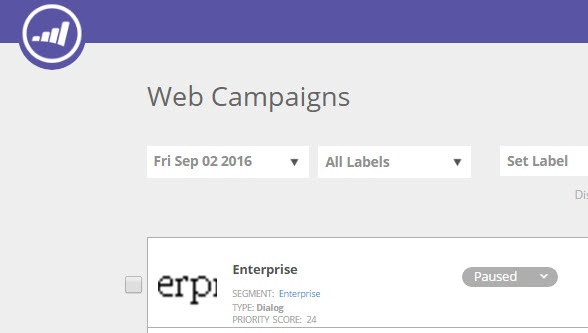

# Priorización de campañas web {#prioritizing-web-campaigns}

Priorice las campañas web cuando dos o más campañas web se superpongan estableciendo una puntuación de prioridad.

>[!NOTE]
>
>**Campañas superpuestas**
>
>Una campaña web se superpone cuando:
>
>* Dos o más campañas Widgets y/o Dialog reaccionan al mismo tiempo en la misma página
>* Dos o más En zonas con el mismo id de zona reaccionan al mismo tiempo en la misma página web
>
>Una campaña En la zona y una campaña (en utilidades o diálogos) pueden reaccionar en la misma página.

1. Vaya a Campañas web.

   

   >[!NOTE]
   >
   >Para facilitar la búsqueda de la campaña web que desea, use la variable [función de filtro](/help/marketo/product-docs/web-personalization/working-with-web-campaigns/filter-web-campaigns.md).

1. En la página Editar campaña , establezca la puntuación de prioridad (9999 = Prioridad más alta 1 = Prioridad más baja).

   

   >[!TIP]
   >
   >Se recomienda utilizar la puntuación de prioridad de la campaña solo si existe una posible superposición de la campaña, con una importancia mayor de una de las campañas. No es necesario que establezca una prioridad para cada campaña.

1. Guarde o inicie la campaña.

1. Consulte la puntuación de prioridad mostrada en la página Campañas web.

