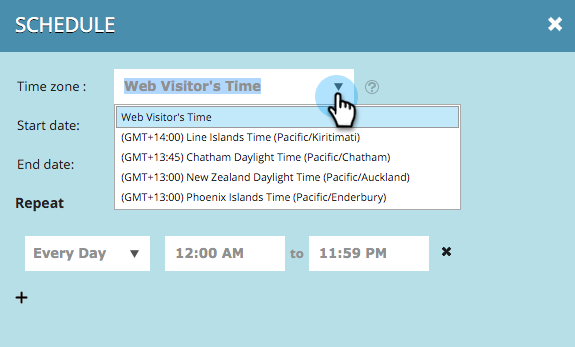

# Programar una Campaña Web {#schedule-a-web-campaign}

Si sabe cuándo desea que se ejecute la campaña web, puede programarla con antelación. Es fácil configurar fechas de inicio y parada, repeticiones y varios días.

Puede programar la campaña web en función de la hora del visitante web o de un huso horario seleccionado.

>[!NOTE]
>
>**Ejemplo**
>
>La programación de las fechas de inicio y parada es buena para un evento programado, como un seminario web, que se ejecuta durante un período específico. Las repeticiones son perfectas para una oferta especial que se ejecuta cada semana sólo en un día en particular.

1. Vaya a **Campañas Web**.

   

   >[!NOTE]
   >
   >Para facilitar la búsqueda de la campaña deseada, utilice la función [filter](/help/marketo/product-docs/web-personalization/working-with-web-campaigns/filter-web-campaigns.md).

1. Abra el menú Estado de Campaña y seleccione **Programar**.

   

1. En el cuadro de diálogo Programar periodicidad, seleccione la zona horaria para la campaña

   

   >[!TIP]
   >
   >La configuración predeterminada ejecuta campañas en la zona horaria del visitante web.

1. Seleccione una fecha y hora de inicio y una fecha y hora de finalización.

   

   >[!NOTE]
   >
   >Puede seleccionar la fecha y la hora en el menú desplegable y en el calendario, o bien introducirlas manualmente. Los horarios están en las 12 horas a.m./p.m.

1. De forma predeterminada, la campaña se ejecuta todos los días entre el inicio y la fecha de finalización. Si desea ejecutar la campaña solo en días específicos o en momentos específicos, utilice la configuración **Repetir**. Seleccione el día, el inicio y la hora de finalización para mostrar la campaña. Utilice el signo + para agregar días adicionales.

   

1. Haga clic en **Programar**.

   

1. El estado de la campaña en la página Campañas cambia a **Programado** y se muestra el icono de reloj/calendario. Haga clic en este icono para editar la programación de campañas.

   

   >[!NOTE]
   >
   >El estado de campaña permanece como **Programado** incluso cuando la campaña se está ejecutando durante las horas programadas seleccionadas. Cuando ha pasado una fecha de finalización programada, el estado de la campaña cambia a **Pausado**.
