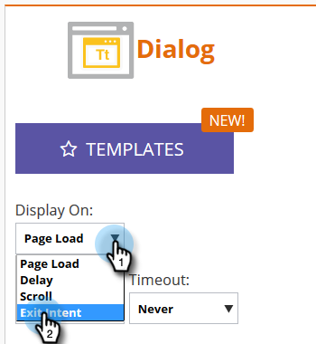

# Configurar la forma en que se muestra la Campaña Web {#set-how-your-web-campaign-displays}

Existen varios métodos que se pueden utilizar cuando se trata de cuándo y cómo se muestra la campaña web.

## Carga de página {#page-load}

Seleccionado de forma predeterminada, esta opción simplemente muestra la campaña al cargar la página.

## Retraso {#delay}

Especifique un tiempo de espera (en segundos totales) para que las campañas web reaccionen en el sitio web.

1. Haga clic en la lista desplegable **Mostrar en** y seleccione **Retraso**.

   

1. Haga clic en la lista desplegable **Espere** y seleccione la cantidad de tiempo deseada.

   

## Desplazar {#scroll}

1. Haga clic en la lista desplegable **Mostrar en** y seleccione **Desplazarse**.

   

1. Haga clic en la lista desplegable **Cuándo** y seleccione cuándo desea que se muestre la campaña Web.

   

<table> 
 <tbody> 
  <tr> 
   <td><strong>Debajo del pliegue</strong></td> 
   <td>Muestra la campaña cuando el visitante se desplaza por debajo del pliegue. La campaña desaparece cuando el visitante se desplaza hacia atrás por encima del pliegue.</td> 
  </tr> 
  <tr> 
   <td><strong>Porcentaje</strong></td> 
   <td>Muestra la campaña cuando el visitante se desplaza hasta un porcentaje predeterminado de la página.</td> 
  </tr> 
  <tr> 
   <td><strong>Píxel</strong></td> 
   <td>
Muestra la campaña cuando el visitante se desplaza al píxel superior predesignado de la página.
</td> 
  </tr> 
 </tbody> 
</table>

## Calidad de salida {#exit-intent}

La calidad de salida mostrará la campaña web al salir del explorador con el cursor del ratón.

1. Haga clic en la lista desplegable **Mostrar en** y seleccione **Calidad de salida**.

   

1. Aparece un mensaje que le recuerda que la calidad de salida no es compatible con móvil.

   

>[!TIP]
>
>¿Quieres ver cómo se verán los efectos elegidos con antelación? Échenlos a través de una [Previsualización de Campaña Web](/help/marketo/product-docs/web-personalization/working-with-web-campaigns/preview-and-test-a-web-campaign.md).
