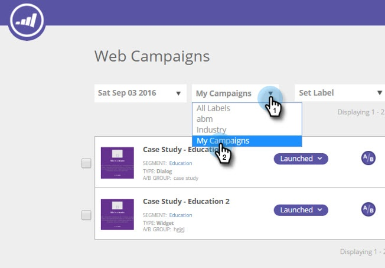

# Vista de Campañas Web desde una etiqueta específica {#view-web-campaigns-from-a-specific-label}

¿Busca vista y filtrar sus campañas según una etiqueta específica?

## Filtrar por etiquetas existentes {#filter-by-existing-labels}

1. Vaya a **Campañas Web**.

   

1. En la lista desplegable de etiquetas, seleccione la etiqueta que desee.

   

1. Observe que ahora solo se muestran las campañas asociadas a la etiqueta seleccionada.

   

>[!MORELIKETHIS]
>
>* [Etiquetar sus Campañas Web](/help/marketo/product-docs/web-personalization/working-with-web-campaigns/label-your-web-campaigns.md)
>* [Vista de segmentos desde una etiqueta específica](/help/marketo/product-docs/web-personalization/using-web-segments/view-segments-from-a-specific-label.md)
>* [Etiquetar los segmentos](/help/marketo/product-docs/web-personalization/using-web-segments/label-your-segment.md)

