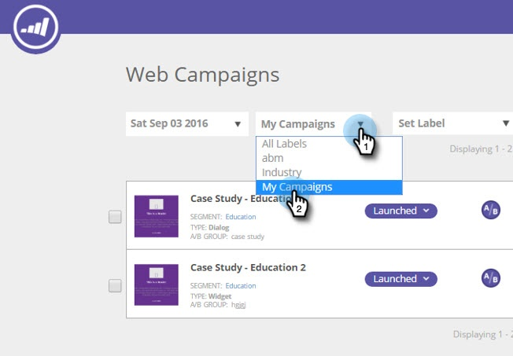

# Visualización de campañas web de una etiqueta específica {#view-web-campaigns-from-a-specific-label}

¿Quiere ver y filtrar sus campañas según una etiqueta específica?

## Filtrar por etiquetas existentes {#filter-by-existing-labels}

1. Vaya a **[!UICONTROL Campañas web]**.

   

1. En la lista desplegable etiquetas, seleccione la etiqueta que desee.

   

1. Tenga en cuenta que ahora solo le mostramos las campañas asociadas a la etiqueta seleccionada.

   

>[!MORELIKETHIS]
>
>* [Etiquetar Sus [!UICONTROL Campañas Web]](/help/marketo/product-docs/web-personalization/working-with-web-campaigns/label-your-web-campaigns.md)
>* [Ver segmentos de una etiqueta específica](/help/marketo/product-docs/web-personalization/using-web-segments/view-segments-from-a-specific-label.md)
>* [Etiquetar sus segmentos](/help/marketo/product-docs/web-personalization/using-web-segments/label-your-segment.md)
