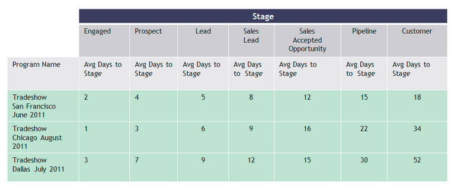

# Notas de la versión: Ene/Feb 2012 {#release-notes-jan-feb}

Las siguientes funciones se incluyen en la versión de enero y febrero. Compruebe la disponibilidad de las funciones en la edición de marketing. Vuelva después de la versión para ver vínculos a la documentación detallada de las funciones.

>[!NOTE]
>
>**Buceo profundo**
>
>Para otras versiones, consulte la sección [Notas de la versión](https://docs.marketo.com/display/docs/release+notes) profunda.

## Contenido dinámico avanzado {#advanced-dynamic-content}

*Disponible para las versiones Pro y Enterprise*

Con el contenido dinámico avanzado, puede crear interesantes comunicaciones por correo electrónico y páginas de aterrizaje relevantes para su audiencia sin tener que crear varios recursos para el mismo mensaje. Las vistas previas actualizadas le permiten realizar vistas de cada versión única en una sola pantalla.

## Segmentación {#segmentation}

*Disponible para las versiones Pro y Enterprise*

La segmentación es un grupo de segmentos, que son un grupo de individuos objetivo a los que se comercializa. Los segmentos están definidos por reglas que se rigen por criterios de filtro similares a listas inteligentes. Los segmentos se pueden basar en datos demográficos, como el puesto de trabajo o la industria, o en comportamientos como páginas web visitadas o vínculos en los que se hace clic.

## Fragmentos {#snippets}

*Disponible para las versiones Pro y Enterprise*

Almacene contenido enriquecido que se puede usar una y otra vez para crear correos electrónicos y páginas de aterrizaje estáticos o dinámicos.

## PURL {#purls}

*Disponible para las versiones Pro y Enterprise*

Los especialistas en mercadotecnia de direcciones URL personalizadas (PURL) ahora pueden crear direcciones URL específicas de los contactos para impulsar la personalización, la medición y el alza de las respuestas en programas de mercadotecnia con varios toques tanto para campañas de correo directo como de correo electrónico.

## Compatibilidad con la directiva de privacidad de la UE {#eu-privacy-directive-support}

Las nuevas funciones para respetar la configuración &quot;No rastrear&quot; del explorador incluyen la capacidad de deshabilitar el seguimiento de posibles clientes anónimos; esto facilita el cumplimiento de las regulaciones de seguimiento de la privacidad más estrictas de la UE.

## Inicio de sesión único {#single-sign-on}

Las organizaciones ahora pueden admitir un inicio de sesión sin problemas en la aplicación de marketing mediante SAML 2.0 para el inicio de sesión único desde un portal corporativo.

## Editores de correo electrónico y Página de aterrizaje actualizados {#updated-email-and-landing-page-editors}

Los editores de correo electrónico y Página de aterrizaje se han rediseñado con una interfaz más atractiva, navegación intuitiva y una experiencia de usuario considerablemente mejorada, que incluye:

Una vista de texto y HTML paralela

En el editor se muestran los campos Desde nombre, Desde correo electrónico, Responder a (NUEVO) y Asunto. Se puede acceder a todos los demás ajustes mediante el botón Editar configuración.

## Compatibilidad con exploradores {#browser-support}

* Mozilla Firefox 9.0
* Google Chrome 16
* Microsoft Internet Explorer 8 y 9
* **Nota**: ya no se admite Internet Explorer 7

## Administración de programas {#program-management}

La administración simplificada de programas mejora la facilidad de uso con la eliminación de tokens y la eliminación más sencilla de Programas.

## Cancelar suscripción al informe de Suscripción {#unsubscribe-from-subscription-report}

Ahora puede cancelar la suscripción a la suscripción directamente desde el informe.

## Actualizaciones de Munchkin {#munchkin-updates}

Las nuevas llamadas de Munchkin reducen los tiempos de carga de las páginas web y proporcionan un rendimiento más coherente para los eventos de vínculos de clics.

## Análisis de oportunidad de programa (solo RCA) {#program-opportunity-analysis-rca-only}

Comprender la contribución de marketing a los ingresos de oportunidades individuales

## Análisis de etapa de ingresos de programa {#program-revenue-stage-analysis}

Obtenga una perspectiva sobre la velocidad de programa de los posibles clientes al comprender qué programas adquirieron los impulsores más rápidos

