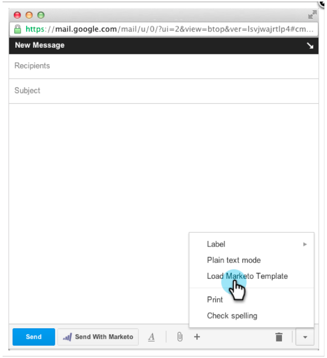

# Notas de la versión: Abril de 2013 {#release-notes-april}

Las siguientes funciones se incluyen en la versión de abril.

## Integración de cuadros {#box-integration}

Conecte Marketing con su cuenta de caja para copiar fácilmente archivos en el estudio de diseño.

## Complemento Gmail {#gmail-plugin}

Si utiliza Marketo Sales Insight, así como Gmail, puede instalar nuestro nuevo complemento Gmail a través de la tienda Chrome. El complemento le permite registrar mensajes con Marketing, cargar plantillas de correo electrónico de Marketing Cloud y enviar mensajes con funciones de seguimiento de Marketing Cloud.

## Análisis de correo electrónico {#email-analysis}

Cree informes avanzados de correo electrónico en el Explorador de ingresos, como el informe Cuadrícula de calor de Actividad de clics. Este informe proporciona una visión detallada del día y la hora a las que las personas hacen clic en los vínculos de sus correos electrónicos.

La función de Análisis de correo electrónico en su conjunto se activará por fases durante los meses de abril y mayo a medida que migremos los datos de correo electrónico de 2012 y 2013. En otras palabras, algunos clientes tendrán acceso a esta función antes que otros.

## API de programa {#program-apis}

Compatibilidad con programas en la llamada de API SOAP, incluido el acceso de solo lectura a datos de programa como: Recuentos de pertenencia a programas, adquiridos por, éxito, configuración, canales, etiquetas, tokens y costes. Consulte la documentación de la API de SOAP para obtener más información.

## Mejora ON24 {#on-enhancement}

Título del trabajo y Nombre de la Compañía se sincronizarán con ON24 desde el formulario de registro de Marketing.
